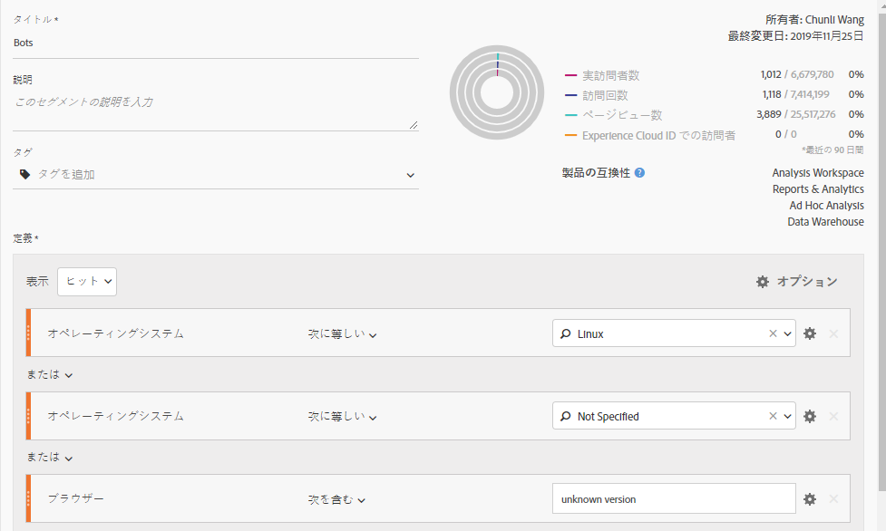
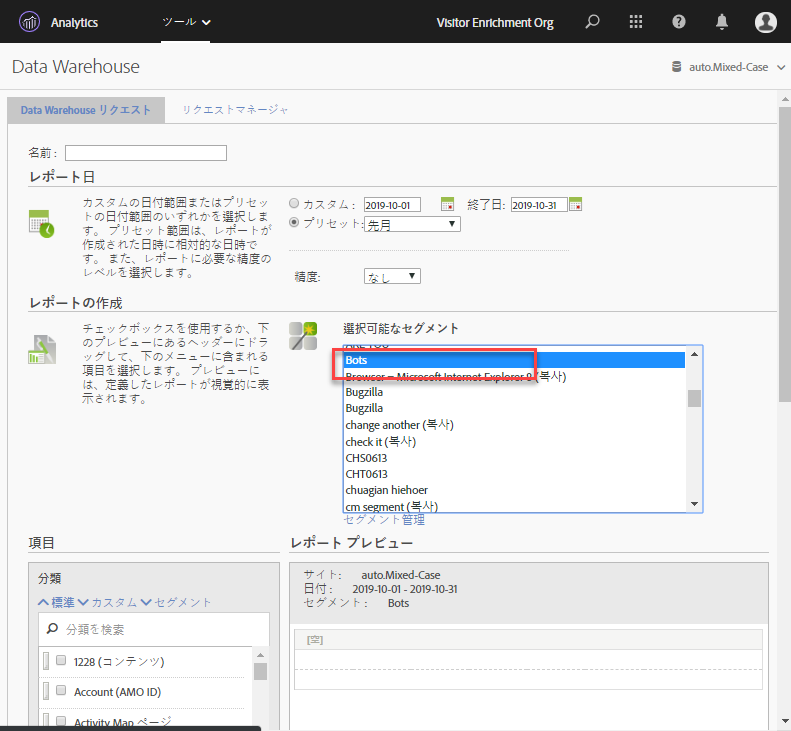

# Adobe Analyticsでのボット削除

Adobe Analyticsでは、レポートからボットトラフィックを削除するための3つの主なオプションがあります。

1. Adobe Analyticsのデフォルトのボットフィルタリングメソッドは、IABボットリストに基づくボットルール [](/help/admin/admin/bot-removal/bot-rules.md) を作成することです。このリストは毎月更新され、CDNや主要インターネットプロパティなどの多くのソースからリストをコンパイルします。すべてのお気に入りを含め、数千もの既知のボットが含まれています。Google、Bing、Mozillaなどこのリストでは、ボットフィルタリングに関する大部分の使用事例および必要事項について説明します。

1. [s.Hit知事導入プラグイン](https://docs.adobe.com/content/help/en/analytics/implementation/javascript-implementation/plugins/hitgovernor.html)を使用して、1分あたり数十件または数百件のヒットを送信してボットのような行動をとる訪問者を削除します。

1. さらに、ボットは急速に進んでいるので、アドビは、適切に組み合わせて定期的に組み合わせて、データ品質の敵を削除することに役立つ、いくつかの強力な機能を提供しています。これらの機能は次のとおりです。Experience Cloud IDサービス、セグメント化、Data Warehouse、顧客属性および仮想レポートスイート。以下に、これらのツールの活用方法の概要を示します。

## 手順1:訪問者のExperience Cloud IDを新しい宣言IDに渡す

開始するには [、Audiencesコアサービスで新しい宣言済みIDを作成](https://docs.adobe.com/content/help/en/core-services/interface/audiences/audience-library.html)します。この新しい宣言IDに訪問者のExperience Cloud IDを渡す必要があります。このIDは、Adobe Experience Platform Launchで [迅速かつ容易に実行](https://docs.adobe.com/content/help/en/launch/using/implement/solutions/idservice-save.html)できます。宣言されたIDに"ECID"という名前を使用します。

スクリーンショット

以下に、このIDをデータ要素によって取得する方法のスクリーンショットを示します。必ずAdobe Mcorg IDをデータ要素に入力してください。

```return Visitor.getInstance("REPLACE_WITH_YOUR_ECORG_ID@AdobeOrg").getExperienceCloudVisitorID();```

このデータ要素が設定されたら、次 [の手順](https://docs.adobe.com/content/help/en/launch/using/implement/solutions/idservice-save.html) に従って、宣言済みIDを起動時にECIDツールに渡します。

## 手順2:セグメントを使用してボットを特定する

これで、訪問者のECIDが宣言済みのIDに渡されるので、Analysis Workspaceでセグメントを使用して、ボットのような行動をとる訪問者を識別します。ボットは、多くの場合、行動によって定義されます。単一アクセス訪問、一般的なユーザーエージェント、不明なデバイス/ブラウザー情報、リファラー、新規訪問者、珍しいランディングページなど。Workspaceドリルダウンおよびセグメント化の累乗を使用して、IABフィルタリングおよびレポートスイートボットルールが設定されているボットを特定します。例えば、次のようなセグメントのスクリーンショットを使用できます。



## 手順3:Data Warehouseを介してセグメントからすべてのEIDをエクスポートする

セグメントを使用してボットを識別したら、次の手順でData Warehouseを利用して、このセグメントに関連付けられているすべてのExperience Cloud IDを抽出します。[Data Warehouse](https://docs.adobe.com/content/help/en/analytics/export/data-warehouse/data-warehouse.html) レポートのセットアップ方法を次に示します。



ディメンションとしてExperience Cloud訪問者IDを使用し、ボットセグメントを適用します。

## 手順4:このリストを顧客属性としてAdobeに戻す

データウェアハウスレポートが届くと、履歴データからフィルタする必要のあるeIDのリストが表示されます。これらのeIDをコピーして、2列、EIDフラグ、およびボットフラグだけで空白のCSVファイルに貼り付けます。


最初の列ヘッダーが、上記の新しい宣言済みIDに与えた名前と一致していることを確認してください。この. CSVファイルを顧客属性インポートファイルとして使用し、 [このブログ投稿の説明に従ってレポートスイートを顧客属性に登録](https://theblog.adobe.com/link-digital-behavior-customers)します。

## 手順5:新しい顧客属性を利用するセグメントの作成

データセットを処理してAnalysis Workspaceに統合したら、新しい「ボットフラグ」顧客属性ディメンションを利用する1つのセグメントを作成します。
