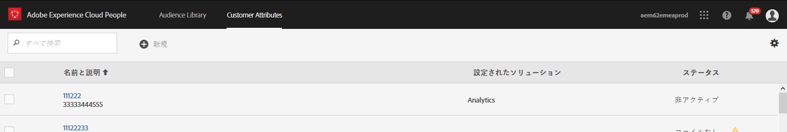
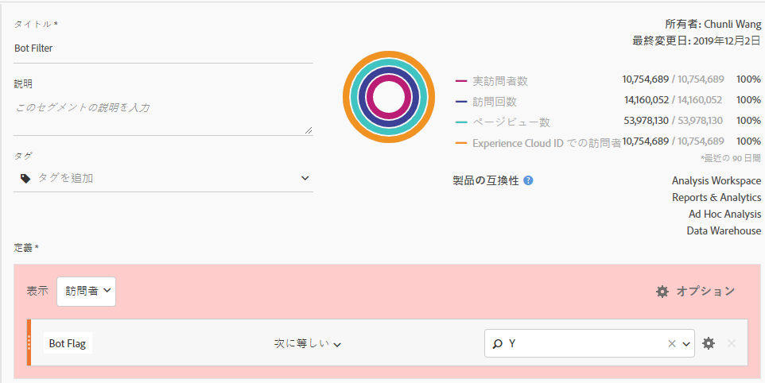
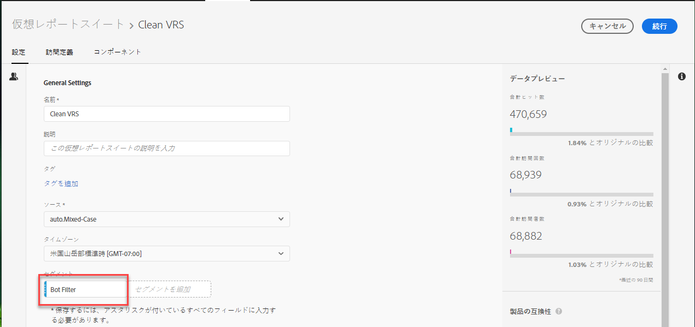

# Adobe Analyticsでのボットの削除

Adobe Analyticsでは、レポートからボットトラフィックを削除する複数のオプションがあります。

## ボットルールの使用

標準フィルタリング方法とボットフィルタリング方法の両方が、 **[!UICONTROL Analytics]** / **[!UICONTROL Admin]** / **[!UICONTROL Report suites/]** Settings Settings Settings Settings/General Edit General Bot Rules **[!UICONTROL /Bot Filtering]**********:

| ルールタイプ | 説明 |
|--- |--- |
| 標準IABボットルール | 「 **[!UICONTROL IABボットフィルタリングルール]** を有効にする [」を選択すると、](https://www.iab.com/) IAB（International Advertising Bureauの）International Spiders &amp; Bots listを使用してボットトラフィックが削除されます。 ほとんどのお客様は、少なくともこのオプションを選択します。 |
| カスタムボットルール | ユーザーエージェント、IPアドレス、またはIP範囲に基づいて、カスタムボットルールを定義して追加できます。 |

詳しくは、ボットルールの概要を [参照してください](/help/admin/admin/bot-removal/bot-rules.md)。

## 実装プ `hitGovernor` ラグインの使用

ボットのよ [うな行動をとる訪問者を削除する](https://docs.adobe.com/content/help/en/analytics/implementation/javascript-implementation/plugins/hitgovernor.html)s.hitGovernor実装プラグインを使用します。つまり、訪問者は1分あたり数十件または数百件のヒットを送信します。

## Adobeツールの組み合わせの使用

さらに、ボットはすばやく変形するので、アドビは、適切に、定期的に組み合わせれば、データ品質のこれらの敵を排除するのに役立つ、強力な機能をいくつか提供しています。 以下の特徴があります。Experience Cloud IDサービス、セグメント化、Data Warehouse、顧客属性および仮想レポートスイートを参照してください。 以下に、これらのツールの活用方法の概要を示します。

### 手順1:訪問者のExperience Cloud IDを新しい宣言済みIDに渡す

まず、 [Peopleコアサービスに新しい宣言済みIDを作成します](https://docs.adobe.com/content/help/en/core-services/interface/audiences/audience-library.html)。 訪問者のExperience Cloud IDをこの新しい宣言済みIDに渡す必要があります。これは、 [Adobe Experience Platform Launchですばやく簡単に行うことができます](https://docs.adobe.com/content/help/en/launch/using/implement/solutions/idservice-save.html)。 宣言済みIDに「ECID」という名前を使用します。



このIDをデータ要素を使用して取得する方法を次に示します。 Experience cloud組織IDをデータ要素に正しく入力してください。

```return Visitor.getInstance("REPLACE_WITH_YOUR_ECORG_ID@AdobeOrg").getExperienceCloudVisitorID();```

このデータ要素を設定したら、次の手順に従 [って](https://docs.adobe.com/content/help/en/launch/using/implement/solutions/idservice-save.html) 、宣言済みIDを起動のECIDツールに渡します。

### 手順2:セグメント化を使用したボットの識別

訪問者のECIDを宣言済みIDに渡したので、Analysis Workspaceのセグメント化を使用して、ボットのよう [な行動を示す訪問者を識別できます](https://docs.adobe.com/content/help/en/analytics/analyze/analysis-workspace/components/t-freeform-project-segment.html) 。 ボットは、多くの場合、その動作によって定義されます。直帰数、通常と異なるユーザーエージェント、不明なデバイス/ブラウザー情報、リファラーなし、新規訪問者、通常と異なるランディングページなど Workspaceのドリルダウンとセグメント化の機能を使用して、IABフィルタリングを回避したボットとレポートスイートのボットルールを識別します。 例えば、次のスクリーンショットに使用できるセグメントを示します。


### 手順3:Data Warehouseを使用してセ [!DNL Experience Cloud IDs] グメントからすべてエクスポート

セグメントを使用してボットを識別したので、次の手順はData Warehouseを利用して、このセグメントに関連付けられたすべてのExperience Cloud IDを抽出することです。 次に、 [Data Warehouseリクエストの設定方法を示します](https://docs.adobe.com/content/help/en/analytics/export/data-warehouse/data-warehouse.html) 。


Experience cloud訪問者IDをディメンションとして使用し、ボットセグメントを適用することを忘れないでください。

### 手順4:このリストを顧客属性としてアドビに渡す

Data Warehouseレポートが届くと、履歴データからフィルタする必要のあるECIDのリストが表示されます。 これらのECIDをコピーして、ECIDとボットフラグの2列の空白の.CSVファイルに貼り付けます。

* **ECID**:この列ヘッダーが、上記の新しい宣言済みIDに与えた名前と一致することを確認します。
* **ボットフラグ**:これを顧客属性スキーマディメンションとして追加します。

この.CSVファイルを顧客属性インポートファイルとして使用し、このブログ投稿の説明に従って顧客属性にレポートスイートを登録 [します](https://theblog.adobe.com/link-digital-behavior-customers)。


### 手順5:新しい顧客属性を利用したセグメントの作成

データセットが処理され、Analysis Workspaceに統合されたら、新しい「ボットフラグ」顧客属性ディメンションと [!UICONTROL Exclude] Containerを利用する1つ以上のセグメントを作成します。



### 手順6:このセグメントを仮想レポートスイートフィルターとして使用する

最後に、このセグメントを利用し [て識別されたボットを除外する仮想レポートスイートを](/help/components/vrs/vrs-about.md) 、次のように作成する必要があります。



この新しくセグメント化された仮想レポートスイートは、識別されたボットが完全に削除され、データのセットが非常に洗練されるようになります。

### 手順7:手順2、3、4を定期的に繰り返します。

少なくとも毎月のリマインダーを設定して、定期的にスケジュールされた分析の前に、新しいボットを識別し、フィルターします。
