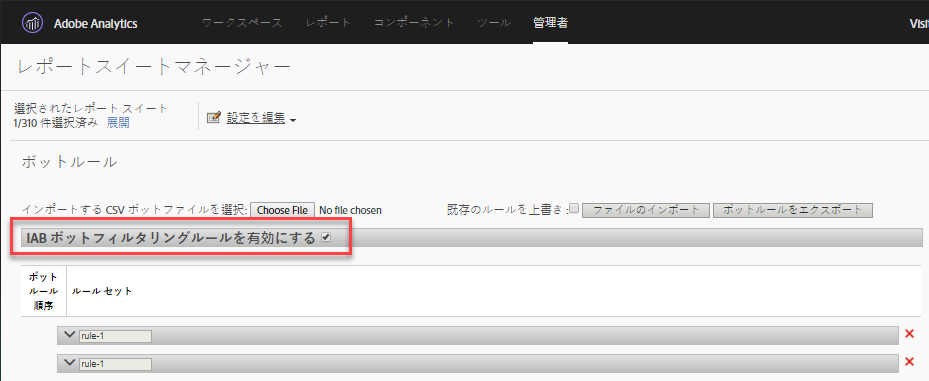

# ボットルールの概要

ボットルールを使用すると、既知のスパイダーおよびボットによって生成されたレポートスイートからトラフィックを削除できます。ボットトラフィックを削除することで、Web サイトでのユーザーアクティビティをより正確に測定できるようになります。

ボットルールを定義すると、すべてのトラフィックが定義済みのルールと比較されます。ボットルールのいずれかと一致するトラフィックは、レポートスイートでは収集されず、レポート対象から除外されます。

To update or upload bot rules, navigate to **[!UICONTROL Analytics]** &gt; **[!UICONTROL Admin]** &gt; **[!UICONTROL Report Suites]**. Select the correct Report Suite, and then go to **[!UICONTROL Edit Settings]** &gt; **[!UICONTROL General]** &gt; **[!UICONTROL Bot Rules]**.

通常、ボットトラフィックを削除すると、トラフィックの量が減り、コンバージョン指標が下がります。多くの場合は、ボットトラフィックを削除することで、コンバージョン率が上がり、他のユーザビリティ指標が増加することを確認できます。ボットトラフィックを削除する前に、関係者に連絡して、この削除を行った場合に、主要業績評価指標に必要な調整を加えることができるかどうかを確認します。調整が可能な場合は、最初に小規模なレポートスイートからボットトラフィックを削除して、発生する可能性がある影響を予測することをお勧めします。

ボットトラフィックデータは、ボットレポートとボットページレポートに表示するために、個別のリポジトリに保存されます。ボットフィルタリングを有効にするには、次の2つのオプションがあります。

| ルールタイプ | 説明 |
|--- |--- |
| 標準IABボットルール | 「 [!UICONTROL IABボットフィルタリングルール] を有効にする」を選択すると、 [IABの](https://www.iab.com) （International Advertising Bureau） International Spiders&amp; Bots Listを使用してボットトラフィックが削除されます。ほとんどの顧客は最低でもこのオプションを選択しています。 |
| カスタムボットルール | ユーザーエージェント、IPアドレスまたはIP範囲に基づいて、カスタムボットルールを定義および追加できます。 |

## 標準IABボットルール

標準IABボットルールは、"IABボットフィルタリングルール [!UICONTROL を有効にする」] チェックボックスをオンにしてオンにすることができます。これにより、ボットトラフィックを削除するためにIABの（International Advertising Bureau） International Spiders&amp; Bots Listにボットが削除されます。IABはこのリストを毎月更新します。



アドビは詳細な IAB ボットリストをお客様に提供できませんが、ボットレポートを使用して、サイトにアクセスしたボットのリストを表示できます。ボットをIABリストに送信するには、IABを訪問 [](https://www.iab.com)します。

## カスタムボットルール

>[!Ntoo]
>ユーザーインターフェイスでは 500 個のルールを手動で定義することが可能です。この制限を超える場合は、「ファイルのインポート」および「ボットルールをエクスポート」オプションを使用して、ルールを一括処理する必要があります。

カスタムボットルールを使用すると、定義した条件に基づいてトラフィックをフィルターできます。

カスタムボットルールは、次の条件タイプを使用して定義されます。

* ユーザーエージェント
* IP アドレス
* IP 範囲

1 つのルールに複数の条件を定義できます。複数の条件で照合するには、「or」を使用します。例えば、ユーザーエージェントに関する値と IP アドレスを指定した場合、いずれかの条件に適合した場合にボットトラフィックと見なされます。

### ユーザーエージェント

ユーザーエージェントの条件では、そのユーザーエージェントの値を調べて、指定した文字で&#x200B;**[!UICONTROL 始まる]**&#x200B;か、その文字を&#x200B;**含む]かを判断します。[!UICONTROL **「**[!UICONTROL 次を含む]」を選択した場合、ユーザーエージェントの任意の場所に指定した文字が含まれていれば、一致と見なされます。**

オプションの値を「**[!UICONTROL 次を含まない]」リストに含めることで、照合を適切に行う際にユーザーエージェントに含めない値を定義できます。**&#x200B;複数の値を指定するには、1 行に 1 つの値を設定します。ユーザーエージェントが照合文字列で指定した条件に一致するとき、「次を含まない」リスト内の文字列も含んでいる場合は、一致と見なされません。

「**[!UICONTROL 次を含む]」フィールドに入力できるのは 100 文字までです。**「次を含まない」リストに入力できる文字数は、255 文字から、各改行の区切り文字の数を引いた文字数です（区切り文字の数は文字列の数 から 1 を引いた数になります。例えば、4 つの「次を含まない」文字列を指定する場合、3 文字の区切り文字が必要です）。**&#x200B;すべての文字列照合では、大文字と小文字が区別されません。

### IP アドレス（ワイルドカードの照合を含む）

1 つの IP アドレスと照合するか、ワイルドカード（*）を使用して同じブロック内の複数のアドレスと照合します。照合する IP アドレスの数値を指定します。ワイルドカードを使用して照合する場合、どのような値にも一致させたい部分に * を使用します。次に、IP アドレスの照合文字列の例を示します。

```
10.10.10.1
10.10.10.*
```

### IP アドレスの範囲

照合する IP アドレスの開始と終了の範囲を指定します。ワイルドカードを使用して照合する場合、どのような値にも一致させたい部分に * を使用します。

### カスタムボットルールの定義

1. **[!UICONTROL Analytics]** / **[!UICONTROL 管理者に移動]**&#x200B;し、1つまたは複数のレポートスイートを選択して、 **[!UICONTROL 一般]** / **[!UICONTROL ボットルール]**&#x200B;をクリックします。
1. Click **[!UICONTROL Add Rule]** and define one or more match conditions.
1. 「**[!UICONTROL 保存]**」をクリックします。変更が反映されるまで、最大 30 分かかります。

## ボットルールのアップロード

ボットルールを一括してインポートするには、ルールを定義した CSV ファイルをアップロードします。

次の列を使用してCSVファイルを作成します。

| 列 1 | 列 2 | 列 3 | 列 4 | 列 5 |
|--- |--- |---|---|---|
| ボットの名前 | IP の開始値 | IP の終了値 | Agent Match Rule<br>(contains or starts with)</br> | 以下を除外<br>するエージェント（255文字の制限）</br> |

次の 3 種類のボットルールを定義できます。

* 「次を含む」または「次で始まる」ユーザーエージェント
* 単一の IP アドレスまたはワイルドカードの一致
* IP 範囲の一致

インポートファイルの各行には、次のボット定義の 1 つのみを含めることができます。

* **「次を含む」または「次で始まる」ユーザーエージェント**：以下を含むエージェント列に、照合する 1 つのユーザーエージェント文字列を指定します。「エージェントの一致ルール」フィールドに、「次を含む&#x200B;**」または「次で始まる&#x200B;**」を入力して、実行する照合のタイプを指定します。An optional value can be included in the Agent Exclude column that defines one or more pipe-delimited ( `|` ) strings that the Agent does not contain. 文字列の照合では、大文字と小文字が区別されません。「IP の開始値」列と「IP の終了値」列の両方は、空にする必要があります。

* **単一のIPアドレスまたはワイルドカードの一致**:単一のIPアドレス（ `10.10.10.1`）またはワイルドカードのIPアドレス（ `10.10.*.*`）に一致させるには、"IPの開始」列と"IPの終了」列の両方に同じ値を設定します。「一致ルール」、「以下を含むエージェント」、「以下を含まないエージェント」は空にする必要があります。

* **IP 範囲の一致**：IP の開始値列とIP の終了値列を使用して、IP アドレスの範囲を定義します。Wildcards can be used to match IP ranges, for example `10.10.10.*` to `10.10.20.*`. 「一致ルール」、「以下を含むエージェント」、「以下を含まないエージェント」は空にする必要があります。

### OR を使用して複数のルールを組み合わせる

（ユーザーエージェント「または」IP アドレスなどのように）OR を使用した複数のルールの組み合わせによってボットを照合するには、組み合わせるすべてのルールについて、「ボットの名前」フィールドに同じ名前を指定します。AND 一致はサポートされません。

### すべてのルールをアップロードファイルで上書き

すべての既存のルールを削除し、アップロードファイルに定義されているルールで置き換えるには、「**[!UICONTROL Overwrite existing rules（既存のルールを上書き）]」チェックボックスをオンにします。**

### ルールのエクスポート

「**[!UICONTROL Export Uploaded Bot File（更新されたボットファイルをエクスポート）]」ボタンをクリックすとる、UI に定義されているすべてのルールが CSV 形式でエクスポートされます。**


## Impact of bot rules on data collection {#section_F01A3130E7A04A9993371CF26F6586F2}

ボットルールは、すべての解析データに適用されます。ボットルールによって削除されたデータは、ボットレポートとボットページレポートにのみ表示されます。

VISTA rules are applied after Bot Rules (see [Processing Order](../../../admin/admin/c-processing-rules/c-processing-rules-configuration/processing-rule-order.md#concept_8A6BBEA7F50C40C8A8D8755D4F579B1E)).

**高ヒット訪問の処理**：訪問において 100 を超えるヒットが発生した場合、訪問において経過した時間（秒数）が訪問のヒット数以下かどうかを判定します。このような場合、長く集中的な訪問はデータを処理する時間がかかるので、訪問が強制的に終了され、新たな訪問として計測が継続されます。一般に、高ヒットの訪問はボット攻撃によるもので、通常の訪問者による閲覧とは考えられません。

>[!NOTE]
>
>ヒットがサーバー *`bots`* コールとして [請求されるヒット](https://docs.adobe.com/content/help/en/analytics/admin/server-call-usage/overage-overview.html)。

## Impact of IP Obfuscation on bot filtering {#section_92E60B95BE8940D983F28C79E0CD6B12}

IAB ボットリストはユーザーエージェントにのみ基づいているため、このリストを使用したフィルタリングは IP の不明化の設定に影響を受けません。非 IAB ボットフィルタリング（カスタムルール）の場合は、IP をフィルタリング条件の一部とすることができます。IP を使用してボットをフィルタリングする場合、その設定が有効であれば、最後のオクテットが削除された後、IP 全体の削除や一意 ID での IP の置換など他の IP 不明化オプションの実行前に、ボットフィルタリングが行われます。

つまり、IP の不明化を有効にすると、IP アドレスが不明化される前に IP の除外がおこなわれるので、設定の変更などの対応は不要です。

最後のオクテットが削除されると、IP フィルタリングの前に行われます。最後のオクテットが 0 に置換されるので、末尾が 0 の IP アドレスに一致するように IP 除外ルールを更新します。「* に一致」は、 0 にも一致します。
