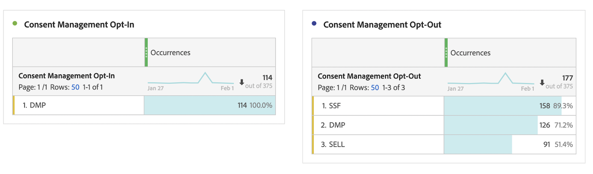

# プライバシーレポート

プライバシーレポートで [同意管理のオプトイン](/help/components/dimensions/cm-opt-in.md), [同意管理のオプトアウト](/help/components/dimensions/cm-opt-out.md) および [広告の同意](/help/components//dimensions/ad-consent.md) レポートで使用するディメンションです。

このページにアクセスするには：

1. Adobe Analytics にログインし、**[!UICONTROL 管理者]**／**[!UICONTROL レポートスイート]**&#x200B;に移動します。
1. 目的のレポートスイートを 1 つ以上選択し、**[!UICONTROL 設定を編集]**／**[!UICONTROL プライバシー管理]**／**[!UICONTROL プライバシーレポート]**&#x200B;を選択します。

   

1. 「**[!UICONTROL データプライバシー レポートを有効にする]**」ボタンをクリックします。

   >[!NOTE]
   >
   >有効にした後で、これらの変数をオフにすることはできません。

   

1. 有効にすると、確認メッセージが表示されます。ディメンションは、レポートで使用できます。

   
