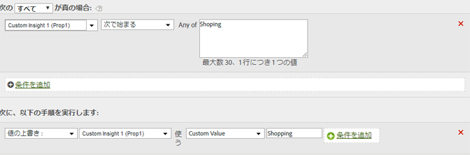

# レポート内の値のクリーンアップ

値が一般的な誤ったつづりと一致する場合、レポート内で正しく表示されるように更新することができます。

意図せずに他の値と一致することがないようにするには、できる限り厳しい一致オプションを使用します。変数（下の例では prop1）に対してレポートを実行し、置換するように選択した語句を検索して、意図しない値と一致しないようにすることができます。文字列の比較では大文字と小文字が区別されます。

| ルールセット | 値 |
|---|---|
| 条件 | prop1 が Shoping で始まる場合 |
| アクション | prop1 の値を上書きしてカスタム値 Shopping に設定する |

次に例を示します。

