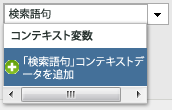
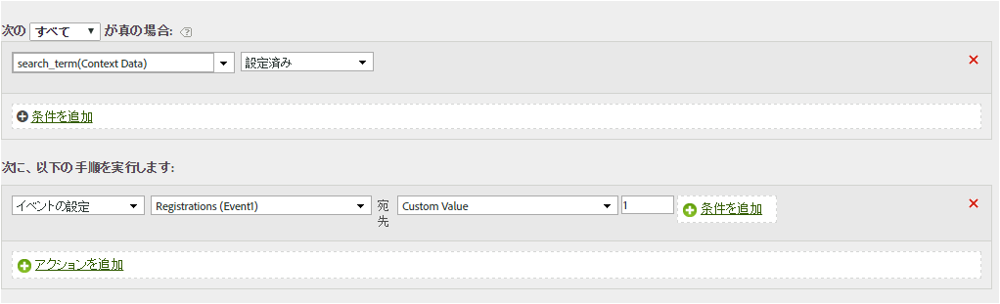

# コンテキストデータ変数を使用したイベントの設定

処理ルールで、コンテキストデータ変数に基づいてイベントをトリガーできます。

コンテキストデータ変数は、次の形式で AppMeasurement に指定します。

```
 s.contextData['search_term']
```

[!UICONTROL コンテキスト変数]リストには、過去 30 日間にレポートスイートへ送信されたすべての変数が含まれます。If you know the context data variable name but have not sent it into the current report suite, you can add a value by typing the variable name and clicking **[!UICONTROL Add variable name context data]**:



The following rule definition expands on the [Copy a Context Data Variable to an eVar](../../../../admin/admin/c-processing-rules/processing-rules-examples/processing-rules-copy-context-data.md#concept_43AA4980A2D847D6A3BEC50BCC0780E7) rule to also set an event on every hit that contains a specific context data variable:

| ルールセット | 値 |
|---|---|
| 条件 | 「search_term」コンテキストデータが設定されている場合 |
| アクション | イベント「searches」の設定 |

次に例を示します。



実装のヘルプの[コンテキストデータ変数](https://marketing.adobe.com/resources/help/en_US/sc/implement/index.html?f=context_data_variables)を参照してください。
