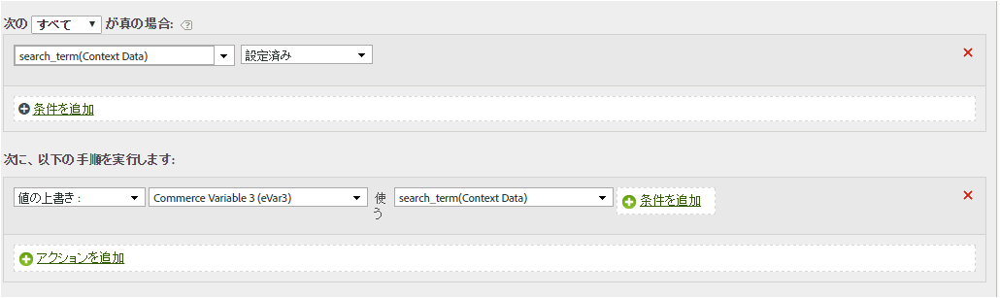
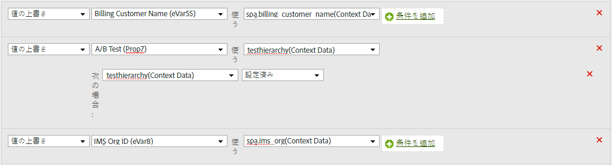

# コンテキストデータ変数の eVar へのコピー

処理ルールは、コンテキストデータ変数からpropおよびeVarに値を移動するために使用します。 処理ルールがないと、コンテキストデータ変数は無意味になり、Analyticsではレポートに入力されません。

[!UICONTROL コンテキスト変数]リストには、過去 30 日間にレポートスイートへ送信されたすべての変数が含まれます。If you know the context data variable name but have not sent it into the current report suite, you can add a value by typing the variable name and clicking **[!UICONTROL Add variable name context data]**:

次の例では、コンテキスト `search_term` データ変数を使用し、その値をに配置しま `eVar3`す。

上記の例は、設定するeVarが少数の場合に適しています。 組織に数百のコンテキストデータ変数があり、各変数に独自のeVarが必要な場合は、条件ステートメントを使用できます。 多数の条件ステートメントを単一の処理ルールに含めることができるので、150個のルールの制限に達することなく、レポートスイート内のすべてのeVarを設定できます。

次の例では、コンテキ `prop7` ストデータ変数を設定しま `testhierarchy`すが、設定されてい `testhierarchy` る場合のみです。

コンテキストデータ変数の実装について詳しくは、実装ユーザーガ [イドの](../../../../implement/js-implementation/c-variables/context-data-variables.md) 「コンテキストデータ変数」を参照してください。
