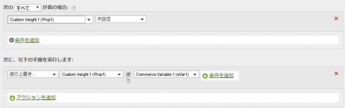

# eVar値をpropにコピーしてパスを特定する

eVar の値を prop にコピーしてパス指定を有効にすることができます。

値を設定する際、左側の変数は右側の変数からの値（空白の場合でも）を受け入れます。

| ルールセット | 値 |
|---|---|
| 条件 | なし（常に実行する） |
| アクション | prop1 の値を eVar1 で上書きする |

次のように、prop1 に値が含まれていない場合にのみ、このルールを変更して prop1 の値を設定できます。

| ルールセット | 値 |
|---|---|
| 条件 | prop1 が設定されていない場合 |
| アクション | prop1 の値を eVar1 で上書きする |

次に例を示します。

