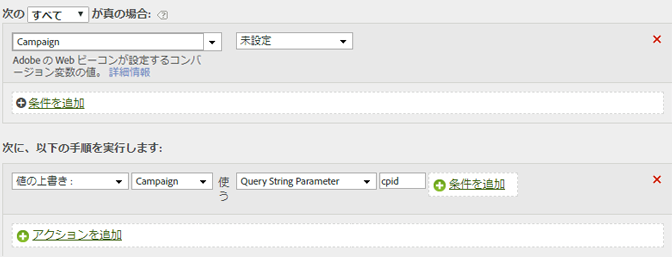

# クエリ文字列パラメータからのキャンペーンIDの入力

クエリ文字列パラメーターを使用して、変数を入力することができます。

ほとんどの場合、クエリ文字列からの変数の入力にはプラグインを使用します。入力ミスなどの問題によって値を入力できない場合、処理ルールを使用して変数を入力できます。

値を上書きする前に、値が空白であるか、期待された値が含まれているかを必ず確認する必要があります。

| ルールセット | 値 |
|---|---|
| 条件 | キャンペーンが設定されていない |
| アクション | キャンペーンの値を上書きしてクエリ文字列パラメーター cpid の値に設定する |

次に例を示します。

