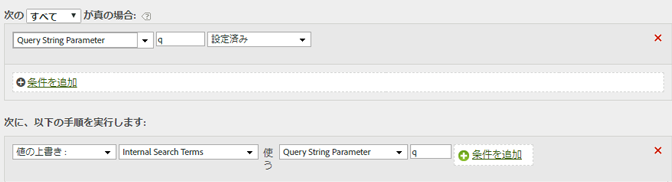

# クエリー文字列パラメーターを使用して内部検索用語を入力

q などの一般的な変数を使用して検索用語を入力する場合、処理ルールを使用して内部検索用語 eVar にこのような変数の値を入力できます。

処理ルールで読み取れるように、クエリー文字列値を Unicode または UTF-8 でエンコードする必要があります。

| ルールセット | 値 |
|---|---|
| 条件 | クエリー文字列パラメーター q が設定されている場合 |
| アクション | 内部検索用語の値を上書きしてクエリー文字列パラメーター q の値に設定する |

次に例を示します。

