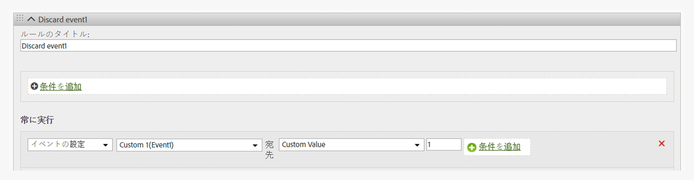

# ヒットからのイベントの削除

ページ上の変更を実装することなく処理ルールを使用してヒットからイベントを削除または破棄する方法を示します。

## Remove an event from a hit {#topic_9548385BFE344FC08CA99718A24FC093}

ページ上の変更を実装することなく処理ルールを使用してヒットからイベントを削除または破棄する方法を示します。

次の図に示すように、処理ルールを設定してイベントのカスタム値を 0 に設定します。

