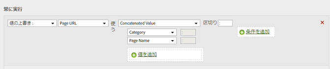

# カテゴリとページ名を連結してサブカテゴリを追加

連結オプションを使用して他の値を組み合わせることによって値を入力できます。

<table id="table_FF761C2011CD456B9A466C054A54FC30"> 
 <thead> 
  <tr> 
   <th colname="col1" class="entry"> ルールセット </th> 
   <th colname="col2" class="entry"> 値 </th> 
  </tr> 
 </thead>
 <tbody> 
  <tr> 
   <td colname="col1"> 条件 </td> 
   <td colname="col2"> なし（常に実行する） </td> 
  </tr> 
  <tr> 
   <td colname="col1"> アクション </td> 
   <td colname="col2">サブカテゴリの値を上書きして連結値に設定する 
カテゴリ 
 
ページ名 
 </td> 
  </tr> 
 </tbody> 
</table>

次に例を示します。

