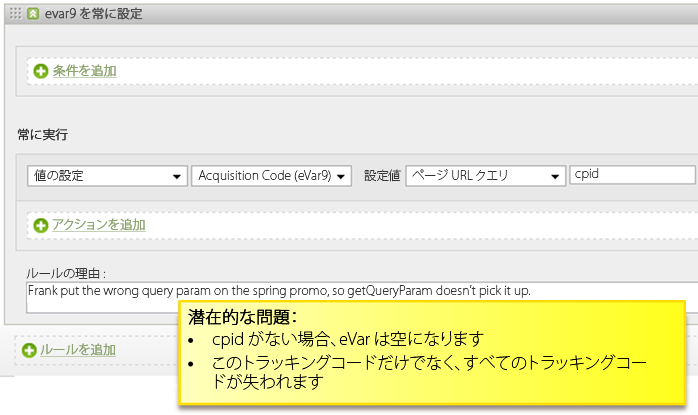
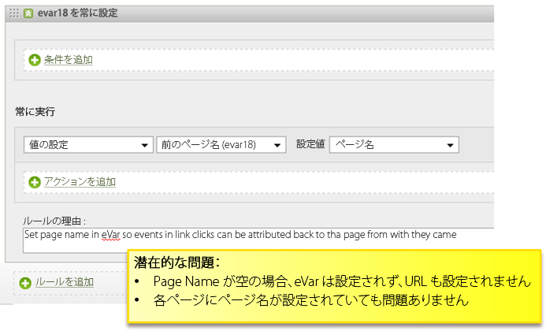
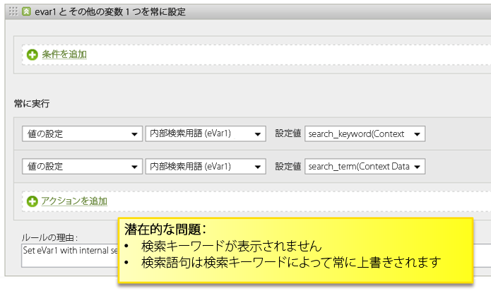
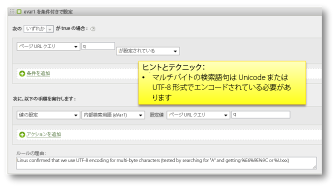
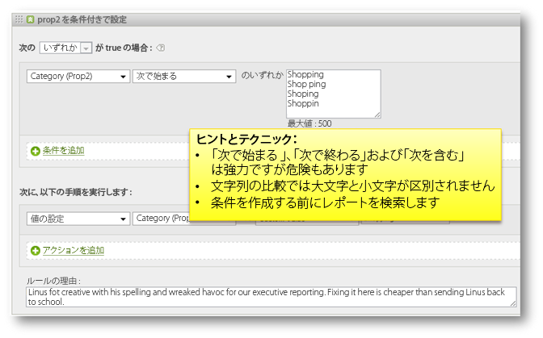

# 処理ルールのヒントとテクニック

ここでは、処理ルールのテストに関するガイドラインと、回避する必要がある一般的な間違いについて説明します。

## 処理ルールのテスト {#section_F092D2FECDE24082AE9FC6F8BE87F29F}

ここでは、処理ルールを実稼働環境に導入する前に行うテストで役立つガイドラインをいくつか説明します。

**検索用語を読み取るルールのテスト**

「prop1 に news が含まれる場合」などの条件に基づく検索では、prop1 レポートを開き、「news」を検索して、予期していなかった一致があるかどうかを確認します。

**変数を読み取るルールのテスト**

Create a blank HTML page on your desktop, include the s_code from your site, and set the `s.account` variable to a dev report suite. ルールがリファラーや参照ドメインなどに基づいている場合、実際に使用しているリファラーレポートの URL をいくつかサンプルとして利用し、その値のいずれかを `s.referrer` 変数に設定して、ページを読み込みます。同様に、ルールがページ URL 値に基づいている場合、`s.pageURL` を設定できます。これと同じプロセスを、すべての変数に使用できます。

**開発レポートスイートの使用**

開発レポートスイートに処理ルールを設定して、これらのルールが正しく動作していることを確認することをお勧めします。可能であれば、幅広く導入する前に、ルールを小規模な実稼動用レポートスイートにコピーしてください。

## 空の値の確認 {#section_EE84A5525E26415787930723B0CAAE0F}

ルールを作成するときは、値が空の場合を考慮します。空の値を確認する条件を追加しないと、誤って変数を空の値で上書きする可能性があります。

また、処理順を考慮することも重要です。次の例では、ページ名が存在しない場合、カスタムeVarの「前のページ名」がURLに設定されます。 ただし、処理ルールが適用された後でページ名に URL が設定されても、Page Name がページ上で設定されていなければ、Page Name は空になります。

## 値の上書きの回避 {#section_49FCCA31E31A433EA2EF5EAF91443DAF}

次の例では、2 つのコンテキストデータ変数がサイトで使用され、search_keyword と search_term という検索用語が取得されます。ただし、設定に基づいて、search_term が空であっても、search_keyword 値は常に上書きされます。

内部検索用語を入力する前に、値の各コンテキストデータ変数をテストするように、このルールを設定しなおす必要があります。また、必要に応じて、2 つの値を維持する使用事例がある場合、それらの値を連結します。

## 検索用語の UTF-8 または Unicode へのエンコード {#section_3BBBE1FB8FEA48589362452DE51DB575}

クエリ文字列から取得した検索用語は正しくエンコードする必要があります。そうしないと、処理ルールと一致しなくなります。

## 「次で始まる」、「次を含む」、「次で終わる」 {#section_80CE853244FC435B844A09EA51868D8D}

正しい照合条件を選択して、正確に照合を行う最も厳密な条件を見つけます。ルールを作成する前にレポート内の値を検索して、意図しない一致がないことを確認します。例えば、prop2 レポートを検索して、この条件が一致する場所をすべて見つけてから、このルールを有効にします。

