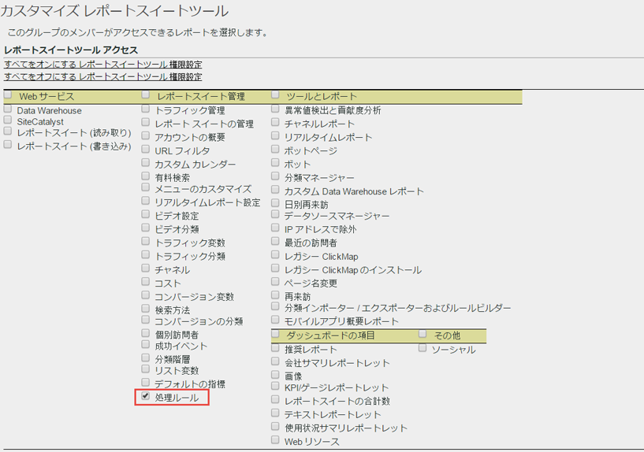
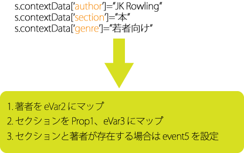

# 処理ルールの概要

処理ルールはデータ収集をシンプル化し、レポーティングに送信されるコンテンツを管理します。処理ルールは、以下に対するインターフェイスを提供することにより、IT グループおよび Web 開発者とのやり取りの単純化に役立ちます。

* 製品の概要ページでイベントを設定する
* クエリー文字列パラメーターでキャンペーンを入力する
* レポートを容易にするために、prop でカテゴリとページ名を連結する
* eVar を prop にコピーし、パスを確認する
* スペルを間違えたサイトセクションのクリーンアップ
* クエリー文字列から eVar に内部検索用語またはキャンペーン ID を取り込む

>[!VIDEO](https://video.tv.adobe.com/v/26124/?quality=12&learn=on)

## 処理ルールの権限 {#section_8A4846688050453784DAE4D89355169A}

Administrators have rights to use processing rules **by default**. また、管理者は、管理ツールインターフェイスを使用してこの権限を非管理者に付与できます。手順については、[]

>[!IMPORTANT]
>
>処理ルールはAnalyticsデータに永続的な影響を与えるので、Adobeでは、処理ルール管理者に対して、Adobe Analyticsで認定トレーニングを受け、レポートスイートのすべてのデータソース（標準Webサイト、モバイルサイト、モバイルアプリ、Data Insertion APIなど）を理解することを強くお勧めします。 様々なプラットフォームで入力されるコンテキストデータ変数と標準変数に関する知識は、データの予期しない削除や変更を防ぐのに役立ちます。

## コンテキストデータを使用したデータ収集の単純化 {#section_09EEA03612D24C15839631AA9E9668D8}

コンテキストデータ変数は、処理ルールでのみ使用できる変数の一種です。 コンテキストデータを使用するには、キー／値データペアを送信し、処理ルールを使用して標準的な Analytics 変数にこれらの値を取り込みます。これによって、プログラマーは prop や eVar に含めるべき値を正確に理解する必要がなくなります。

実装のヘルプの[コンテキストデータ変数](https://docs.adobe.com/content/help/ja-JP/analytics/implementation/vars/page-vars/contextdata.html)を参照してください。

## 処理ルールを使用したヒットデータの変換とイベントのトリガー {#section_8284E72E999244E091CD7FB1A22342B6}

処理ルールでは、受け入れる値を監視し、よくある入力ミスを変換したり、レポートされたデータに基づいてイベントを設定したりできます。prop は eVar にコピーでき、レポートで値を連結でき、イベントを設定できます。

## レポートでのコンテキストデータ変数の使用 {#section_BD098BC503024A0B8703596628071134}

定義したコンテキストデータ変数をレポートで使用するには、eVar などの変数にコピーする必要があります。

詳しくは、[こちら](/help/admin/admin/c-processing-rules/processing-rules-examples/processing-rules-copy-context-data.md)と[こちら](/help/admin/admin/c-processing-rules/processing-rules-examples/processing-rules-copy-context-data-event.md)をご覧ください。
