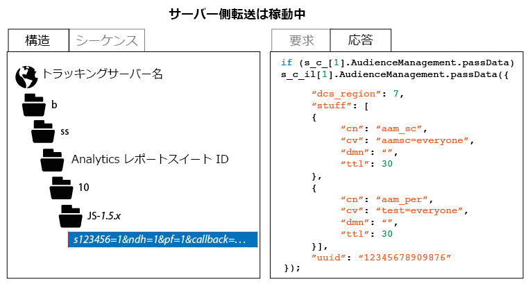

# サーバー側転送の実装の確認方法

サーバー側転送が適切に有効になっていることを確認するには、Analytics トラッキングリクエストの HTTP 応答を調べる必要があります。そのためには、ブラウザーの開発者ツールを使用するか、Charles Web デバッガーなどのプロキシツールを使用します。サーバー側転送が適切に有効になっていることを示すデータを確認する手順を以下に示します。

サーバー側転送のステータスを確認するには：

1. 更新された AppMeasurement コードを含むテストページを読み込みます。
1. ブラウザーのデバッグツールまたはプロキシソフトウェアを使用して、Analytics のトラッキングリクエストの HTTP 応答を調べます（「b/ss」を含むすべてのパスを選択することで簡単にフィルタリングできます）。
1. HTTP 応答を確認します。（以下の図に示すように）応答に Audience Manager データが含まれている場合は、サーバー側転送が動作しています。

>[!CAUTION]
>
>応答に `"status":"SUCCESS"` というキーと値のペアまたは 2 x 2 の画像が含まれている場合、サーバー側転送は適切に設定されていません。ID サービスが適切にデプロイされていること、アプリ測定モジュールがデプロイされていること、適用可能なレポートスイートが正しい IMS Org にマップされていること、Analytics Admin Console でサーバー側転送が有効になっていることを確認してください。

>[!MORELIKETHIS]
>
>* [Charles Web デバッガー](https://www.charlesproxy.com/)

