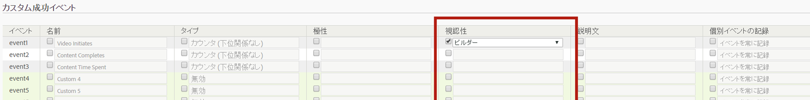

# 成功イベントの設定

成功イベントを設定する方法について手順を説明します。

1. **[!UICONTROL Analytics]** / **[!UICONTROL 管理者]** / **[!UICONTROL レポートスイート]**&#x200B;の順にクリックします。
1. レポートスイートを選択します。
1. Click **[!UICONTROL Edit Settings]** &gt; **[!UICONTROL Conversion]** &gt; **[!UICONTROL Success Events]**.

   

1.  「**名前**」列で編集を有効にする各項目の横にあるチェックボックスを選択し、名前を指定します。
1.  「**タイプ**」列でドロップダウンリストを有効にする各項目の横にあるチェックボックスを選択し、タイプを選択します。

   >[!NOTE]
   >
   >Before you change an event type, see [Change event type](../../../admin/admin/c-success-events/event-type.md#concept_2A6FCC19E7FC429DBDFA65BC640BD448).

   ここに挙げた要素について詳しくは、[成功イベントページ - 説明](../../../admin/admin/c-success-events/success-event.md#section_681ECEC981694CABBDBF00E18165B447)を参照してください。

1. **[!UICONTROL 極性]** 列で、この指標の上昇傾向が良いか悪いかを指定します。
1. **[!UICONTROL 表示]** 列では、メニュー、指標セレクター、計算指標ビルダーおよびセグメントビルダーの標準（組み込み）指標、カスタムイベントおよび組み込みイベントを非表示にできます。

   この設定は、ユーザーインターフェイス内での表示にのみ影響し、指標やイベントのデータ収集には影響しません。[さらに詳しく...](../../../admin/admin/metric-visibility.md#concept_A85EB68D27534C4581AF1DCF5702DDE5) 1. 説明を入力します。
1. イベントを常に記録するかどうかを選択します。
1. [パーティシペーション指標](/help/components/c-variables/c-metrics/metrics-participation.md)を有効または無効にします。

   >[!NOTE]
   >
   >パーティシペーションは最大100個のカスタムイベントに対して有効にできます。100 を超える場合は、[計算指標](https://marketing.adobe.com/resources/help/en_US/analytics/calcmetrics/participation_metric.html)ビルダーでパーティシペーション指標を作成できます。

1. 「**[!UICONTROL 保存]**」をクリックします。

