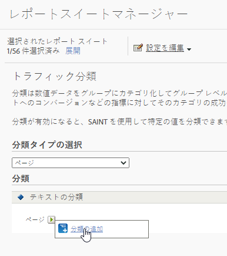

# トラフィック分類

トラフィック分類では、トラフィック変数（prop）の分類がおこなえます。トラフィック分類ではテキスト分類しか使用できません。

## トラフィック分類 {#concept_028079B29A9C412AA68910A87E11176F}

トラフィック分類では、トラフィック変数（prop）の分類がおこなえます。トラフィック分類ではテキスト分類しか使用できません。

トラフィック分類ページでは、選択したレポートスイートの分類を作成することができます。分類後は、主要データを使用して生成できるすべてのレポートは、関連付けられた属性を使用して生成することもできます。

分類を有効にした後、[分類インポーター](/help/components/classifications/importer/c-working-with-saint.md)を使用して、該当する分類に特定の値を割り当てます。

## トラフィック分類の追加 {#task_4DB49CCB1D764483907BC33A5CEB7315}

<!-- 

t_classification_add_traffic.xml

 -->

選択したレポートスイートの分類を追加または編集する方法について手順を説明します。

1. スイートのヘッダーで&#x200B;**[!UICONTROL 管理者]**／**[!UICONTROL レポートスイート]**&#x200B;の順にクリックします。
1. レポートスイートを選択します。
1. 「**[!UICONTROL 分類タイプの選択]**」フィールドで分類の追加先の変数を選択します。
1. **[!UICONTROL 設定の編集]**／**[!UICONTROL トラフィック]**／**[!UICONTROL トラフィック分類]**&#x200B;の順にクリックします。

   

1. 「**[!UICONTROL 分類の編集]**」アイコンにマウスを移動して、「**[!UICONTROL 分類の追加]**」または「**[!UICONTROL 分類の編集]**」を選択します。
1. **[!UICONTROL テキスト分類]**&#x200B;ダイアログボックスで、必要に応じて分類を設定します。

   **[!UICONTROL 名前]**：分類に名前を付けます。

   **[!UICONTROL 説明]**：詳細な説明を入力します。
1. 「**[!UICONTROL 保存]**」をクリックします。
