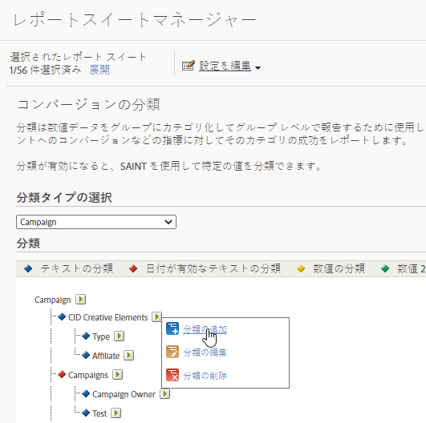

# コンバージョンの分類

分類は値をグループにまとめてグループレベルで報告するために使用します。例えば、すべての有料検索キャンペーンを「*ポップミュージック用語*」という分類に入れて、インスタンス（クリックスルー）や成功イベントへのコンバージョンなどの指標に関してそのカテゴリの成功を報告します。

コンバージョン分類では、コンバージョン変数を分類できます。分類後は、主要データを使用して生成できるすべてのレポートは、関連付けられたデータプロパティを使用して生成することもできるようになります。

分類を有効にした後、[分類インポーター](/help/components/classifications/importer/c-working-with-saint.md)を使用して、該当する分類に特定の値を割り当てます。

>[!WARNING]
>
>分類の名前を変更すると、[分類ルールビルダー](/help/components/classifications/crb/classification-rule-builder.md)で作成した既存のルールで問題が発生する可能性があります。 分類ルールを持つ分類の名前を変更する場合は、名前を変更した分類を指すように各ルールを修正してください。

## コンバージョン分類の説明

| 要素 | 説明 |
| --- | --- |
| 名前 | 分類の名前 |
| 有効な日付（テキストのみ） | テキスト分類がキャンペーン変数の日付範囲かどうかを示します。 |
| オプション（テキストのみ） | その分類に使用できる分類値のリストを作成します。オプションはキャンペーン変数で使用され、キャンペーンマネージャーの分類でサポートされている値のリストをユーザーに提供します。 |
| 数値のタイプ（数値のみ） | 数値分類での数値のタイプを指定します。オプションには「数値」、「パーセント」、「通貨」があります。 |

## コンバージョン分類の追加

管理でコンバージョン分類を追加する方法について手順を説明します。

1. **[!UICONTROL 管理者]**／**[!UICONTROL レポートスイート]**&#x200B;の順にクリックします。
1. レポートスイートを選択します。
1. **[!UICONTROL 設定の編集]**／**[!UICONTROL コンバージョン]**／**[!UICONTROL コンバージョンの分類]**&#x200B;の順にクリックします。
1. **[!UICONTROL 分類タイプの選択]**&#x200B;ドロップダウンリストで分類の追加先の変数を選択します。

   

1. 「**[!UICONTROL 分類の編集]**」アイコンにマウスを移動して、「**[!UICONTROL 分類の追加]**」を選択します。
1. 「**[!UICONTROL タイプの選択]**」フィールドで、変数に追加する分類のタイプを選択します。

   オプションには「**[!UICONTROL テキスト]**」と「**[!UICONTROL 数値]**」があります。分類タイプの詳細については、「[分類について](/help/components/classifications/c-classifications.md)」を参照してください。
1. **[!UICONTROL テキスト分類]**&#x200B;ダイアログボックスで、必要に応じて分類を設定します。

1. **[!UICONTROL ドロップダウンリスト]**&#x200B;ダイアログボックスで、オプションを追加または削除します。

   オプションを追加すると、その分類に使用できる分類値のリストが作成されます。campaign 変数でこのオプションを使用して、キャンペーンマネージャーの分類でサポートされている値のリストをユーザーに提供することができます。このリストは、ほとんどまたはまったく変更がない少数の値を許可する分類ディメンションに使用します。例えば、異なるレベルの顧客忠誠度（シルバー、ゴールド、プラチナ）向けに異なるキャンペーンを実施するとします。その際、ドロップダウンリストを使用すると、3 つのレベルに適した値だけを受け付けることが可能です。異なる値を使用しようとすると、破棄されます。

1. 「**[!UICONTROL 保存]**」をクリックします。

## コンバージョンの分類の削除

不要になった時点でコンバージョンの分類を削除します。

1. スイートのヘッダーで&#x200B;**[!UICONTROL 管理者]**／**[!UICONTROL レポートスイート]**&#x200B;の順にクリックして、Report Suite Manager を開きます。
1. レポートスイートを選択します。
1. **[!UICONTROL 設定の編集]**／**[!UICONTROL コンバージョン]**／**[!UICONTROL コンバージョンの分類]**&#x200B;の順にクリックします。
1. **[!UICONTROL 分類タイプの選択]**&#x200B;ドロップダウンリストで分類を削除する変数を選択します。
1. 「**[!UICONTROL 分類の編集]**」アイコンにマウスを移動して、「**[!UICONTROL 分類の削除]**」を選択します。
1. 分類の削除ダイアログボックスで「**[!UICONTROL 削除]**」をクリックします。
