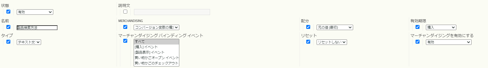
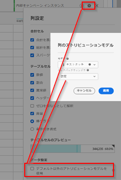

# マーチャンダイジングeVarと製品検索方法

この非常に詳細なドキュメントでは、マーチャンダイジングeVarの概念を説明します。マーチャンダイジングeVarは、標準的なeVarとは異なる方法でデータを処理および割り当てします。 また、マーチャンダイジングeVarと製品検索方法との関係についても説明します。

## 概要

マーチャンダイジングeVarを使用すると、eVarによって取り込まれた値に、*訪問あたり/注文あたり*&#x200B;レベルではなく&#x200B;*製品ごとの*&#x200B;レベルで成功したアクティビティを割り当てることができます。

ほとんどの小売Webサイトには商品を見つける方法が多数ありますが、Adobeでは、Adobe Analyticsですべての小売クライアントが追跡する必要がある基本的な商品検索方法は次のとおりと見なします。

* 内部検索キーワード
* 内部キャンペーントラッキングコード
* マーチャンダイジング/閲覧のカテゴリ
* クロス販売リンク

このドキュメントの目的上、次のようにeVarをいくつかソリューションにマッピングします。

* eVar2:内部検索キーワード
* eVar3:内部キャンペーントラッキングコード
* eVar4:マーチャンダイジング/閲覧のカテゴリ
* eVar5:クロス販売リンク

追加のeVarを使用して、すべての製品検索方法のパフォーマンスを相互に測定できます。 上記の検索方法に加えて、外部のWebサイトからの製品の詳細ページへのリンクなど、比較対象となる他の検索方法もeVarに含まれます。

* eVar1:製品検索方法

これらの変数を標準のeVarに設定する代わりに、マーチャンダイジングeVarに設定します。

これらの変数の設定方法を示すために、訪問者が内部キーワード検索「サンダル」を使用してサイト上の製品を検索する例を以下に示します。 キーワード検索結果ページで、データを少なくとも2つのeVarに取り込む必要があります。

* `eVar2` が検索で使用されたキーワード（「サンダル」）と等しい
* `eVar1` が、使用する製品の検索方法（「内部キーワード検索」）と等しい。

これらの2つの変数をこれらの特定の値に等しく設定すると、訪問者が内部キーワード検索用語「サンダル」を使用して製品を見つけることがわかります。 同時に、訪問者が他の製品検索方法を使用して商品を検索していないことがわかります（例えば、訪問者がキーワード検索を実行するのと同時に、商品カテゴリを閲覧していない場合など）。 製品ごとの適切な配分を確実におこなうために、これらの未使用の方法は、内部キーワード検索で見つかった製品を見つけ出すクレジットを受け取らないでください。 したがって、他の検索方法に関連付けられたeVarを自動的に「非検索方法」の値に設定するロジックをコード（AppMeasurement、AEP Web SDKなど）に挿入する必要があります。

例えば、ユーザーが「サンダル」というキーワードを使用して製品を検索する場合、Analyticsコードのロジックでは、内部キーワード検索結果ページで変数を次と等しく設定する必要があります。

* eVar2=&quot;サンダル&quot;:内部キーワード検索で「サンダル」というキーワードが使用された
* eVar1=&quot;内部キーワード検索&quot;:「内部キーワード検索」検索方法が使用されました。
* eVar3=&quot;非内部キャンペーン&quot;:内部キャンペーンが検索結果ページへのアクセスに使用されなかった
* eVar4=&quot;non-browse&quot;:検索結果ページで参照カテゴリにアクセスできませんでした
* eVar5=&quot;non-cross-sell&quot;:検索結果ページでクロス販売リンクがクリックされなかった問題を修正しました。

## マーチャンダイジングeVar設定

マーチャンダイジングeVarで使用できる設定は次のとおりです。 Report Suite Managerのスクリーンショットを次に示します。 これにアクセスするには、[!UICONTROL Analytics] / [!UICONTROL 管理者] / [!UICONTROL レポートスイート] / [!UICONTROL 設定の編集] / [!UICONTROL コンバージョン] / [!UICONTROL コンバージョン変数] [!UICONTROL 新しい] > [!UICONTROL マーチャンダイジングを有効にする]を追加します。



これらの設定の詳細については、表の下のセクションを参照してください。

| 設定 | 説明 |
|--- | --- |
| 名前 | 変数を関連付ける名前、またはレポートディメンション。 `eVar1`が製品検索方法を取り込む場合は、`eVar1`の「名前」フィールドを「製品検索方法」に設定する必要があります。 |
| マーチャンダイジング | マーチャンダイジングeVar値の取得に使用される構文のタイプ |
| 配分 | が、成功したイベントが発生したときにクレジットを受け取る必要があるマーチャンダイジングeVar値を決定するのに役立ちます。 |
| 有効期限 | 既存の製品とマーチャンダイジングeVarの連結を有効にしないタイミングを指定します。 |
| タイプ | マーチャンダイジングデータで収集されるeVarのタイプ |
| マーチャンダイジングバインディングイベント | 製品をマーチャンダイジングeVar値に結び付けるタイミングを決定するイベント |
| リセット | その時点でeVarのすべてのバックエンドデータをリセットするトリガー |
| マーチャンダイジングを有効にする | eVarを標準eVarからマーチャンダイジングeVarに変換するには、「有効」に設定する必要があるフラグ |

### マーチャンダイジングを有効にする

「マーチャンダイジングを有効にする」設定が「有効」に設定されている場合、以下に説明するすべての設定がReport Suite Managerに表示されます。 「マーチャンダイジングを有効にする」設定を「無効」に設定した場合は、標準のeVar設定のみ使用できます。

### マーチャンダイジング

このオプションは、標準のeVarでは使用できません。 [!UICONTROL マーチャンダイジング]設定を使用すると、マーチャンダイジングeVarの値を取り込む方法として、[!UICONTROL コンバージョン変数の構文]または[!UICONTROL 製品の構文]を選択できます。

**[!UICONTROL コンバージョン変]** 数構文とは、ユーザーが独自の変数にeVar値を設定したことを意味します。例えば、コンバージョン変数の構文を使用する場合、「内部キーワード検索」の`eVar1`値は、ページコード（またはAppMeasurementコード、AEP Web SDKコードなど）内で次のように設定されます。

`s.eVar1="internal keyword search";`

ただし、**[!UICONTROL 製品の構文]**&#x200B;を使用すると、eVarはAdobe Analytics製品変数内にのみ設定されます。 Analyticsの製品変数は、製品ごとに6つの異なる部分に分かれています。

`s.products="[category];[productID];[quantity];[revenue];[events];[eVars]"`

*  Categoryは非推奨（廃止予定）の機能で、製品カテゴリのパフォーマンスを追跡するための実行可能なオプションとして推奨されなくなりました。単なる存在は、products変数のほとんどの実装で、変数値のproductID部分の前に1つのセミコロンを置く理由を示しています。
*  数量と売  上高は、製品購入が追跡されている場合に役立ちます。
*  イベントは、売上高としてカウントされないカスタムの増分イベント値または通貨イベント値（送料、割引など）を記録するのに役立ちます。

製品構文を使用するように設定されたマーチャンダイジングeVarは、products変数の最後の部分に設定されます。 例えば、訪問者が内部のキーワード検索を使用して製品ID「12345」を見つけたとします。 この例でeVar1を設定する際の製品の構文に基づく方法は、次のようになります。

`s.products=";12345;;;;eVar1=internal keyword search";`

products変数の量、売上高、イベント部分のセミコロン区切りのプレースホルダーが残っていることに注意してください。  これらのプレースホルダーがないと、内部キーワード検索の`eVar1`設定は完全に無視されます。

### 配分

特にコンバージョン変数構文を使用するマーチャンダイジングeVarでは、マーチャンダイジングeVarに対して「配分」という用語が誤解を招きます。 すべての標準eVarに、独自の配分設定を設定できます。 ただし、コンバージョン変数構文を使用するマーチャンダイジングeVarでは、Report Suite Managerの配分設定に関係なく、「最新（最後）」の配分設定のみが使用されます。

この設定の意味を理解することは、eVar割り当てとマーチャンダイジングeVarバインディングの違いを理解することです。 マーチャンダイジングeVarの場合、「マーチャンダイジングeVarバインディング」は、この「配分」設定のより適切な名前です。

**標準eVar割り当て設定**

標準構文のeVarがイメージリクエストから収集されるたびに、Adobe Analytics処理サーバーは`post_evar`列と呼ばれる別のデータベース列にデータを挿入します。 eVarは永続的であることを目的としており、ほとんどの場合、現在のヒットのある時点を超えて期限切れになります。その後のイメージリクエストのたびに、この`post_evar`列を設定します。 対応するeVarに渡された最後の値と等しく設定されます。 標準的なeVarの場合、成功イベントが発生すると、Adobe Analyticsでは通常のeVar列ではなく`post_evar`列を使用して、イベントのクレジットとして付与するeVar値を決定します。

標準のeVarの場合、配分設定によって、特定の期間に収集された最初のeVar値と最後のデータ値のどちらを`post_evar`列に挿入するかが決まります。 標準eVarの配分設定が「元の値（最初）」に等しい場合、訪問者から収集された最初のeVar値が、以降のすべてのイメージリクエストの`post_evar`列に挿入されます。 これは、eVarが「有効期限」設定に従って期限切れになるまで、この訪問者のブラウザーから送信される今後のすべてのリクエストに対して続行されます。

標準eVarの配分設定が「最新（最後）」に等しい場合、訪問者から収集された最新のeVar値は、以降のすべてのイメージリクエストの`post_evar`列に入力されます。 「最新（最後）」の配分は、対応するeVarがイメージリクエストの新しい値に設定されるたびに`post_evar`の値が変更されることを意味します。 「元の値（最初）」の配分は、対応するeVarが将来のイメージリクエストで異なる値に設定される場合でも、ヒット間で`post_evar`列が変化しないことを意味します。

**マーチャンダイジングeVar割り当て（バインディング）設定**

前述のように、コンバージョン変数構文を持つすべてのマーチャンダイジングeVarには「最新（最後）」のみが割り当てられています。  「配分」設定は、実際にはマーチャンダイジングeVarに対して次のことを意味します。前述のとおり、訪問者が引き続きサイトを使用するので、この設定は`post_evar`列に挿入される値を決定しません。 マーチャンダイジングeVarの配分設定は、製品にバインドされたeVar値と、その成功イベントを連結されたeVar値に割り当てる方法を決定します。

マーチャンダイジングeVarの配分（バインディング）設定が「元の値（最初）」に等しい場合はどうなるかを説明します。 `post_evar`列と共に設定され、以前にpost_evar列の対応する「前処理済み」eVarにバインドされていない製品は、`post_evar`列に含まれる値にバインドされます。 eVar値と製品の間のこの連結は、eVarがレポートスイート設定の「有効期限」設定に従って期限切れになるまで変更されません。

イメージリクエストが、既にバインドされている製品を最新の設定eVar値にバインドする条件を満たす場合、「元の値（最初）」設定により、Adobe Analyticsデータ収集サーバーはそれ以上の試みを無視します。 この逆は、「配分（バインディング） 」設定が「最新（最後）」に等しいマーチャンダイジングeVarで発生します。 イメージリクエストが商品をマーチャンダイジングeVarにバインドする条件を満たすたびに、商品自体が、eVarに渡された最新の値、または`post_evar`列に含まれる（常に）値にバインド（および再バインド）されます。

前述のように、マーチャンダイジングeVarでは、成功イベントを、訪問別/注文別ではなく、製品別の値に割り当てることができます。 したがって、連結された製品に成功イベント（買い物かごの追加や購入など）が関連付けられている場合、成功イベントは製品とその製品が結び付けられているマーチャンダイジングeVar値の両方にクレジットを与えます。

### 有効期限

マーチャンダイジングeVarの有効期限設定では、

* 製品とeVarの連結の両方が期限切れになり、

* イメージリクエストにeVarが渡された後にpost_evar列が自動的に入力されなくなった場合。

eVarの有効期限は、成功イベントが記録された場合、または一定期間が経過した場合に発生する可能性があります。 Adobe Analyticsでは、eVar1つにつき、一度に1つの有効期限設定のみ使用できます。

製品の検索方法では、マーチャンダイジングeVarの有効期限をに設定するベストプラクティスは次のとおりです。

* サイトが商品を買い物かごから自動的に削除するまでに商品がサイトの買い物かごに入れられた時間
* または、購入イベントが発生した場合。

どちらの設定でも、訪問者が購入する製品には、その製品が当時バインドされていたマーチャンダイジングeVarの値に割り当てられた注文/単位/売上高のクレジットが割り当てられます。

### タイプ

eVar型の設定は、データに挿入するeVarの種類を決定します。 ほとんどの場合、この値は「テキスト」に等しい必要があります。 マーチャンダイジングeVarに「カウンター」を使用することはまれです。 ただし、「カウンター」は、製品ごとのカウンターeVar値に成功を割り当てるために使用できます。  「カウンター」タイプのソリューションの議論は、このドキュメントの範囲外です。

### マーチャンダイジングバインディングイベント

「マーチャンダイジングバインディングイベント」設定を使用すると、商品をマーチャンダイジングeVarの値にバインドする条件を指定できます。 これらの条件は、特定の成功イベントまたはeVarの実行のみに制限されます。 トラフィック変数（propなど）が発生しても、マーチャンダイジングバインディングには影響しません。

「マーチャンダイジングバインディングイベント」設定では、複数のイベントを使用して1つの製品をeVar値に結び付けることができます。 例：

* 製品表示イベントを使用
* 買い物かごへの追加イベント
* 購入イベントを使用

デフォルトでは、この設定は、他のイベント/eVar（マーチャンダイジングまたは標準）が製品と同じイメージリクエストに含まれる場合は常に、製品をマーチャンダイジングeVar値に連結します。

### リセット

「リセット」設定を使用すると、現在Adobe Analyticsバックエンドデータベースに`post_evar`値があるすべての訪問者のすべてのeVar値を直ちに「期限切れ」にできます。 また、現在の製品とeVarの連結もすべて削除されます。

>[!IMPORTANT]
>Adobeでは、リセットがおこなわれた時点から完全に「新しい」eVarでをやり直す必要がある場合を除き、リセット設定の使用はお勧めしません。

## どの設定を使用する必要がありますか？

使用可能な設定の組み合わせの中で、次の点に疑問を持つ場合があります。ベストプラクティスはどの設定ですか？

「内部キーワード検索」を製品ID 12345にバインドする場合、products変数は次のように設定されます。

`s.products=";12345;;;;eVar1=internal keyword search";`

productID 12345と同時にキャプチャされた成功イベント（買い物かごの追加、購入）のクレジットは、製品ID 12345と「内部キーワード検索」の`eVar1`値の両方に付与されます。 製品ID 12345に関連付けられた成功イベントに対して、別の`eVar1`値がクレジットを受け取る唯一の方法は、 `eVar1`が後で製品変数内の&#x200B;**別の**&#x200B;値(製品ID 12345と共に)に設定された場合です。 例：

`s.products=";12345;;;;eVar1=internal campaign";`

この設定により、製品ID 12345のバインディングが「内部キーワード検索」の`eVar1`値から「内部キャンペーン」の`eVar1`値に変更されます。 この再バインドは、eVar構文が使用され、製品の配分（連結）設定が「最新（最後）」に設定されるたびに実行されます。 「配分（連結）」設定が「元の値（最初）」に設定されている場合はどうなりますか？ その場合、eVar1を製品ID 12345と同じ「内部キャンペーン」に設定しても、製品ID 12345を「内部キャンペーン」のeVar1値に再バインドしません。 連結は、元の連結値（「内部キーワード検索」）に保持されます。

### 製品の構文を使用する際の課題

慎重な計画を立てずに、製品構文の使用によっていくつかの問題が生じる場合があります。 複数のeVarを使用してWebサイト上の製品検索方法を追跡する場合を考えてみましょう。 ここでは、特定の検索方法のeVarクレジット（および他の検索方法のeVarにクレジットがない）を与えるために、個々の製品検索方法eVarを同時に設定する必要があります。 製品の構文はこのようなシナリオで使用できますが、デプロイするコードはより複雑です。

元の「サンダル」の例を使用し、製品構文を使用するように適応する場合（訪問者が「サンダル」というキーワード用語を使用して「sandal123」のIDを持つ製品を見つけた場合）、結果のproducts変数を次のように設定する必要があります。

`s.products=";sandal123;;;;eVar2=sandals|eVar1=internal search|eVar3=non-internal campaign|eVar4=non-browse|eVar5=non-cross-sell";`

この例ではproducts変数の構文は長くなりますが、表示された各eVar値が「sandal123」の製品IDに連結されます。 それ以降は、「sandal123」製品と同時にキャプチャされた成功イベント（買い物かごの追加、購入など）が、最後に製品にバインドされたeVar値にクレジットされます。  このコードサンプルは、上記のeVarが「sandal123」製品にバインドされた後に、「sandal123」製品（79.95ドル）の1単位の購入がおこなわれたかどうかを示します。

```
s.products=";sandal123;1;79.95";
s.events="purchase";
```

次の値には、すべて1つの注文、1つの単位、およびそれらに起因する売上高の$79.95が含まれます。

* 「eVar」の値2
* eVar1の「内部キーワード検索」の値
* eVar3の「非内部キャンペーン」の値
* eVar4の「non-browse」値

これは正しいアトリビューションで、問題ではありません。 むしろ、このアプローチの主なジレンマは、製品検索方法eVarの設定方法と設定タイミングの決定です。

ほとんどの場合、製品検索方法eVarは、検索方法が実際に使用されたページ（キーワード検索結果ページ、参照ページ、内部キャンペーンランディングページなど）ではなく、製品の詳細ページで設定する必要があります。 訪問者がある程度製品を操作するまで、製品が真に「見つからなかった」と仮定するのは妥当です。 したがって、複数の製品が（通常は）そのようなページに表示されるので、これらのeVar（製品構文を使用した）を検索方法ページに設定しないでください。 検索方法の値を、訪問者がやり取りした製品のみに結び付けます。

さらに、検索方法のページを表示している間、訪問者は、個々の製品の詳細ページに移動するリンクをクリックしたり、検索方法のページから直接買い物かごに個々の製品を追加したりできます。 アドビの「サンダル」検索キーワードの例を使用して、訪問者がキーワード検索結果ページから買い物かごに「sandal123」製品を直接追加した場合、買い物かごに追加するコード（「買い物かごに追加」ボタンのonClickイベントなどを使用） は、買い物かごの追加がおこなわれる際に動的に生成されるか、ページコードまたはタグ管理システムを介して直接「ハードコード」される必要があります。  そのような場合に実行するコードは、次のようになります。

```
s.linkTrackVars="products,events";
s.linkTrackEvents=s.events="scAdd";
s.products=";sandal123;;;;eVar2=sandals|eVar1=internal keyword search|eVar3=non-internal campaign|eVar4=non-browse|eVar5=non-cross-sell";
s.tl(true,"o","Cart Add")
```

このコードは、上記のeVar値を「sandal123」製品に適切にバインドします。 ただし、クリックイベントの発生時にこれらの値を適切に設定するには、開発者は次の操作を行う必要があります。

* 製品検索方法eVarに挿入する必要がある値を決定する検索結果ページにサーバー側ロジックを追加し、
* 構文エラーなしで、上記の製品変数全体を組み立てます。

また、訪問者が製品の詳細ページへのリンクをクリックして「検索」を決定した場合は、開発者は次の操作をおこなう必要があります。

* 商品検索方法の詳細（上述のとおり）を検索方法のページから商品詳細ページに渡し、 * *前のページから渡した項目から同じ商品変数値を組み立てます。

このソリューションには、実現不可能な高いレベルの複雑さが必要です。

### 製品の構文が役立つ場所

製品構文は、

* 同じ製品IDを持つ複数の製品が、同時に
* このような製品に結び付けるeVarは、製品IDごとに異なる値を持つ必要があります。

例えば、多くの衣料品には「子SKU」があり、これはサイズ、色、スタイルおよびその他の属性を示します。 これらの属性は、同じ親製品に属する他の製品と1つの子製品を分離します。 例えば、中青のTシャツに大きなTシャツを加えて購入するとします。 両方のシャツに「tshirt123」の親製品IDがあり、`eVar10`が子SKUを取り込むように設定されているとします。 購入確認ページで設定される変数は次のように設定されます。

```
s.events='purchase';
s.products=';tshirt123;1;20;;eVar10=tshirt123-m-blue,;tshirt123;1;20;;eVar10=tshirt123-l-red"
```

この場合、「tshirt123-m-blue」と「tshirt123-l-red」の`eVar10`(childSKU)値の両方が、製品ID「tshirt123」のそれぞれのインスタンスの購入に対するクレジットを受け取ります。

### 「最新」の割り当てに関する課題

「最新（最後）」の「配分（連結）」設定を使用すると、追加の問題が発生する場合があります。 多くのWebブラウジングエクスペリエンスでは、訪問者は、既に表示した製品や買い物かごに追加した製品を「再検索」します。 これは通常、後続の訪問で発生するか、購入を完了する直前に発生します。 サイトへの初回訪問時に、「サンダル」のキーワード検索で「sandal123」製品を見つけたとします。 すぐに、キーワード検索結果ページから買い物かごに追加されました。 買い物かごへの追加をキャプチャするコードは、次のように設定されます。

```
s.linkTrackVars="products,events";
s.linkTrackEvents=s.events="scAdd";
s.products=";sandal123;;;;eVar2=sandals|eVar1=internal keyword search|eVar3=non-internal campaign|eVar4=non-browse|eVar5=non-cross
```

その結果、このイメージリクエストに表示される各eVar値が「sandal123」製品にバインドされます。

次に、訪問者がこの訪問中に製品を購入せず、3日後にサイトに戻ったと仮定します。 既に「サンダル123」製品を買い物かごに追加していることを知っています。 しかし、購入前にもっと詳しく知りたいと考えています。 訪問者は、キーワード検索を使用して商品を見つける代わりに、サイトを閲覧します。 製品を「再検索」する直前に、「女性/靴/サンダル」マーチャンダイジングの閲覧セクションに移動します。 「sandal123」製品の製品の詳細ページが「再検索」されると、変数は次のように設定されます（ページ読み込み時）。

```
s.events="prodView";
s.products=";sandal123;;;;eVar4=womens > shoes > sandals|eVar1=browse|eVar3=non-internal campaign|eVar2=non-search|eVar5=non-cross-sell";
```

「配分（バインディング） 」設定が「最新（最後）」の場合、「sandal123」製品は、元のeVar値とはまったく異なるデータ値に再バインドされます。 さらに、訪問者が「sandal123」の購入を完了すると、元々バインドされていた値ではなく、新しくバインドされたeVar値に対してすべての購入クレジットが与えられます。

ここでの質問は次のとおりです。どのeVar値が購入のクレジットを受ける必要がありますか？ 訪問者は、内部キーワード検索を通じて最初に「sandal123」製品を見つけたことに注意してください。 その後、検索結果ページから直接買い物かごに追加しました。 したがって、「内部キーワード検索」のeVar1値(および「サンダル」のeVar2値)が購入のクレジットを受け取る必要があります。 ただし、「配分（連結）」設定は「最新（最後）」に設定されています。 したがって、「browse」のeVar1値(および「womens/靴/サンダル」のeVar4値)が代わりに購入クレジットを受け取ります。 これは、訪問者が購入を完了する前に「sandal123」にバインドされた最後の値であったためです。

この問題の解決策は、マーチャンダイジングeVarの「配分（バインディング）」設定を「最新（最後）」から「元の値（最初）」に変更することです。 これにより、訪問者が製品を「再検索」した回数に関係なく、購入が発生したときに、「sandal123」製品にバインドされた元のeVar値がクレジットを受け取ります。

訪問者が買い物かごに商品を追加したが購入しなかった場合、eVarの有効期限を使用すると、新しい検索方法の値を商品に結び付けることができます。 eVarの有効期限は、製品が自動的に削除される前に、Webサイトが製品を買い物かごに入れておく時間と同じにする必要があります。

### コンバージョン変数の構文の使用

では、「製品の構文」に戻ります。「コンバージョン変数の構文」に関する質問。 Adobeは、製品検索方法マーチャンダイジングeVarを収集し、訪問者が見つけた製品にその値を結び付ける、より簡単な方法を発見しました。コンバージョン変数の構文を使用すると、クライアントの開発者が担当する実装作業が軽減されます。 製品の構文と同じ、またはより優れた情報を提供します。 開発者は、提供されたデプロイメント手順に従うだけです。残りのコードは、Adobe AppMeasurement/AEP Web SDKファイルに配置できます。

例えば、内部キーワード検索のパフォーマンスを追跡するために推奨されるソリューションを見てみましょう。 これは、キーワード検索結果ページで、コードがprop（prop4など）と別のprop（prop5など）を介して検索されたキーワードをキャプチャすることを意味します。 これらのpropは、検索で表示される結果の数を追跡します。 検索結果ページでAdobe Analyticsイメージリクエストが生成されるたびに、開発者がデプロイしたデータレイヤーオブジェクト（またはページコード）を使用して、上記の変数(prop)に入力しました。

AppMeasurement/AEP Web SDKファイルに含まれる追加のロジックによって、同時に設定する必要のある残りの変数（マーチャンダイジングeVar/ディメンション）を入力できます。\
例えば、新しい訪問者が「サンダル」というキーワード検索をおこなった場合、検索結果ページで25件の結果が返され、呼び出されるコード（ページコードまたはデータレイヤーキャプチャを介して）は次のようになります。

```
s.prop4="sandals";
s.prop5="25";
```

AppMeasurement/Analytics SDKファイル内のロジックは、コードのこのスニペットを自動的に次のコードに変換できます。

```
s.prop4="sandals";
s.prop5="25";
s.eVar2="sandals";
s.eVar1="internal keyword search";
s.eVar3="non-internal campaign";
s.eVar4="non-browse";
s.eVar5="non-cross sell";
```

ページ間でデータを渡すことや、products変数に挿入する大きくて手持ちのない文字列を作成しようとすることについて心配する必要はありません。 代わりに、開発者は、トラッキングソリューションの一部（propに挿入されたもの）を実装し、残りの実装をAdobeコンサルティングが提供するカスタムコードに残すことができます。

前述したように、コンバージョン変数構文を使用するすべてのマーチャンダイジングeVarの配分設定は「最新（最後）」になります。 eVarが任意の値に設定されると、その値は（post_evar列を介して）後続のすべてのヒットで保持されます。 この値は、異なる値に設定されるか、eVarの有効期限が切れるまで保持されます。 したがって、eVarが設定された後にやり取りする製品が、それらのeVarにまだバインドされていない場合は、eVarに渡される「最新（最後）」の値にバインドされます。

上記の例では、「サンダル」の`eVar2`値と「内部キーワード検索」のeVar1値などです。 キーワード検索の実行後に表示されるすべてのページで保持されます。 eVarが他の値で上書きされるまで保持されます。 訪問者がキーワード検索結果ページから、「sandal123」製品IDの製品の詳細ページへのリンクをクリックしたとします。  次に、「sandal123」製品ID（まだバインドされていない場合）を、post_evar列に含まれる各値または前の（検索結果）ページで収集されたeVar値にバインドします。

コンバージョン変数の構文を再検討する必要があります。 バインディングイベントは、製品にeVar値をバインドするように設定する必要があります。 Adobe Analyticsイメージリクエストで、製品と（products変数で）一緒に（独自の変数に）マーチャンダイジングeVarを設定するだけでは、eVar値が製品に結び付くわけではありません。  代わりに、Report Suite Managerの「マーチャンダイジングバインディングイベント」設定によって、eVar値を製品にバインドする条件が決定されます

商品が「見つかった」ことを意味する商品のやり取りが発生した場合は常に、商品検索方法のeVar値を商品に連結するので、最も一般的な「商品見つけた」やり取りは、商品表示（商品詳細ページへの訪問者）または買い物かご追加(

したがって、これら2つのイベント(prodView、scAdd)を「基本」マーチャンダイジングバインディングイベントとして選択できます。
これらのバインディングイベントのいずれかがイメージリクエスト内に含まれている場合、次の処理がおこなわれます。 同じリクエスト（products変数内）に含まれ、マーチャンダイジングeVarにバインドされていない製品IDは、マーチャンダイジングeVar（post_evar列）に渡された最新の値にバインドされます。 「配分（連結） 」設定が「元の値（最初）」に設定されている場合、この元の連結後にこれらの製品を再連結しようとしても無視されます。

### ベストプラクティス設定

ベストプラクティスの設定は次のとおりです。 最適な結果を得るために、製品検索方法を簡単に実装できます。 Adobeでは、クライアントが（一般に）各製品検索方法のマーチャンダイジングeVarを次のように設定することをお勧めします。

* マーチャンダイジング有効：有効
* マーチャンダイジング[構文]:コンバージョン変数の構文
* 割り当て[バインディング]:元の値（最初）
* 有効期限：製品が自動的に削除されるまでに買い物かごに入ったままの時間（14日、30日など）。  該当する時間がない場合は、「購入」イベントの後に有効期限が切れます
* 型：テキスト
* マーチャンダイジングバインディングイベント： 製品表示、買い物かごへの追加、購入

## バインディングイベントの実際の動作

製品変数と同じサーバー呼び出しにバインディングイベントが含まれている場合、post列のマーチャンダイジングeVar（コンバージョン変数の構文を使用）値がproducts変数にバインドされます。 前の例に基づいて、1つのサーバー呼び出しに次のマーチャンダイジングeVar値が含まれているとします。

```
s.eVar2="sandals";
s.eVar1="internal keyword search";
s.eVar3="non-internal campaign";
s.eVar4="non-browse";
s.eVar5="non-cross sell";
```

前述のように、上記のeVarは、それぞれのpost_evar列を介して現在のヒットの後に持続します。 したがって、Adobeのサーバーは、上記のeVarを次のように変換します。

```
post_eVar2="sandals";
post_eVar1="internal keyword search";
post_eVar3="non-internal campaign";
post_eVar4="non-browse";
post_eVar5="non-cross sell";
```

これらのpost列はAdobeのデータベースに保存され、最初に設定された現在のヒットの後も保持されます。 これは、有効期限や変数のリセットが行われないことを前提としています。  Adobeのサーバーは、バインディングイベントとproducts変数の両方を含む今後のサーバー呼び出しを処理する際に、これらのpost_evar値を「使用可能」にします。

バインディングは、これらのpost_evar値とproducts変数の内容の間でのみ実行されます。 バインディングイベントは、必ずしもeVar変数またはproducts変数に「バインド」されるわけではありません。 Adobeサーバーにpost_evar値を製品にバインドするように指示するのは「catalyst」です。

将来のヒットで、次の変数が設定されるとします。

```
s.products=";sandals123"
s.events="prodView";
```

post_evar列では、このヒットが次のようにAdobe処理サーバーに表示されます。

```
s.products=";sandals123"
s.events="prodView";
post_eVar2="sandals";
post_eVar1="internal keyword search";
post_eVar3="non-internal campaign";
post_eVar4="non-browse";
post_eVar5="non-cross sell";
```

eVar1、eVar2、eVar3、eVar4、eVar5がバインディングイベントとして`prodView`を使用するように設定されているとします。 これらのeVarのいずれかがprodViewをバインディングイベントとして使用するように設定されていない場合、その（誤った設定の）eVarとproducts変数のバインドは実行されません。

バインディングは、非常に興味深い結果を生み出し、post_products列の値に表示されます。 バインディングは、上記のコードを変換し、次のように、さらにいくつかのpost列を設定します。

```
post_events="prodView"
post_products=";sandals123;;;;eVar2=sandals|eVar1=internal keyword search|eVar3=non-internal campaign|eVar4=non-browse|eVar5=non-cross-sell"
```

post_products列に含まれる値は、よく知られている場合があります。 このドキュメントを上にスクロールして、の下に示すように、このpost_products値とs.products値を比較します。  post_products列は、製品変数の構文を使用して設定されます。

つまり、バインディングでは、コンバージョン変数の構文eVar値を製品の構文を使用してproducts変数に「コピー」します。 このコピーアクションは、products変数と(eVar設定を介して設定された)バインディングイベントが同じリクエストに含まれている場合にのみ実行されます。 その時点で、post_data列に含まれる値がeVarに連結されます。 このバインディングは、post_products列に格納された製品の構文で表されます。

## マーチャンダイジングeVar、インスタンス指標、Attribution IQ

標準eVarがAnalyticsサーバーコールで送信されると、そのpost_evar列の値には常に、その標準データに属するインスタンスが取得されます。 インスタンスは、イメージリクエスト内の特定の値に等しくeVarが設定された回数を表します。

例えば、`eVar10`が[!UICONTROL ラストタッチ]アトリビューションを持つ標準eVarであるとします。 任意のページで`s.eVar10="hello world"`を設定した場合、Adobeがヒットを処理する際に、「hello world」の値がpost_evar10列に渡されます。 インスタンス指標は、`hello world`の個々の`eVar10`設定の「1」に等しくなります。 post_evar列に値が含まれる場合、インスタンスが記録されない場合があることに注意してください。 代わりに、インスタンスの記録時にインスタンスを取得する値はpost_evar列で決まります。

マーチャンダイジングeVarのインスタンスは、eVarが収集する値にアトリビューションを与えます。 ただし、これは、マーチャンダイジングeVar値に結び付けられた製品が同時に「インタラクション」された場合にのみ発生します。

例えば、`s.eVar1="Internal Keyword Search"`を単独で設定しても、「内部キーワード検索」のeVar1値にインスタンス指標のクレジットは与えられません。 インスタンスは、その時点で記録されます。 ただし、製品が同時に「内部キーワード検索」の値`eVar1`に結び付けられない限り、インスタンスは「未指定」バケットに関連付けられます。 つまり、「内部キーワード検索」の`eVar1`値はインスタンスを取得できます。 ただし、これは、同じイメージリクエストのproducts変数で「内部キーワード検索」の値にバインドされている製品が表示された場合にのみ発生します。

要約すると、追加の設定を行わない限り、マーチャンダイジングeVarの標準インスタンス指標はあまり役に立ちません。 幸いにも、Adobeは[Attribution IQ](https://experienceleague.adobe.com/docs/analytics/analyze/analysis-workspace/attribution/overview.html?lang=en)をリリースしました。 Adobe Analyticsが収集するカスタマイズされた指標に対して、複数のアトリビューションモデルを適用できます。 これらのアトリビューションモデルを適用する指標では、post_evar列に含まれる値や、特定の製品に連結されている値は使用されません。 代わりに、これらの指標は、イメージリクエスト自体(またはAdobe Analyticsの処理ルールで取り込まれた値)を経由して渡された値のみを使用します。 コンバージョン変数構文を使用するすべてのマーチャンダイジングeVarについて、Attribution IQの機能を使用して、正確にアトリビュートされたインスタンス指標を取得できます。



マーチャンダイジングeVarのインスタンス指標をレポートに追加する場合、適切なAttribution IQモデルは「ラストタッチ」モデルになります。 この場合、モデルのルックバックウィンドウ設定は重要ではありません。 理由は、「強制」ラストタッチアトリビューションモデルは、リクエストを介して渡される各個々の値にインスタンスのクレジットを常に与えるからです。 これは、eVarの実際のアトリビューション/バインディング設定が「最新（最後）」から「元の値（最初）」に等しいかどうかに関係なく、です。
