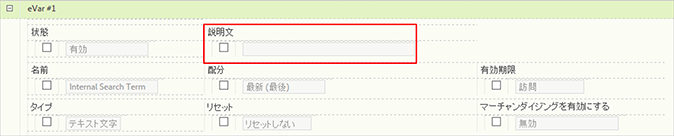

# カスタムレポートの説明

eVar、prop、分類およびイベントに対して、カスタムレポートの説明を入力できます。説明は、すべてのエンドユーザーに表示されます。

**[!UICONTROL Analytics]**／**[!UICONTROL 管理者]**／**[!UICONTROL レポートスイート]**／**[!UICONTROL 設定を編集]**／**[!UICONTROL *変数&#x200B;*]**

>[!NOTE]
>
>従来のほとんどの分類に対して説明を追加できますが、現時点でモバイルの分類には説明を追加できません。

1. レポートの説明を入力します。最大文字数は 255 文字です。
1. 「**[!UICONTROL 保存]**」をクリックします。

説明は、2 か所に表示されます。

* 該当するレポートのタイトルバー：

   

* 左側のナビゲーションでレポートの上にマウスカーソルを置いたときのツールチップ：

   
