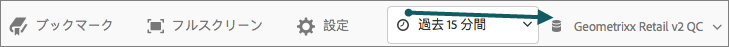
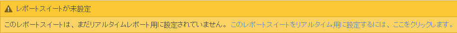
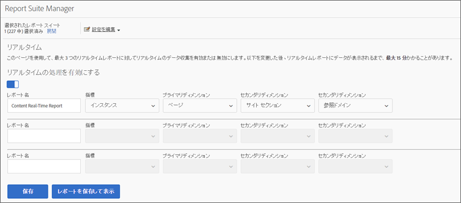
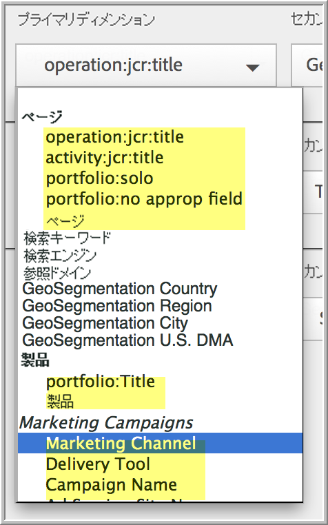
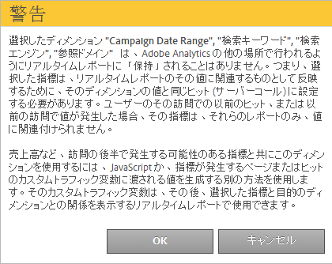

# リアルタイムレポートの設定

リアルタイムレポートを設定するための管理者の手順です。

Reports &amp; Analytics 内でリアルタイムレポートを設定する手順は、レポートスイートを選択する操作と、そのレポートスイートに対して最大 3 つのレポートを設定する操作で構成されます。

1. リアルタイムレポートを有効にするレポートスイートを選択します。

   Navigate to **[!UICONTROL Analytics]** > **[!UICONTROL Reports]** > **[!UICONTROL View All Reports > Site Metrics]** > **[!UICONTROL Real-Time]** and select the report suite from the drop-down at the top:

   

   リアルタイムレポート用に設定されていないレポートスイートのリアルタイムレポートを表示しようとすると、メッセージが表示されます。このメッセージから、レポートスイートの設定を実行できます。

   

1. (歯車ア **[!UICONTROL Configure]** イコン)をクリックして、を実行しま [!UICONTROL Report Suite Manager]す。

   (> > >から **[!UICONTROL Analytics]** も使 **[!UICONTROL Admin > Report Suites]** 用で **[!UICONTROL Edit Settings]** き **[!UICONTROL Real-Time]**&#x200B;ます)。

1. 設定をオンにし **[!UICONTROL Enable Real-Time]** ます。
1. 最大 3 つのレポートに対してリアルタイムデータ収集を設定し、レポートあたり 1 つの指標と 3 つのディメンションまたは分類を使用できます。

   

   サポートされるリアルタイム指標とディメンションについて詳しくは、「[サポートされる指標とディメンション](/help/admin/admin/realtime/realtime-metrics.md)」を参照してください。

   分類を作成している場合は、定義されているディメンションの下に、それらの分類がインデントして表示されます。

   

   >[!NOTE]
   >
   >単一のリアルタイムレポートの場合、ディメンションごとに異なる分類が選択されていても、ディメンションの複製を有効にすることは現在サポートされていません。

   分類の詳細については、「[分類について](/help/components/c-classifications2/c-classifications.md)」を参照してください。

   >[!NOTE]
   >
   >「検索キーワード」や「製品」などのディメンションが Adobe Analytics と同じようにリアルタイムで保持されるとは限りません。永続的ではない指標を選択すると、次の警告が表示されます。

   

1. Click **[!UICONTROL Save]** or **[!UICONTROL Save and View Report]**.

   この最初のレポート設定の後、データのストリーミングが開始されるまでに最大 20 分間かかることがあります。それ以降はデータをすぐに使用できます。リアルタイムレポートの表示については、[リアルタイムレポートの実行](https://docs.adobe.com/content/help/en/analytics/analyze/reports-analytics/t-running-report-types.html)を参照してください。

1. デフォルトでは、すべてのユーザーがリアルタイムレポートにアクセスします。
