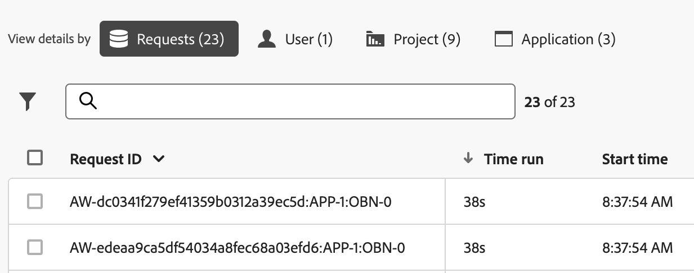

# レポートアクティビティマネージャーでのレポートアクティビティの表示

{{release-limited-testing}}

The [!UICONTROL レポートアクティビティマネージャー] 管理者は、ピーク時のレポート作成時に、レポート容量の問題を迅速に診断して修正できます。

主要なメリットや権限要件など、Reporting Activity Manager の詳細は、 [Activity Manager のレポートの概要](/help/admin/admin/reporting-activity-manager/reporting-activity-overview.md).

## すべてのレポートスイートのレポートアクティビティを表示 {#view-all-report-suites}

1. Adobe Analyticsで、 **[!UICONTROL 管理者]** > **[!UICONTROL レポートアクティビティマネージャー]**.

   有効なベースレポートスイートのリストが表示されます。

   

1. （オプション）レポートスイートのリストを検索またはフィルタリングできます。

   * 検索フィールドを使用して、特定のレポートスイートを検索します。 レポートスイート名または ID を入力し、入力時にレポートスイートのリストが更新されます。

   * を選択します。 [!UICONTROL **フィルター**] アイコン  をクリックして、フィルターオプションのリストを展開します。 次の条件でフィルターできます。 [!UICONTROL **お気に入力**] または [!UICONTROL **ステータス**].

     レポートスイートをお気に入りに登録するには、レポートスイート名の左側にある星形のアイコンを選択します。

<!-- (does this option still exist?) 1. (Optional) Select **[!UICONTROL Refresh]** at the top-right to refresh the data. -->

1. 各レポートスイートの使用状況情報を表示します。 列ヘッダーを選択して、その列でテーブルを並べ替えることができます。

   以下の列を表示できます。

   | UI 要素 | 説明 |
   | --- | --- |
   | **[!UICONTROL レポートスイート]** | 監視するレポートアクティビティのベースレポートスイート。 |
   | **[!UICONTROL 仮想レポートスイート]** | このベースレポートスイートにフィードするすべての仮想レポートスイートを表示します。仮想レポートスイートでは、適用されるフィルタリングとセグメント化のレベルが追加されるため、レポートリクエストが複雑になります。仮想レポートスイートからのすべてのリクエストが組み合わされて、ベースレポートスイートに送られます。
例えば、5 つの VRS から 10 件のリクエストがある場合、ベースレベルのレポートスイートでは 50 件のリクエストになります。このようにして、たちまち処理能力に達してしまいます。 |
   | **[!UICONTROL 処理能力の使用率]** | 使用中のレポートスイートのレポート容量の割合（リアルタイム）。 
**注意** 100%の使用容量でも、必ずしもレポート要求のキャンセルを開始する必要があるとは限りません。 平均待機時間が妥当な場合は、100%の使用能力が正常になる可能性があります。 100%の使用率は、キューに登録されたリクエストの数も増加している場合に問題を示す可能性があります。
 |
   | **[!UICONTROL キューに入れられたリクエスト]** | 処理を待機しているリクエストの数。 <!-- ??? --> |
   | **[!UICONTROL キューの待機時間]** | 各リクエストが処理されるまでの平均待ち時間です。 <!-- ???? --> |
   | **[!UICONTROL ステータス]** | 可能なステータスは次のとおりです。 <ul><li>[!UICONTROL **アクティブ**] （青）：レポートはレポートスイートで実行され、アクティビティが監視されています。</li><li>[!UICONTROL **非アクティブ**] （グレー）：レポートスイートで実行されたレポートはありません。 このステータスは、レポートスイートが最初に作成されたときにのみ表示されます。</li></ul> |

   {style="table-layout:auto"}

## 単一のレポートスイートのレポートアクティビティを表示します

1. Adobe Analyticsで、 [!UICONTROL **管理者**] > [!UICONTROL **レポートアクティビティマネージャー**].

1. 詳細を表示するレポートスイートの、リンクされたタイトルを選択します。

   選択したレポートスイートのレポートアクティビティデータが表示されます。

   <!-- Need to update this screenshot:  -->

1. 使用可能なグラフと表を使用して、レポートスイートのレポートアクティビティを理解します。

   * [グラフの表示](#view-graphs)

   * [テーブルを表示](#view-data-in-the-table)

### グラフの表示

次のグラフは、レポートスイートで発生しているアクティビティをより深く理解するのに役立ちます。 グラフが表示されない場合は、 [!UICONTROL **グラフを表示**] 」ボタンをクリックします。

#### 使用率グラフ {#utilization}

[ 使用率 ] グラフには、過去 2 時間の選択したレポートスイートのレポート使用率がどのように表示されます。

* x 軸には、過去 2 時間の使用状況のレポートが表示されます。
* y 軸には、レポートの使用率の割合が分単位で表示されます。
* グラフの上にマウスポインターを置くと、その分の使用率の割合が最も高かった時点のポイントを表示できます。

  

#### ユニークユーザーのグラフ

「ユニークユーザー」グラフには、過去 2 時間の選択したレポートスイートのレポートアクティビティが表示されます。

* x 軸は 2 時間の時間枠を示しています。
* y 軸は、レポートリクエストをおこなったユーザーの数を 1 分ごとに表示します。
* グラフの上にマウスポインターを置くと、その分で最大ユーザー数が最も多かった時点のポイントを表示できます。

  

<!--

#### Requests graph

The Requests graph shows the number of processed and completed requests for the selected report suite over the last 2 hours. 

* The x-axis shows a 2-hour time frame.
* The y-axis shows the number of processed requests (in purple) and completed requests (in green), by minute.
* You can hover over the chart to view points in time where the maximum number of requests was highest for that minute.

   

#### Queueing graph

The Queueing graph shows the average queue wait time (in seconds) for reporting requests for the selected report suite over the last 2 hours. 

* The x-axis shows a 2-hour time frame.
* The y-axis shows the average wait time (in seconds).
* You can hover over the chart to view points in time where the maximum average wait time was highest for that minute.

   

-->

### テーブルを表示 {#view-table}

データテーブルの上部にある次のタブのいずれかを選択して、データを表示することを選択できます。 [!UICONTROL **リクエスト**], [!UICONTROL **ユーザー**], [!UICONTROL **プロジェクト**]&#x200B;または [!UICONTROL **アプリ**].

>[!TIP]
>
>次の項目を選択できます。 [!UICONTROL **グラフを非表示にする**] をクリックして、テーブルのみを表示します。

#### リクエスト別のデータの表示

次の項目を選択した場合： [!UICONTROL **リクエスト**] 「 」タブでは、次の列がテーブルで使用可能です。

| 列 | 説明 |
| --- | --- |
| [!UICONTROL **リクエスト ID**] | トラブルシューティングに使用できます。 |
| [!UICONTROL **時間の実行**] | リクエストが実行されている期間。 |
| [!UICONTROL **開始時間**] | （管理者のローカル時間に基づいて）リクエストの処理が開始されたとき。 |
| [!UICONTROL **待ち時間**] | リクエストが処理されるまで待機している時間。 通常、十分な処理能力がある場合は「0」です。 |
| [!UICONTROL **アプリケーション**] | [!UICONTROL レポートアクティビティマネージャー]でサポートされているアプリケーションは次のとおりです。 <ul><li>Analysis Workspace UI</li><li>Workspace のスケジュール済みプロジェクト</li><li>Report Builder</li><li>ビルダー UI：セグメント、計算指標、注釈、オーディエンスなど。</li><li>API 1.4 または 2.0 からの API 呼び出し</li><li>インテリジェントアラート</li></ul> |
| [!UICONTROL **ユーザー**] | リクエストを開始したユーザー。 この列の値が [!UICONTROL **認識不可能**]&#x200B;というのは、ユーザーがログイン会社に属し、管理者権限を持っていないことを意味します。 |
| [!UICONTROL **プロジェクト**] | 保存済みの Workspace プロジェクト名、API レポート ID など（メタデータはアプリケーションによって異なる場合があります）。 |
| [!UICONTROL **ステータス**] | 次のステータスインジケーターがあります。 <ul><li>**実行中**：リクエストは現在処理中です。</li><li>**保留中**：リクエストは処理待ちの状態です。</li></ul> |
| [!UICONTROL **複雑さ**] | すべてのリクエストの処理に同じ時間が必要とは限りません。 リクエストの複雑さは、リクエストの処理に必要な時間に関する一般的なアイデアを提供するのに役立ちます。 指定できる値には以下のものがあります。 <ul><li>[!UICONTROL **低**]</li><li>[!UICONTROL **メディア**]</li><li>[!UICONTROL **高**]</li></ul>この値は、次の列の値の影響を受けます。<ul><li>[!UICONTROL **月の境界**]</li><li>[!UICONTROL **列**]</li><li>[!UICONTROL **セグメント**]</li></ul> |
| [!UICONTROL **月の境界**] | リクエストに含まれる月数。 これにより、リクエストがより複雑になります。 |
| [!UICONTROL **列**] | リクエスト内の指標と分類の数。 これにより、リクエストがより複雑になります。 |
| [!UICONTROL **セグメント**] | リクエストに適用されたセグメントの数。 これにより、リクエストがより複雑になります。 |

{style="table-layout:auto"}

#### ユーザー別のデータの表示

次の項目を選択した場合： [!UICONTROL **ユーザー**] 「 」タブでは、次の列がテーブルで使用可能です。

| 列 | 説明 |
| --- | --- |
| [!UICONTROL **ユーザー**] | リクエストを開始したユーザー。 この列の値が [!UICONTROL **認識不可能**]&#x200B;というのは、ユーザーがログイン会社に属し、管理者権限を持っていないことを意味します。 |
| [!UICONTROL **リクエスト数**] | ユーザーが開始したリクエストの数。 |
| [!UICONTROL **プロジェクト数**] | ユーザーに関連付けられたプロジェクトの数。 <!-- ??? --> |
| [!UICONTROL **アプリケーション**] | [!UICONTROL レポートアクティビティマネージャー]でサポートされているアプリケーションは次のとおりです。 <ul><li>Analysis Workspace UI</li><li>Workspace のスケジュール済みプロジェクト</li><li>Report Builder</li><li>ビルダー UI：セグメント、計算指標、注釈、オーディエンスなど。</li><li>API 1.4 または 2.0 からの API 呼び出し</li><li>インテリジェントアラート</li></ul> |
| [!UICONTROL **平均複雑度**] | ユーザーが開始したリクエストの平均複雑度。 
すべてのリクエストの処理に同じ時間が必要とは限りません。 リクエストの複雑さは、リクエストの処理に必要な時間に関する一般的なアイデアを提供するのに役立ちます。

この列の値は、次の列の値によって決定されるスコアに基づきます。
<ul><li>[!UICONTROL **平均月の境界**]</li><li>[!UICONTROL **平均列数**]</li><li>[!UICONTROL **平均セグメント数**]</li></ul> |
| [!UICONTROL **平均月の境界**] | リクエストに含まれる平均月数。 これにより、リクエストの平均的な複雑さが増します。 |
| [!UICONTROL **平均列数**] | 含まれるリクエストの指標および分類の平均数。 これにより、平均的な複雑さが増します。 |
| [!UICONTROL **平均セグメント数**] | 含まれるリクエストに適用されたセグメントの平均数。 これにより、平均的な複雑さが増します。 |

{style="table-layout:auto"}

#### プロジェクト別のデータの表示

次の項目を選択した場合： [!UICONTROL **プロジェクト**] 「 」タブでは、次の列がテーブルで使用可能です。

| 列 | 説明 |
| --- | --- |
| [!UICONTROL **プロジェクト**] | クエリが開始されたプロジェクト。 |
| [!UICONTROL **リクエスト数**] | プロジェクトに関連付けられた要求の数。 |
| [!UICONTROL **ユーザー数**] | プロジェクトに関連付けられたユーザーの数。 <!-- ??? --> |
| [!UICONTROL **アプリケーション**] | [!UICONTROL レポートアクティビティマネージャー]でサポートされているアプリケーションは次のとおりです。 <ul><li>Analysis Workspace UI</li><li>Workspace のスケジュール済みプロジェクト</li><li>Report Builder</li><li>ビルダー UI：セグメント、計算指標、注釈、オーディエンスなど。</li><li>API 1.4 または 2.0 からの API 呼び出し</li><li>インテリジェントアラート</li></ul> |
| [!UICONTROL **平均複雑度**] | プロジェクトに含まれるリクエストの平均的な複雑さ。 
すべてのリクエストの処理に同じ時間が必要とは限りません。 リクエストの複雑さは、リクエストの処理に必要な時間に関する一般的なアイデアを提供するのに役立ちます。

この列の値は、次の列の値によって決定されるスコアに基づきます。
<ul><li>[!UICONTROL **平均月の境界**]</li><li>[!UICONTROL **平均列数**]</li><li>[!UICONTROL **平均セグメント数**]</li></ul> |
| [!UICONTROL **平均月の境界**] | リクエストに含まれる平均月数。 これにより、リクエストの平均的な複雑さが増します。 |
| [!UICONTROL **平均列数**] | 含まれるリクエストの指標および分類の平均数。 これにより、平均的な複雑さが増します。 |
| [!UICONTROL **平均セグメント数**] | 含まれるリクエストに適用されたセグメントの平均数。 これにより、平均的な複雑さが増します。 |

{style="table-layout:auto"}

#### アプリケーション別のデータの表示

次の項目を選択した場合： [!UICONTROL **アプリ**] 「 」タブでは、次の列がテーブルで使用可能です。

| 列 | 説明 |
| --- | --- |
| [!UICONTROL **アプリケーション**] | クエリが開始されたアプリケーション。 |
| [!UICONTROL **リクエスト数**] | アプリケーションに関連付けられたリクエストの数。 |
| [!UICONTROL **ユーザー数**] | アプリケーションに関連付けられているユーザーの数。 <!--???--> |
| [!UICONTROL **プロジェクト数**] | アプリケーションに関連付けられているプロジェクトの数。 <!--???--> |
| [!UICONTROL **平均複雑度**] | アプリケーションに関連付けられているリクエストの平均複雑度。 
すべてのリクエストの処理に同じ時間が必要とは限りません。 リクエストの複雑さは、リクエストの処理に必要な時間に関する一般的なアイデアを提供するのに役立ちます。

この列の値は、次の列の値によって決定されるスコアに基づきます。
この列の値は、次の列の値によって決定されるスコアに基づきます。<ul><li>[!UICONTROL **平均月の境界**]</li><li>[!UICONTROL **平均列数**]</li><li>[!UICONTROL **平均セグメント数**]</li></ul> |
| [!UICONTROL **平均月の境界**] | リクエストに含まれる平均月数。 これにより、リクエストの平均的な複雑さが増します。 |
| [!UICONTROL **平均列数**] | 含まれるリクエストの指標および分類の平均数。 これにより、平均的な複雑さが増します。 |
| [!UICONTROL **平均セグメント数**] | 含まれるリクエストに適用されたセグメントの平均数。 これにより、平均的な複雑さが増します。 |

{style="table-layout:auto"}

<!--

### Filter

You can filter the table by Application (see list in the table below), by User, and by Project.

### Summary Numbers {#summary}

The Summary Numbers show the following information:

| Summary Number | Description |
| --- | --- |
| [!UICONTROL **Users**] | The number of users that are currently sending reporting requests to this report suite. |
| [!UICONTROL **Projects**] | Workspace projects, Report Builder workbooks, etc.  | 
| [!UICONTROL **Queries**] | The number of queries currently running. |
| [!UICONTROL **Average Wait Time**] | The average wait time for all running queries.  |
| [!UICONTROL **Usage Capacity**] | The current usage capacity for this report suite. |

{style="table-layout:auto"}

-->

