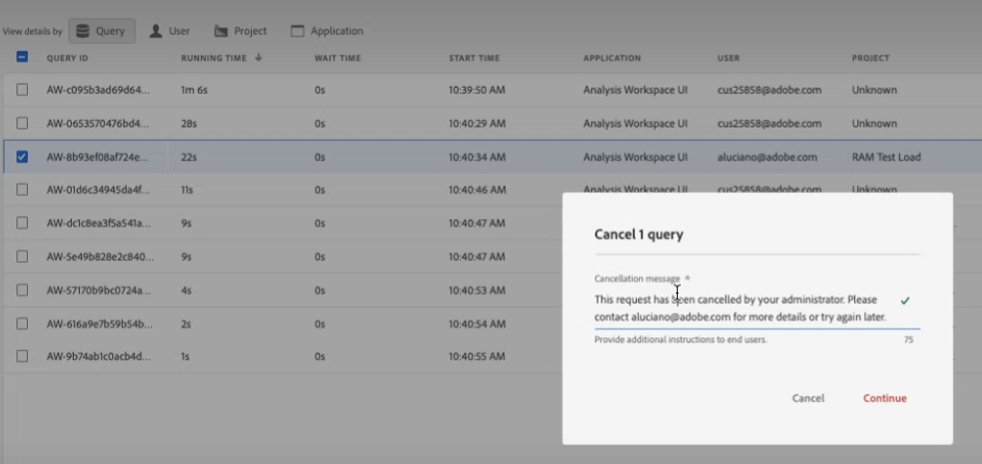

# レポートアクティビティマネージャー

>[!NOTE]
>
>この機能は現在ベータ版テスト中です。

この [!UICONTROL レポートアクティビティマネージャー] では、組織内の各レポートスイートのレポート容量を確認できます。 これにより、管理者はレポートの消費状況を詳細に把握し、ピーク時のレポート作成時に容量の問題を簡単に診断および修正できます。

組織がレポート要求の容量に達し、レポートのパフォーマンスが低下した場合、Adobeのカスタマーケアやエンジニアリングの介入なしに、レポートの問題を自己診断できるようになりました。 単一のインターフェイス内でレポートキューを簡単に管理でき、即座に処理して&#x200B;ユーザーエクスペリエンスを向上させることができます。 このツール：

* 複数のレポートスイートにわたる現在のレポート容量についてリアルタイムで通知します。
* 現在のレポートリクエストに関する詳細なレポートクエリ情報を提供します。キューに登録されているか処理中かに関係なく表示されます。
* 一部のレポート要求を優先順位付けし、他のレポート要求をキャンセルして容量を解放することで、レポートキューを最適化できます。 つまり、リアルタイムで確認できます。このレポートは現時点で必要ですか？それとも、もっと緊急な報告を受けるためにキャンセルすることはできますか？

## レポートアクティビティマネージャーへのアクセス

Adobe Analyticsで、管理者は **[!UICONTROL 管理者]** > **[!UICONTROL レポートアクティビティマネージャー]**.

## 権限

レポートアクティビティを管理するには、Analytics システム管理者権限が必要です。 製品管理者のアクセス権が不十分です。

## レポートキューを表示

( [!UICONTROL レポートアクティビティ] Manager の概要ページに、有効なベースレポートスイートのリストが表示されます。

| UI 要素 | 説明 |
| --- | --- |
| **[!UICONTROL レポートスイート]** | 監視するレポートアクティビティのベースレポートスイート。 |
| **[!UICONTROL 仮想レポートスイート]** | このベースレポートスイートにフィードするすべての仮想レポートスイートを表示します。 仮想レポートスイートは、適用されたフィルタリングとセグメント化のレベルが増えるので、レポートリクエストをより複雑にします。 仮想レポートスイートからのすべてのリクエストが組み合わされて、ベースレポートスイートに送られます。
例えば、5 つの VRS からの 10 のリクエストがある場合、それはベースレベルのレポートスイートでの 50 のリクエストです。 この方法で、容量を非常に迅速にヒットできます。 |
| **[!UICONTROL 使用能力]** | 割合（%単位）、レポートスイートのレポート容量の使用量をリアルタイムで示します。 |
| **[!UICONTROL ステータス]** | 次の 4 つのステータスインジケーターが使用可能です。 <ul><li>**赤 — [!UICONTROL 容量で]**:レポートスイートは、レポートの容量に関して最大限に使用できます。 (100%) </li><li>**黄色 — [!UICONTROL 容量に近づく]**:このレポートスイートは、最大容量に達する恐れがあります。 (90% - 99%)</li><li>**緑 — [!UICONTROL すべて良好]**:レポートには十分な容量があります。 (0% - 89%)</li><li>**グレー — [!UICONTROL ステータス保留中/無効]**:レポートの容量が使用できません。</li></ul> |

{style=&quot;table-layout:auto&quot;}

### その他のレポートアクティビティのアクション

* クリック **[!UICONTROL 更新]** をクリックして、結果を更新します。
* レポートスイート名の左にある星をクリックして、このレポートスイートをお気に入りに設定します。
* チェック **[!UICONTROL お気に入り]** お気に入りを表示するには、左上に移動します。
* 検索バーで、名前または ID でレポートスイートを検索します。
* ステータスでレポートスイートをフィルタリングします。

## 個々のレポートスイートのレポートアクティビティを表示

詳細を表示するレポートスイートのタイトルリンクをクリックします。

### 折れ線グラフ

折れ線グラフには、過去 2 時間の選択したレポートスイートのレポートアクティビティが表示されます。

* x 軸には、過去 2 時間のレポート容量データが表示されます。
* y 軸は、クエリの平均待機時間を秒単位で示します。
* 折れ線グラフの上にマウスポインターを置くと、その時点のポイントと平均待機時間を表示できます。

   

### フィルター

テーブルは、アプリケーション（以下の表の一覧を参照）、ユーザー、およびプロジェクトでフィルタリングできます。

### 概要番号

概要番号には、次の情報が表示されます。

| 数値の概要 | 説明 |
| --- | --- |
| [!UICONTROL ユーザー] | 現在このレポートスイートにレポートリクエストを送信しているユーザーの数。 |
| [!UICONTROL プロジェクト] | Workspace プロジェクト、Report Builderワークブックなど。 |
| [!UICONTROL クエリ] | 現在実行中のクエリの数。 |
| [!UICONTROL 平均待機時間] | 実行中のすべてのクエリの平均待機時間です。 |
| [!UICONTROL 使用能力] | このレポートスイートの現在の使用能力。 |

{style=&quot;table-layout:auto&quot;}

### テーブル

次の詳細テーブルは、レポートスイートの詳細を示しています。

| 列 | 説明 |
| --- | --- |
| [!UICONTROL クエリ ID] | トラブルシューティングに使用できます。 |
| [!UICONTROL 実行時間] | クエリが実行されている期間。 |
| [!UICONTROL 待機時間] | クエリが処理されるまでに待機している時間。 通常は、十分な容量がある場合は「0」です。 |
| [!UICONTROL 開始時間] | クエリが処理を開始したとき（管理者のローカル時間）。 |
| [!UICONTROL アプリケーション] | でサポートされるアプリケーション [!UICONTROL レポートアクティビティマネージャー] 次の場合： <ul><li>Analysis Workspace UI</li><li>Workspace スケジュール済みプロジェクト</li><li>Report Builder</li><li>ビルダー UI:セグメント、計算指標、注釈、オーディエンスなど。</li><li>1.4 または 2.0 API からの API 呼び出し</li><li>インテリジェントアラート</li></ul> |
| [!UICONTROL ユーザー] | クエリを開始したユーザー。 |
| [!UICONTROL プロジェクト] | 保存済みの Workspace プロジェクト名、API レポート ID など。 （メタデータは、アプリケーションによって異なる場合があります）。 |
| [!UICONTROL 月の境界] | リクエストが横切る月の境界の数。 これにより、リクエストがより複雑になります。 |
| [!UICONTROL 列] | リクエストの複雑さを測定するための Workspace の指標と分類の数。 |
| [!UICONTROL セグメント] | このリクエストに適用されるセグメントの数。 これにより、リクエストがより複雑になります。 |
| [!UICONTROL ステータス] | ステータスインジケーター： <ul><li>**実行中**:リクエストは現在処理中です。</li><li>**保留中**:リクエストは処理を待機中です。</li></ul> |

{style=&quot;table-layout:auto&quot;}

## レポート要求のキャンセル

要求をキャンセルするには

1. 1 つ以上の **[!UICONTROL クエリ ID]** テーブル内で、 **[!UICONTROL リクエストをキャンセル]** 下に
1. 内 **[!UICONTROL x クエリのキャンセル]** ウィンドウが表示され、必要に応じてキャンセルメッセージを変更できます。
1. 「**[!UICONTROL 続行]**」をクリックします。

   

例えば、Workspace のアプリケーションユーザーの場合、プロジェクトには次の通知が表示されます。

## よくある質問

| 質問 | 回答 |
| --- | --- |
| 追加のレポート容量を購入することはできますか？ | この機能は近い将来に利用可能になる予定です。 |

{style=&quot;table-layout:auto&quot;}
