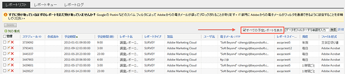
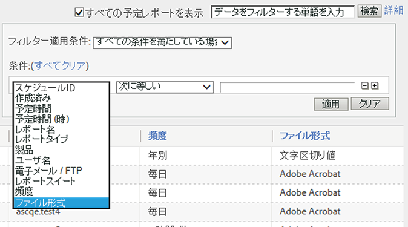
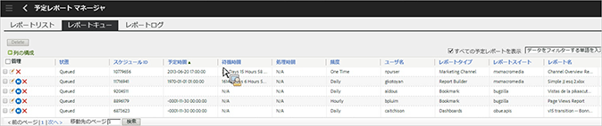
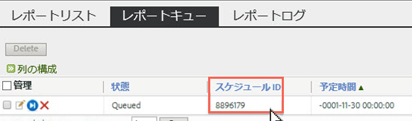

# 予定レポートキュー

管理者レベルのユーザーは、組織全体の予定レポートを表示および管理できます。

**[!UICONTROL Analytics]** / **[!UICONTROL コンポーネント]** / **[!UICONTROL 予定レポート]**

予定レポートマネージャーの管理者レベルの機能には次のものがあります。

* 組織内の[すべての予定レポートを表示](../../admin/admin/scheduled-reports-admin.md#section_3F167CAAEEC24140B476CF95B7402690)するオプション。
* 組織全体にわたる[高度なフィルター機能](../../admin/admin/scheduled-reports-admin.md#section_206A52A85DE84947AAB3AD082FBF6275)。
* レポートサーバーで実行するためにキューに登録されているすべてのレポートを一覧表示する新しい「[レポートキュー](../../admin/admin/scheduled-reports-admin.md#section_03C866115D354BB182E90BF4D52F1E0B)」タブ
* レポートキューインターフェイスでの[スケジュール ID](../../admin/admin/scheduled-reports-admin.md#section_568B70F4228C4229977CB85D2DCD53A1) の公開

## すべての予定レポートを表示 {#section_3F167CAAEEC24140B476CF95B7402690}

「**[!UICONTROL レポートリスト]**」タブでは、自身でスケジュールしたレポートに加えて、組織の&#x200B;**すべての予定レポートを表示[!UICONTROL できます。]**

>[!NOTE]
>
>**[!UICONTROL [レポート名]** ]列にはスケジュールされているレポートの名前が表示され、 **[!UICONTROL [ファイル名]** ]列には[アドバンス配信オプション]で設定したカスタムファイル名が表示されます。その結果、同じレポートタイプのレポートを複数スケジュールして、それぞれにカスタマイズした名前を指定すると、レポート名が同じでファイル名が異なる複数のエントリが予定レポートマネージャーに表示されます。これは、スケジュール中のバックエンドレポートが同じなので、すべてのレポートに対して「レポート名」列のレポート名は同じになりますが、ファイル名は（設定したとおりに）カスタマイズされるからです。

## 高度なフィルター機能 {#section_206A52A85DE84947AAB3AD082FBF6275}

For example, if you wanted to filter on all reports that are scheduled hourly, you would specify **[!UICONTROL Frequency equals Hourly]** in the **[!UICONTROL Advanced]** filter and click **[!UICONTROL Apply]**:

## レポートキュー {#section_03C866115D354BB182E90BF4D52F1E0B}

このキューを使用して、予定レポートを管理したり、キューを停滞させている予定レポートを削除したりできます（通常、レポートは 4 時間でタイムアウトします）。

レポートキューでは、「予定レポートを 1 回スキップ」することもできます。「**[!UICONTROL 管理]」列にある青色のアイコンをクリックします。**

## スケジュール ID {#section_568B70F4228C4229977CB85D2DCD53A1}

レポートキューインターフェイスで公開された&#x200B;**[!UICONTROL スケジュール ID]は、予定レポートの問題を解決するために Adobe ClientCare に連絡する必要がある場合に役立ちます。**

