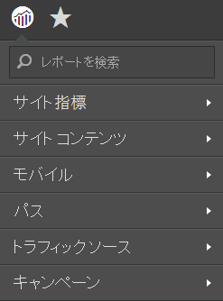
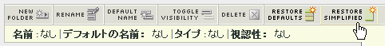

# シンプル化されたレポートメニュー

Reports&amp; Analyticsにシンプル化されたレポートメニューを実装する手順です。

シンプル化された Adobe Reports &amp; Analytics メニューにより、下位に複数のフォルダーが再構成された、シンプル化された代替メニューを適用することを選択できます。シンプル化されたメニューにはデフォルトで次のオプションが表示されます。

>[!NOTE]
>
>シンプル化されたメニューを適用すると、デフォルトのメニュー構造に対して行ったカスタマイズがすべて削除されます。また、組織内のすべての Reports &amp; Analytics ユーザー用にシンプル化されたメニュー構造が実装されます。この新しいメニューを実装する前に、それによってどのような影響が及ぶか（既存のメニュー構造に従って開発されたトレーニングがある場合など）を慎重に検討してください。一度実装した後で、既存のメニュー構造のカスタマイズを元に戻すことはできません。

1. **[!UICONTROL Analytics]** / **[!UICONTROL 管理者]** / **[!UICONTROL レポートスイート]** に移動して、Report Suite Managerを開きます。
1. シンプル化されたメニュー構造を実装するレポートスイートを選択します。
1. Go to **[!UICONTROL Edit settings]** &gt; **[!UICONTROL General]** &gt; **[!UICONTROL Customize Menus]**.
1. Click **[!UICONTROL Restore Simplified]** to implement the simplified menu structure.

   

1. To go back to the (non-customized) default menu, click **[!UICONTROL Restore Defaults]**.
