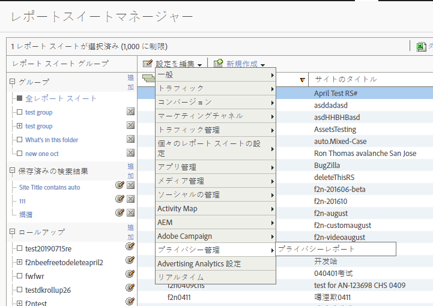
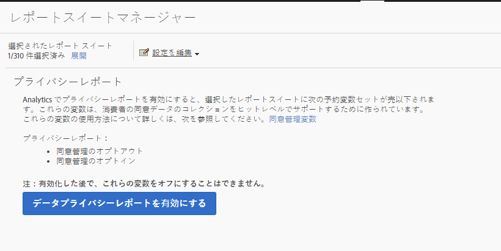
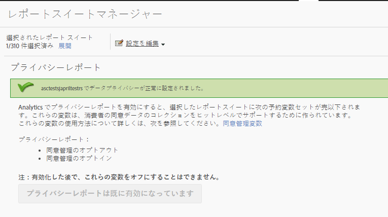
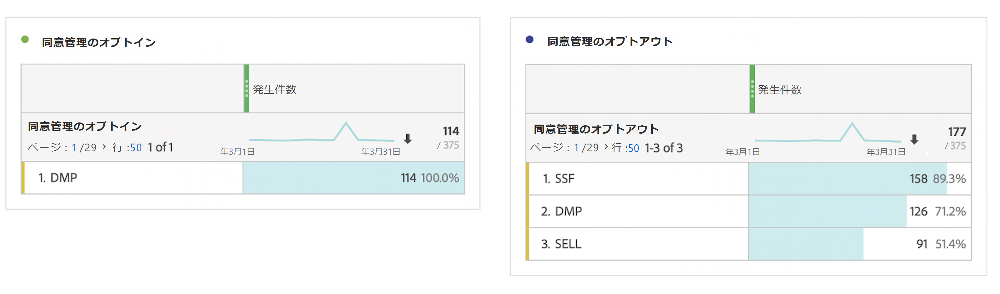

# プライバシーレポート変数

プライバシーデータ管理に関する追加の支援を提供するために、一連の予約済み変数を特定のコンテキストデータ変数と組み合わせて使用できます。
これらのプライバシーレポート変数は、各分析ヒットのプライバシーステータスを取り込むための使いやすいフレームワークです。

## 変数

* 同意管理のオプトアウト
   * 予約変数：リスト prop
   * タイプ：コンマ区切り文字列
   * 次を含む：
      * SSF として表示される `contextData.['cm.ssf']=1`
      * DMP として表示される `contextData.['opt.dmp']=N`
      * SELL として表示される `contextData.['opt.sell']=N`

* 同意管理のオプトイン
   * 予約変数：リスト prop
   * タイプ：コンマ区切り文字列
   * 次を含む：
      * DMP として表示される `contextData.['opt.dmp']=Y`
      * SELL として表示される `contextData.['opt.sell']=Y`

## レポート

Analytics Admin Console で利用できる新しいプライバシー設定を使用して、プライバシーレポート変数を有効にできます。

各レポートスイートは、次のように設定できます。
1. Reports &amp; Analytics で、**[!UICONTROL 管理者／レポートスイートをクリックします]**。
1. メディアデータを収集するレポートスイートを選択して、**[!UICONTROL 設定を編集／プライバシー管理]**&#x200B;をクリックします。

   

1. 「**[!UICONTROL データプライバシー レポートを有効にする]**」ボタンをクリックします。

   >[!NOTE]
   >
   >有効化した後で、これらの変数をオフにすることはできません。

   

1. 有効にすると、確認メッセージが表示されます。

   

1. Reports &amp; Analytics および Workspace で予約変数を分析に使用できるようになりました。「同意管理のオプトアウト」および「同意管理のオプトイン」を参照してください。

   

## 実装

3 つのコンテキストデータ変数が、プライバシーレポート管理予約変数と連携するように事前に定義されています。これらの変数の設定の管理方法と保持の方法は、各実装エンジニアが決定します。

コンテキスト データ変数の実装に関する一般的なガイダンスについては、[コンテキストデータ変数](https://docs.adobe.com/content/help/ja-JP/analytics/implementation/vars/page-vars/contextdata.html)を参照してください。

### SSF

* コンテキストデータ：`contextData.['cm.ssf']`
* 指定可能な値：
   * 1：値「1」を送信する場合は、サーバー側転送がオプトアウト状態であることを示します。この変数と対になる値「1」は、このヒットが Adobe Audience Manager と共有されるのをブロックします。[AAM ePrivacy のコンプライアンス](https://docs.adobe.com/help/en/analytics/integration/audience-analytics/audience-analytics-workflow/ssf-gdpr.html)を参照してください。
   * 0 - オプション。ターゲットマーケティングに同意した顧客には、値「0」を使用します。変数を設定しない場合は、同じ結果になります。

### DMP

* コンテキストデータ：`contextData.['opt.dmp']`
* 指定可能な値：
   * N：値「N」を送信すると、データ管理プラットフォームへの共有をコンシューマーがオプトアウトしていることを示します。**注意**：2020 年 1 月 15 日現在、この変数を「N」に設定すると、AAM に対するサーバー側のヒットの共有がブロックされます。
   * Y：値「Y」を送信すると、データ管理プラットフォームへの共有をコンシューマーがオプトインしていることを示します。

### SELL

* コンテキストデータ：`contextData.['opt.sell']`
* 指定可能な値：
   * N：値「N」を送信すると、データをサードパーティへのデータの共有または販売を、コンシューマーがオプトアウトしていることを示します。
   * Y：値「Y」を送信すると、データをサードパーティへのデータの共有または販売を、コンシューマーがオプトインしていることを示します。
