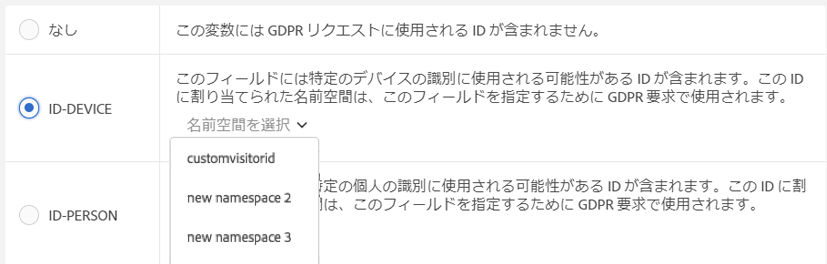
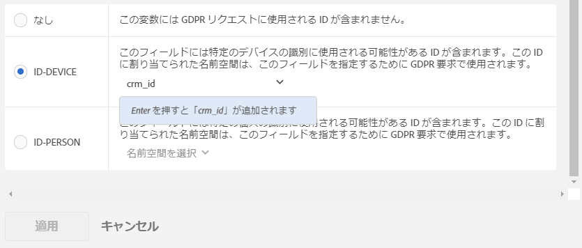

# Analytics 変数のデータプライバシーラベル

## データにラベルを設定する理由 {#section_A075CDF3AD0744BD8CEB41CE3FB7BFB3}

アドビのお客様の多くには、データプライバシー法（GDPR、CCPA など）を確認した法務チームがおり、データプライバシー法に準拠するためのデータの取り扱い方法について、独自の結論を出しています。法律の解釈は企業によって異なり、希望するデータ処理設定もお客様によって異なります。データプライバシーのデータ処理方法とデータセットはお客様によって異なるので、アドビでは、データ管理者であるお客様が、自社の データの処理設定をカスタマイズできるようにしています。これにより、それぞれのお客様が、ブランドのニーズと保有するデータセットに最適な方法でデータプライバシー要求を処理できます。

Adobe Analyticsは、機密性と契約上の制限に従ってデータにラベル付けするツールを提供します。 ラベルは重要で役立ちます。(1)データの主題を特定し、(2)アクセス要求の一部として返すデータを決定し、(3)削除要求の一部として削除する必要のあるデータフィールドを特定する。

どの変数やフィールドにどのラベルを適用するかを把握するためには、Analytics データから取得する [ID について理解](/help/admin/c-data-governance/gdpr-analytics-ids.md)し、データプライバシー要求でどのような ID を使用するかを決める必要があります。

Adobe Analytics のデータプライバシー実装では、識別データ、機密データ、データガバナンス用に以下のラベルを利用できます。

## DULE ラベル {#section_B2E78130957647338495EF37DE21D6BC}

>[!NOTE]Data Usage Labeling &amp; Enforcement（DULE）フレームワークは、アドビのすべてのソリューション／サービス／プラットフォームにまたがり、共通の方法で Adobe Experience Cloud 全体のデータに関するメタデータを取得、伝達、利用できるようにすることを目的としています。データ管理者はこのメタデータを利用して、どのデータが個人情報や機密情報に該当するかを指定したり、契約上のどの制限事項がデータと関連しているかを指定したりできます。この初期リリースでは、Analytics は、データプライバシーに関連する DULE ラベルのみを公開しています。他のアドビ製品がDULEラベルのサポートを実装する中で、今後のリリースでは、機密データラベルと契約上のラベルが追加され、製品間で共有されるデータが法的に許容できる方法でのみ使用されるようになります。

## アイデンティティ・データ・ラベル(DULE) {#identity-data-labels}

個人データを表す「I」ラベルは個人の特定や個人への連絡に使用できるデータの分類するために使用されます。

<table id="table_6B5368D714424E52835D5DFE189BD080"> 
 <thead> 
  <tr> 
   <th colname="col1" class="entry"> ラベル </th> 
   <th colname="col2" class="entry"> 定義 </th> 
   <th colname="col3" class="entry"> その他の要件 </th> 
  </tr>
 </thead>
 <tbody> 
  <tr> 
   <td colname="col1"> <p>I1 </p> </td> 
   <td colname="col2"> <p><b>直接識別可能</b>:名前や電子メールアドレスなど、個人との直接連絡を特定したり、有効にしたりできるデータ。 </p> </td> 
   <td colname="col3"> 
    <ul id="ul_4E2AD59D119E40D28B869D0BB63B9FD9"> 
     <li id="li_AC3E99B57E3A4AE2A12BE219680AFC58">イベント </li> 
     <li id="li_BB66992863C8402F8D58656293F31E71">マーチャンダイジングeVarに設定できない </li> 
    </ul> </td> 
  </tr> 
  <tr> 
   <td colname="col1"> <p>I2 </p> </td> 
   <td colname="col2"> <p><b>間接的に識別可能</b>:個人またはデバイスとの直接接触を識別または有効にするために、他のデータと組み合わせて使用できるデータ。 </p> <p>個人の識別を単独で許可しないが、他の情報（お客様が所有している場合とそうでない場合）と組み合わせて、誰かを識別できる。 例えば、顧客忠誠度番号、または各顧客に対して一意の会社のCRMシステムで使用されるIDなどがあります。 </p> </td> 
   <td colname="col3"> 
    <ul id="ul_A0EF0F3DC5804D4FBE228946D697ABEB"> 
     <li id="li_A592EA6DA82C4D8C80E03F02ADF4E20E">イベント </li> 
     <li id="li_46CE7B1E84884CDAB356A6DF89397849">マーチャンダイジングeVarに設定できない </li> 
    </ul> </td> 
  </tr> 
 </tbody> 
</table>

## 機密データ・ラベル(DULE) {#sensitive-data-labels}

機密データの「S」ラベルは、地理データなどの機密データの分類に使用されます。今後、他のタイプの機密情報を識別するため、機密データのラベルが追加される予定です。

<table id="table_A778A508620545CCB37830E5CF1C75B7"> 
 <thead> 
  <tr> 
   <th colname="col1" class="entry"> ラベル </th> 
   <th colname="col2" class="entry"> 定義 </th> 
  </tr>
 </thead>
 <tbody> 
  <tr> 
   <td colname="col1"> <p>S1 </p> </td> 
   <td colname="col2"> <p> デバイスの正確な位置（100メートル以下）を判断するために使用できる緯度と経度に関する正確な地域データ。 </p> </td> 
  </tr> 
  <tr> 
   <td colname="col1"> <p>S2 </p> </td> 
   <td colname="col2"> <p> 広く定義されたジオフェンス領域の特定に利用できる位置情報データ。 </p> </td> 
  </tr> 
 </tbody> 
</table>

## データガバナンスラベル（データプライバシー） {#data-governance-labels}

データガバナンスラベルを使用すると、規制や企業のポリシーに準拠するためにプライバシー関連の注意事項や契約条件を反映したデータを分類できます。

**データプライバシーアクセスラベル**

<table id="table_663EFF43A454498386F7F3E60875E0F8"> 
 <thead> 
  <tr> 
   <th colname="col1" class="entry"> ラベル </th> 
   <th colname="col2" class="entry"> 定義 </th> 
   <th colname="col3" class="entry"> その他の要件 </th> 
  </tr>
 </thead>
 <tbody> 
  <tr> 
   <td colname="col1"> <p>なし </p> </td> 
   <td colname="col2"> <p>この変数が、データプライバシーアクセス要求の一環としてデータ主体に返されたデータに含まれている必要があるデータを含んでいない場合に、このオプションを選択します。 </p> </td> 
   <td colname="col3"> </td> 
  </tr> 
  <tr> 
   <td colname="col1"> <p>ACC-ALL </p> </td> 
   <td colname="col2"> <p>このフィールドの値は、<u>すべての</u>データプライバシーアクセス要求に含める必要があります。 </p> <p>このヒットの発生源が複数のユーザーが共有するデバイスの場合に、データ管理者であるお客様がこのラベルを適用すると、その共有デバイスへのアクセス権を持つすべてのユーザー間でこのフィールドのデータを共有することを許可したことになります。 </p> </td> 
   <td colname="col3"> <p>このラベルが設定されたフィールドは、すべてのデータプライバシー要求で返されます。 </p> </td> 
  </tr> 
  <tr> 
   <td colname="col1"> <p>ACC-PERSON </p> </td> 
   <td colname="col2"> <p> このフィールドの値は、ID-PERSON フィールドの値と一致するデータプライバシー要求 ID を基に、ヒットの発生源がデータ主体であると合理的に判断できる場合のみ、データプライバシーアクセス要求に含める必要があります。 </p> </td> 
   <td colname="col3"> <p>また、このレポートスイート内の変数にID-PERSONラベルを設定し、そのIDを使用してリクエストを送信する必要があります。そうしないと、このラベルは適用されません。 </p> </td> 
  </tr> 
 </tbody> 
</table>

他のラベルを受け取る変数はほとんどありませんが、多くの変数にアクセスラベルが適用されることが予想されます。 ただし、収集したデータをデータサブジェクトと共有するかどうかは、法務チームと相談してお客様の判断によります。

**データプライバシー削除ラベル**

<table id="table_59DFCE4D90214CB5972BDDE5B7391B4D"> 
 <thead> 
  <tr> 
   <th colname="col1" class="entry"> ラベル </th> 
   <th colname="col2" class="entry"> 定義 </th> 
   <th colname="col3" class="entry"> その他の要件 </th> 
  </tr>
 </thead>
 <tbody> 
  <tr> 
   <td colname="col1"> </td> 
   <td colname="col2"> <p>他のラベルとは異なり、これらの削除ラベルは相互に排他的ではありません。 両方を選択するか、選択しないかを選択できます。 「なし」は、「削除」オプションのいずれかを選択しないだけで示されるので、個別の「なし」ラベルは不要です。 </p> </td> 
   <td colname="col3"> <p>削除ラベルは、ヒットをデータの件名に関連付ける（データの件名を識別できる）値を含むフィールドに対してのみ必要です。 </p> <p> その他の個人情報（お気に入り、閲覧/購入履歴、健康状態など）は、データの件名との関連付けが切断されるので、削除する必要はありません。 </p> </td> 
  </tr> 
  <tr> 
   <td colname="col1"> <p>削除-デバイス </p> </td> 
   <td colname="col2"> <p>データプライバシー削除要求では、このフィールドの値は、指定された ID-DEVICE がヒットに含まれる要求でのみ匿名化する必要があります。 </p> <p>削除されていない他のヒットで同じ値が発生した場合、その他のインスタンスは変更されません。 この結果、このフィールドの実数を計算するレポートの数が変更されます。 共有デバイスでは、データの件名以外に、他の個人の識別子が削除される場合があります。 </p> <p>このフィールドに ID-DEVICE ラベルも設定されており、このフィールドの値がデータプライバシー要求で ID として使用されていた場合は、カウント数は変わりません。 </p> </td> 
   <td colname="col3"> 
    <ul id="ul_45C3A09E1F05492B97C3F3DEA7C78FBC"> 
     <li id="li_BAB277F92F284ADE9D7B6839BDD716E2">I1、I2、またはS1ラベルも必要 </li> 
     <li id="li_6DDFC0571457489CBA9D76F547247F20">イベント </li> 
     <li id="li_E79C6DFC6C58478EAA1504E3820D512C">マーチャンダイジングeVarに設定できない </li> 
     <li id="li_B78E273212E447D49D0707E174B66DEC">分類に設定できません </li> 
     <li id="li_F0F52D0DE7454557A6A97063C1FBC372">ID-DEVICEを使用してリクエストを送信するか、expandIDsをtrueに設定する必要があります。そうしないと、このラベルは適用されません。 </li> 
    </ul> </td> 
  </tr> 
  <tr> 
   <td colname="col1"> <p>DEL-PERSON </p> </td> 
   <td colname="col2"> <p>データプライバシー削除要求では、このフィールドの値は、指定された ID-PERSON がヒットに含まれる要求でのみ匿名化する必要があります。 </p> <p>削除されていない他のヒットで同じ値が発生した場合、その他の値は変更されません。 この結果、このフィールドの実数を計算するレポートの数が変更されます。 このフィールドに ID-PERSON ラベルも設定されており、このフィールドの値がデータプライバシー要求で ID として使用されていた場合は、カウント数は変わりません。 </p> </td> 
   <td colname="col3"> 
    <ul id="ul_6722E42E036E47B4B5E17DC213636D51"> 
     <li id="li_6C1A64FF68AF428A827D8C6C33E22970">I1、I2、またはS1ラベルも必要 </li> 
     <li id="li_8053533FFE874EE795C8B6043A4F73B3">イベント </li> 
     <li id="li_D6700CF4D03E44DDA83C4DDBB5B70CC3">マーチャンダイジングeVarに設定できない </li> 
     <li id="li_B6C2B15484B344889DBF29B62E2EA8FD">分類に設定できません </li> 
     <li id="li_3BBD0C27D9644C2B9618457A0BFC15EF">また、このレポートスイート内の変数にID-PERSONラベルを設定し、そのIDを使用してリクエストを送信する必要があります。そうしないと、このラベルは適用されません。 </li> 
    </ul> </td> 
  </tr> 
 </tbody> 
</table>

**データプライバシー ID ラベル**

<table id="table_F6BBC868457443A19A7B693BD6C55B4B"> 
 <thead> 
  <tr> 
   <th colname="col1" class="entry"> ラベル </th> 
   <th colname="col2" class="entry"> 定義 </th> 
   <th colname="col3" class="entry"> その他の要件 </th> 
  </tr>
 </thead>
 <tbody> 
  <tr> 
   <td colname="col1"> <p>なし </p> </td> 
   <td colname="col2"> <p>この変数には、データプライバシー要求に使用される ID が含まれていません。 </p> </td> 
   <td colname="col3"> <p>このフィールドに、データプライバシー API または UI でアクセス要求または削除要求を送信する際に使用する ID が含まれている場合にのみ、他のラベルのどちらかを設定する必要があります。 </p> </td> 
  </tr> 
  <tr> 
   <td colname="col1"> <p>ID-DEVICE </p> </td> 
   <td colname="col2"> <p>このフィールドには、データプライバシー要求のデバイスを識別するために使用できる ID が含まれていますが、共有デバイスの個々のユーザーを区別することはできません。 </p> <p>ID を含むすべての変数にこのラベルを指定する必要はありません（このために I1／I2 ラベルがあります）。この変数に保存された ID を使用してデータプライバシー要求を送信し、特定の ID についてこの変数を検索したい場合に、このラベルを使用します。 </p> </td> 
   <td colname="col3"> 
    <ul id="ul_618019CB8FCA4A5C94C47636240197B2"> 
     <li id="li_0E5ADED36FF24A348FDD434E2CC8C8EE">I1またはI2ラベルも必要 </li> 
     <li id="li_20BCFF07B2BF468C8E0D477C10B2EF9F">イベント </li> 
     <li id="li_0BD73EEF4184475D8E97878CF8DBEB90">マーチャンダイジングeVarに設定できない </li> 
     <li id="li_129851035C4A4BF0922296B4C3BEE39B">分類に設定できません </li> 
    </ul> </td> 
  </tr> 
  <tr> 
   <td colname="col1"> <p>ID-個人 </p> </td> 
   <td colname="col2"> <p>このフィールドには、データプライバシー要求で認証済みユーザー（特定のユーザー）の識別に使用できる ID が含まれています。 </p> <p>ID を含むすべての変数にこのラベルを指定する必要はありません（このために I1／I2 ラベルがあります）。この変数に保存された ID を使用してデータプライバシー要求を送信し、特定の ID についてこの変数を検索したい場合に、このラベルを使用します。 </p> </td> 
   <td colname="col3"> 
    <ul id="ul_0C7EEC8FCB5C4BCDA5D48F3C98770A67"> 
     <li id="li_2E781AE8D7A046A7996C7300CA854B86">I1またはI2ラベルも必要 </li> 
     <li id="li_EB4C6430C218405DAAE81DEE010DCAA2">イベント </li> 
     <li id="li_05AA67B45974474F9DA520E8B877BA11">マーチャンダイジングeVarに設定できない </li> 
     <li id="li_8A6BF4B40ED249289EAD46FE1C755FB0">分類に設定できません </li> 
    </ul> </td> 
  </tr> 
 </tbody> 
</table>

## Provide a Namespace when Labeling a Variable as ID-DEVICE or ID-PERSON {#section_F0A47AF8DA384A26BD56032D0ABFD2D7}

変数にID-DEVICEまたはID-PERSONというラベルを付けると、変数の指定を求めるプロンプトが表示されます。名前空間 以前に定義した名前空間を使用するか、新しく定義します。

**以前に定義した名前空間**

ログイン会社で、任意のレポートスイートの他の変数にIDラベルを以前に割り当てている場合は、これらの既存の名前空間の1つを選択できます。 この変数に、この名前空間で既にラベル付けされている他の変数と同じタイプのIDが含まれ、リクエストの送信時にそれらをすべて検索する場合は、名前空間を再利用する必要があります。

1. Click **[!UICONTROL Select Namespace]** and select one of the existing namespaces.
1. クリック **[!UICONTROL Apply]**.



**新しい名前空間**

また、新しい定義を定義することもできます。名前空間 名前空間文字列は、英数字と、アンダースコア、ダッシュ、スペースに制限することをお勧めします。 すべて小文字に変換されます。

1. Click **[!UICONTROL Select Namespace]** and type in the namespace title.

   

1. **[!UICONTROL Enter]** キーを押してこの名前空間を追加します。これで「適用」ボタンがアクティブになります。
1. クリック **[!UICONTROL Apply]**.

名前空間として指定した文字列は、データプライバシー API で要求を「名前空間」パラメーターの値として送信する際に使用する必要がある文字列と同じです。その後、Adobe Analyticsは、リクエストで指定したIDに対して、この名前空間を共有するすべてのレポートスイートのすべての変数を検索します。

IDを含むすべての変数（I1/I2ラベルの対象）にID-DEVICEラベルまたはID-PERSONラベルを指定する必要はありません。 この変数に保存された ID を使用してデータプライバシー要求を送信し、特定の ID についてこの変数を検索したい場合に、このラベルを使用します。例えば、eVar1 に電子メールアドレスを、eVar2 にログインユーザー名を含むことができるが、ユーザー名のみを使用して要求を送信する場合、eVar1 には I1、ACC-PERSON、DEL-PERSON とラベル設定しますが、eVar2 は名前空間「ユーザー名」と共に、I2、ACC-PERSON、DEL-PERSON、ID-PERSON とラベル設定します。その後、次のようなユーザーセクションJSONブロックを使用してリクエストを送信できます。

```
{
     "namespace": "user name",
     "type": "analytics",
     "value": "rocketman123"
}
```

同じレポートスイート内の異なる変数に同じ名前空間を使用することは許容されます。 例えば、一部のカスタム実装では、CRM-IDをpropとeVarの両方に保存します。 CRM-IDが常にいずれか（eVarなど）に含まれ、他方(prop)にのみ含まれ、eVarにも含まれない場合はpropには含まれない場合、eVarのみがIDラベルと名前空間を必要とします。これは、アドビがIDを検索できるからです。 ただし、CRM-ID が一方の変数にあることも、もう一方の変数にあることもある場合、両方が同じ名前空間を持つ必要があり、アドビは、この名前空間を持つ、データプライバシー要求の一環として指定した ID について、両方の変数を検索します。これらの変数のすべてにDELラベルを付けておく必要があります。これにより、どこで発生しても値が匿名化されます。

別の例として、eVar1経由で送信されたり、prop7経由で送信されたりする場合があるCRM IDがあるとします。 次に、eVar1の値が存在する場合は、その値をeVar3にコピーする処理ルールがあります。 それ以外の場合は、値をprop7からeVar3にコピーします。 このシナリオでは、eVar3にはCRM IDがわかっている場合は常にCRM IDが含まれるので、eVar3のみがID-PERSONラベルを必要とします。

>[!CAUTION] 名前空間「visitorId」と「customVisitorId」は、Analytics の従来のトラッキング cookie と Analytics の顧客訪問者 ID を識別するために予約されています。これらの名前空間を、カスタムトラフィックやコンバージョン変数に使用しないでください。

## 変数のタイプとそれぞれが対応しているデータプライバシー／DULE ラベル {#section_CE7C3EDE1344466A98BC45E394B40762}

データプライバシー／DULE のラベル設定は、Analytics 変数の 4 つの主要クラスに影響します。すべてのラベルをサポートしていない変数もあります。 次の表に、どの変数がどのラベルをサポートしているか、またはどの変数がどのラベルをサポートしていないかを示します。

<table id="table_95D4416B3A8A40C28B2610D0003456E6"> 
 <thead> 
  <tr> 
   <th colname="col1" class="entry"> 変数の種類 </th> 
   <th colname="col2" class="entry"> サポートされるラベル </th> 
   <th colname="col3" class="entry"> サポートされないラベル </th> 
  </tr>
 </thead>
 <tbody> 
  <tr> 
   <td colname="col1"> 
    <ul id="ul_0615B545A5AD43F2A6F25698A47AAD3E"> 
     <li id="li_A4B3E8E241B149C99F2A71B21227AD72">カスタム成功イベント </li> 
     <li id="li_8AEF688AE9B8426C82D199E4B195330D">マーチャンダイジングeVar </li> 
     <li id="li_DFFCA65DCC6146AEB6D47476B4D4CC3B">複数値の変数(mvVar) </li> 
     <li id="li_3192D08B12C249D1AAA8AAEEDE2FD7D7">階層変数 </li> 
    </ul> </td> 
   <td colname="col2"> <p>S1/S2 </p> <p>ACC-ALL, ACC-PERSON </p> </td> 
   <td colname="col3"> <p>I1/I2 </p> <p>ID-DEVICE, ID-PERSON </p> <p>デル・パーソン </p> </td> 
  </tr> 
  <tr> 
   <td colname="col1"> <p>分類 </p> </td> 
   <td colname="col2"> <p>I1/I2、S1/S2 </p> <p>ACC-ALL、ACC-PERSON、 </p> </td> 
   <td colname="col3"> <p>ID-DEVICE, ID-PERSON </p> <p>デル・パーソン </p> </td> 
  </tr> 
  <tr> 
   <td colname="col1"> 
    <ul id="ul_1C2FD4D606664965A88F10818E1C11A9"> 
     <li id="li_590975F5C7304317B22C80B20718E914">トラフィック変数(prop) </li> 
     <li id="li_6E614B7036994434BFDA71A4424529A0">コマース変数（非マーチャンダイジングeVar） </li> 
    </ul> </td> 
   <td colname="col2"> <p>すべてのラベル </p> </td> 
   <td colname="col3"> - </td> 
  </tr> 
  <tr> 
   <td colname="col1"> <p>他のほとんどの変数 </p> <p><i>（例外については、次の表を参照）。</i> </p> </td> 
   <td colname="col2"> <p>ACC-ALL, ACC-PERSON </p> </td> 
   <td colname="col3"> <p>I1/I2、S1/S2 </p> <p>ID-DEVICE, ID-PERSON </p> <p>デル・パーソン </p> </td> 
  </tr> 
 </tbody> 
</table>

## ACC-ALL/ACC-PERSON以外のラベルを割り当て/変更できる変数 {#section_4FA003003D1B4E2EBCFCDB1A7CD4A824}

<table id="table_0972910DB2D7473588F23EA47988381D"> 
 <thead> 
  <tr> 
   <th colname="col1" class="entry"> グループ </th> 
   <th colname="col2" class="entry"> 変数 </th> 
   <th colname="col3" class="entry"> 修正可能なラベル </th> 
   <th colname="col4" class="entry"> コメント </th> 
  </tr>
 </thead>
 <tbody> 
  <tr> 
   <td colname="col1" morerows="1"> 
    <ul id="ul_62FA1BAA3B9245909509566D8C03F900"> 
     <li id="li_38F7C4E18ECB42C292370713F502B8EB">コンバージョンディメンション </li> 
     <li id="li_41CB61F927CB4402AAB4A62E219CD153">カスタムトラフィックディメンション </li> 
    </ul> </td> 
   <td colname="col2"> <p>すべて（分類を除く） </p> </td> 
   <td colname="col3"> <p>すべて </p> </td> 
   <td colname="col4"> </td> 
  </tr> 
  <tr> 
   <td colname="col2"> <p>分類 </p> </td> 
   <td colname="col3"> <p>なし/I1 / I2 </p> <p>なし/S1 / S2 </p> </td> 
   <td colname="col4"> </td> 
  </tr> 
  <tr> 
   <td colname="col1"> <p>コンバージョンイベント </p> </td> 
   <td colname="col2"> <p>すべて </p> </td> 
   <td colname="col3"> <p>なし/S1 / S2 </p> </td> 
   <td colname="col4"> </td> 
  </tr> 
  <tr> 
   <td colname="col1"> <p>ソリューションディメンションおよびイベント </p> </td> 
   <td colname="col2"> <p>Activity Map リンク, </p> <p>Activity Map ページ </p> </td> 
   <td colname="col3"> <p>なし/I1 / I2 </p> <p>なし/デル装置/デル人 </p> </td> 
   <td colname="col4"> <p>変数にはURLパラメーターを含めることができます。このパラメーターには、直接または間接的に識別可能なデータが含まれる場合があります。 これらの変数で個人を直接的または間接的に特定できるデータを収集しない実装の場合は、識別ラベルおよび削除ラベルは不要です。 </p> <p>deleteはURLパラメーターをクリアしますが、ベースURLは保持されます。 </p> </td> 
  </tr> 
  <tr> 
   <td colname="col1"> <p>データ処理ディメンション </p> </td> 
   <td colname="col2"> <p>カスタム訪問者 ID </p> </td> 
   <td colname="col3"> <p>ID-DEVICE/ID-PERSON </p> <p>デル装置/デル人 </p> </td> 
   <td colname="col4"> <p>ID または DEL ラベルを削除（なしに設定）することはできませんが、カスタム ID 実装に応じて、DEVICE バリアントまたは PERSON バリアントに変更できます。 </p> <p>カスタム訪問者 ID を使用しない場合、設定は関係ありません。 </p> </td> 
  </tr> 
  <tr> 
   <td colname="col1" morerows="1"> 
    <ul id="ul_5EB0193732D44A20AEA08CE9DFE01DBD"> 
     <li id="li_F70D969F83314A94BD8567449968EE2F">標準ディメンション </li> 
     <li id="li_6046764B19FF4679B51E55671C2C0ADB">データ処理ディメンション </li> 
    </ul> </td> 
   <td colname="col2"> <p>IP アドレス </p> <p>IP アドレス 2 </p> </td> 
   <td colname="col3"> <p>デル装置/デル人 </p> </td> 
   <td colname="col4"> <p>DELラベルは削除できませんが、DEL-DEVICEまたはDEL-PERSON、あるいはその両方に変更できます。 </p> </td> 
  </tr> 
  <tr> 
   <td colname="col2"> <p>ClickMap アクション (レガシー), </p> <p>ClickMap コンテキスト (レガシー), </p> <p>ページ、 </p> <p>ページ URL, </p> <p>オリジナルの入口ページの URL, </p> <p>Referrer, </p> <p>訪問開始ページの URL </p> </td> 
   <td colname="col3"> <p>なし/I1 / I2 </p> <p>なし/デル装置/デル人 </p> </td> 
   <td colname="col4"> <p>変数にはURLパラメーターを含めることができます。このパラメーターには、直接または間接的に識別可能なデータが含まれる場合があります。 これらの変数で個人を直接的または間接的に特定できるデータを収集しない実装の場合は、識別ラベルおよび削除ラベルは不要です。 </p> <p>deleteはURLパラメーターをクリアしますが、ベースURLは保持されます。 </p> </td> 
  </tr> 
 </tbody> 
</table>

## 削除処理 {#section_F3DEE591671A4B16A8E043F91C137ECB}

Adobe Analytics でのデータプライバシー削除要求は、レポートへの影響を最小限に抑えるように設計されています。ほとんどの場合、レポートに表示される指標は変わりません。データプライバシー削除の前に実行された履歴レポートは、削除の後に実行された同じレポートと一致します。これは、削除されたデータをデータ主体から完全に切り離し、個人を特定できないデータを保持してレポートの値の一貫性を保つことで実現されます。

次の表に、様々な変数の「削除」方法を示します。これは完全なリストではない。

<table id="table_A329C2E2645F4685BC208826D070A5F6"> 
 <thead> 
  <tr> 
   <th colname="col1" class="entry"> 変数 </th> 
   <th colname="col2" class="entry"> 削除方法 </th> 
  </tr>
 </thead>
 <tbody> 
  <tr> 
   <td colname="col1"> <p>・トラフィック変数(prop) </p> <p>・コマース変数(eVar) </p> </td> 
   <td colname="col2"> <p>既存の値は、「Data Privacy-356396D55C4F9C7AB3FBB2F2FA223482」という形の新しい値で置き換えられます。ここで、「Data Privacy-」プレフィックスの後の 32 桁の 16 進数値は、暗号として強固な 128 bit 疑似乱数です。基本的にランダムな文字列で置き換えられるので、この新しい値から元の値を判別する方法はなく、新しい値をたどって元の値を知ることはできません。 </p> <p>特定の変数について、置き換えられる値と同一の値が、同じデータプライバシー要求の一部として削除される他のヒット内に存在する場合、その値のすべてのインスタンスが同じ新しい値に置き換えられます。 </p> <p>値の一部のインスタンスが1つの削除リクエストで置き換えられ、後でその元の値の他の（新しい）インスタンスが削除される場合、新しい置き換え値は元の置き換え値とは異なります。 </p> </td> 
  </tr> 
  <tr> 
   <td colname="col1"> <p>購入 ID </p> </td> 
   <td colname="col2"> <p>既存の値は、「G-7588FCD8642718EC50」という形の新しい値で置き換えられます。ここで、「G-」プレフィックスの後の 18 桁の 16 進数は、暗号として強固な 128 bit 疑似乱数の最初の 18 桁です。トラフィック変数とコマース変数の削除に適用されるすべてのコメントも、ここで適用されます。 </p> <p>購入IDは、トランザクションIDです。このトランザクションIDの主な目的は、購入確認ページを更新する場合など、購入に2回のクレジットが付与されないようにすることです。 ID自体は、購入が記録される独自のDB内の行に購入を結び付ける場合があります。 ほとんどの場合、このIDを削除する必要はないので、デフォルトでは削除されません。 独自のデータのデータプライバシー削除要求の後でもまだ購入をユーザーに関連付けできる場合、この訪問者の Analytics データを購入者に関連付けできないように、このフィールドを削除する必要がある場合があります。 </p> </td> 
  </tr> 
  <tr> 
   <td colname="col1"> <p>訪問者 ID </p> </td> 
   <td colname="col2"> <p>値は128ビットの整数で、128ビットの擬似乱数値に置き換えられます。 </p> </td> 
  </tr> 
  <tr> 
   <td colname="col1"> <p>・ MCID </p> <p>• カスタム訪問者 ID </p> <p>• IP アドレス </p> <p>• IP アドレス 2 </p> </td> 
   <td colname="col2"> <p>値はクリアされます（変数のタイプに応じて、空の文字列または 0 に設定されます）。 </p> </td> 
  </tr> 
  <tr> 
   <td colname="col1"> <p>• ClickMap アクション (レガシー) </p> <p>• ClickMap コンテキスト (レガシー) </p> <p>• ページ </p> <p>• ページ URL </p> <p>• オリジナルの入口ページの URL </p> <p>• Referrer </p> <p>• 訪問開始ページの URL </p> </td> 
   <td colname="col2"> <p>URLパラメーターの消去/削除。 値がURLと異なる場合は、値がクリアされます（空の文字列に設定されます）。 </p> </td> 
  </tr> 
  <tr> 
   <td colname="col1"> <p>• 緯度 </p> <p>• 経度 </p> </td> 
   <td colname="col2"> <p>精度は1km以下に下がる。 </p> </td> 
  </tr> 
 </tbody> 
</table>

## 定められた削除ラベルをサポートしない変数 {#section_956B766EFFEC427E87E6CFF3A4217E86}

ここでは、削除に対応していない Analytics 変数について説明します。これらの変数は、変数に含まれているデータのタイプを理解しておらず、変数の名前に基づいて不適切な判断をしかねない Analytics 以外のユーザー（法務チームなど）によって削除されてしまう可能性があります。ここでは、これらの変数の一部をリストします。また、削除が不要な理由や、特定の削除ラベルを必要としない理由も示します。

<table id="table_6FECF3D654514862912D371E6BE4143B"> 
 <thead> 
  <tr> 
   <th colname="col1" class="entry"> 変数 </th> 
   <th colname="col2" class="entry"> コメント </th> 
  </tr>
 </thead>
 <tbody> 
  <tr> 
   <td colname="col1"> <p>新しい訪問者 ID </p> </td> 
   <td colname="col2"> <p>新しい訪問者IDは、特定の訪問者IDを初めて表示したときにtrueとなるブール値です。 訪問者IDを匿名化した後は、削除する必要はありません。 匿名化の後、この匿名IDを初めて見たときに対応します。 </p> </td> 
  </tr> 
  <tr> 
   <td colname="col1"> <p>郵便番号 </p> <p>地域郵便番号 </p> </td> 
   <td colname="col2"> <p>郵便番号は、米国からのヒットに対してのみ設定されます。 EUからのヒットに対しては設定されていません。 設定した場合でも、データの対象の再識別が困難な広域的な地域のみを提供します。 </p> </td> 
  </tr> 
  <tr> 
   <td colname="col1"> <p>地域緯度 </p> <p>地域経度 </p> </td> 
   <td colname="col2"> <p>IPアドレスから得られる大まかな場所を提供します。 精度は、通常、実際の位置から数十キロ以内の郵便番号と同じです。 </p> </td> 
  </tr> 
  <tr> 
   <td colname="col1"> <p>ユーザーエージェント </p> </td> 
   <td colname="col2"> <p>ユーザーエージェントは、使用されたブラウザーのバージョンを識別します。 </p> </td> 
  </tr> 
  <tr> 
   <td colname="col1"> <p>ユーザー ID </p> </td> 
   <td colname="col2"> <p> データを含むAnalyticsレポートスイートを数値で指定します。 </p> </td> 
  </tr> 
  <tr> 
   <td colname="col1"> <p>レポートスイート ID </p> </td> 
   <td colname="col2"> <p> データを含むAnalyticsレポートスイートの名前を指定します。 </p> </td> 
  </tr> 
  <tr> 
   <td colname="col1"> <p>訪問者 ID </p> <p>MCID / ECID </p> </td> 
   <td colname="col2"> <p> これらはDEL-DEVICEラベルを持っていますが、DEL-PERSONラベルは追加できません。 If you specify <a href="/help/admin/c-data-governance/gdpr-id-expansion.md"> ID Expansion</a> with each request, then these IDs will automatically be deleted for all delete requests, even those using an ID-PERSON. </p> <p>ID拡張を使用せず、これらのcookie IDをpropまたはeVarに一致するIDを含むヒットに匿名化したい場合は、実際に人を識別する（すべてのDEL-PERSONラベルをDEL-DEVICEラベルで変更する必要がある）場合でも、propまたはeVarにID-DEVICEラベルを付けて、この制限を回避できます)。 この場合、訪問者IDまたはECIDの一部のインスタンスのみが匿名化されるので、一意の訪問者数は履歴レポートで変更されます。 </p> </td> 
  </tr> 
  <tr> 
   <td colname="col1"> <p>AMO ID </p> </td> 
   <td colname="col2"> <p> Adobe Advertising Cloud ID は、変更不能な DEL-DEVICE ラベルが設定されたソリューション変数です。この値は、訪問者IDとMCIDと同様にcookieから入力されます。 他のIDが削除された場合は、必ずヒットから削除する必要があります。 詳しくは、これらの変数の説明を参照してください。 </p> </td> 
  </tr> 
 </tbody> 
</table>

## アクセス要求の日付フィールド {#section_6678FB4FF42B481C9B78E64F61782397}

タイムスタンプを含む5つの標準変数があります。

<table id="table_49A9255366254F799E1682C30CBD98EB"> 
 <thead> 
  <tr> 
   <th colname="col1" class="entry"> タイムスタンプ </th> 
   <th colname="col2" class="entry"> 定義 </th> 
  </tr>
 </thead>
 <tbody> 
  <tr> 
   <td colname="col1"> <p>ヒット時刻 (UTC) </p> </td> 
   <td colname="col2"> <p>Adobe Analyticsがヒットを受け取った時間。 </p> </td> 
  </tr> 
  <tr> 
   <td colname="col1"> <p>カスタムヒット時刻 (UTC) </p> </td> 
   <td colname="col2"> <p>ヒットが発生した時間。一部のモバイルアプリや他の実装では、ヒットが受信された時間よりも早くなる場合があります。 例えば、ネットワーク接続が利用できなかった場合、アプリはヒットを保持し、接続が利用可能になった時点で送信する可能性があります。 </p> </td> 
  </tr> 
  <tr> 
   <td colname="col1"> <p>日時 </p> </td> 
   <td colname="col2"> <p>「カスタムヒット時刻 (UTC)」と同じ値ですが、GMT ではなく、レポートスイートのタイムゾーンです。</p> </td> 
  </tr> 
  <tr> 
   <td colname="col1"> <p>初回ヒット時刻 (GMT) </p> </td> 
   <td colname="col2"> <p>このヒットの訪問者ID値に対して受け取った最初のヒットのカスタムヒット時間(UTC)値。 </p> </td> 
  </tr> 
  <tr> 
   <td colname="col1"> <p>訪問開始時刻 (UTC) </p> </td> 
   <td colname="col2"> <p>この訪問者 ID の現在の値に対して受信した初回ヒットの「カスタムヒット時刻 (UTC)」の値。</p> </td> 
  </tr> 
 </tbody> 
</table>

データプライバシーアクセス要求用に返されたファイルを生成するコードでは、少なくとも最初の 3 つのタイムスタンプ変数のいずれかがアクセス要求に含まれている（この要求のタイプに適用する ACC ラベルを持つ）必要があります。これらがいずれも含まれていない場合、「カスタムヒット時刻 (UTC)」が ACC-ALL ラベルを持つかのように扱われます。

データプライバシーアクセス要求用に返されたヒットレベル CSV ファイルは、これらのフィールドの値を Unix タイムスタンプから YYYY-MM-DD HH:MM:SS 形式（例：2018-05-01 13:49:22）の日付／時刻フィールドに変換します。概要 HTML ファイルでは、これらのタイムスタンプ値は、日付 YYYY-MM-DD のみを含むように切り捨てられて、これらのフィールド用に発生する一意の値の数を減らします。
