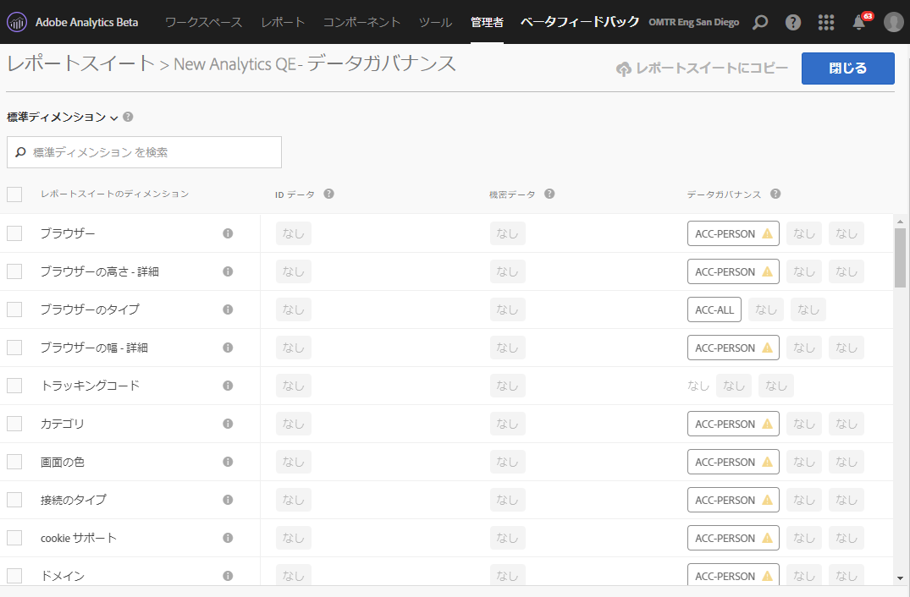
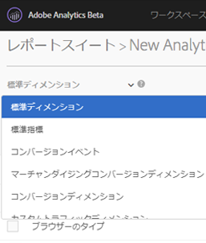
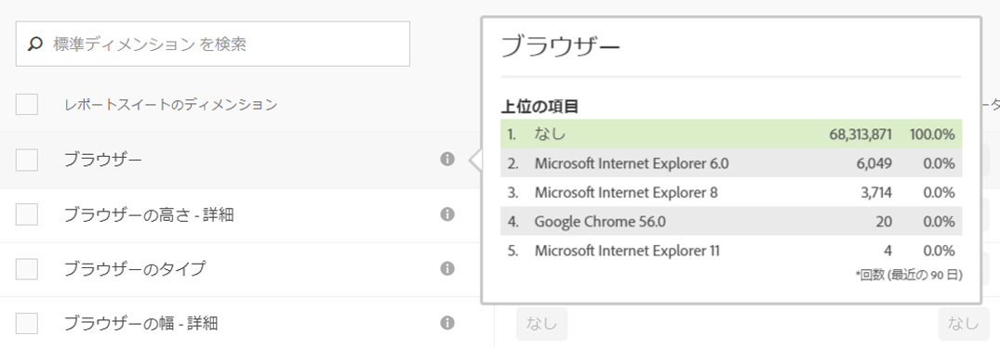
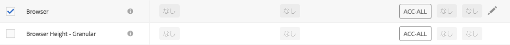
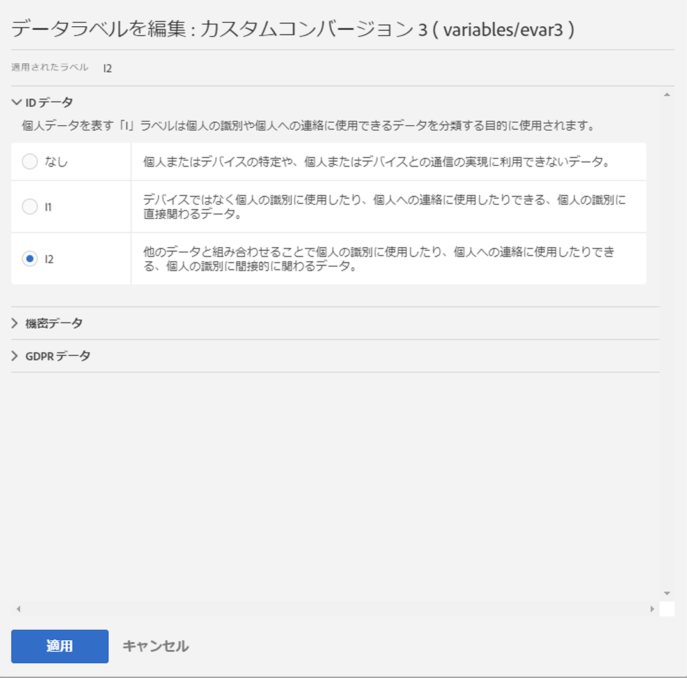
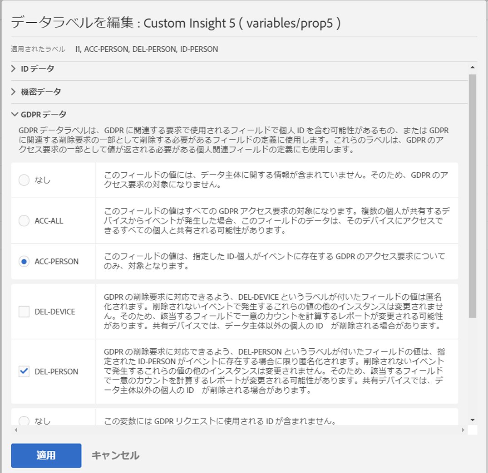
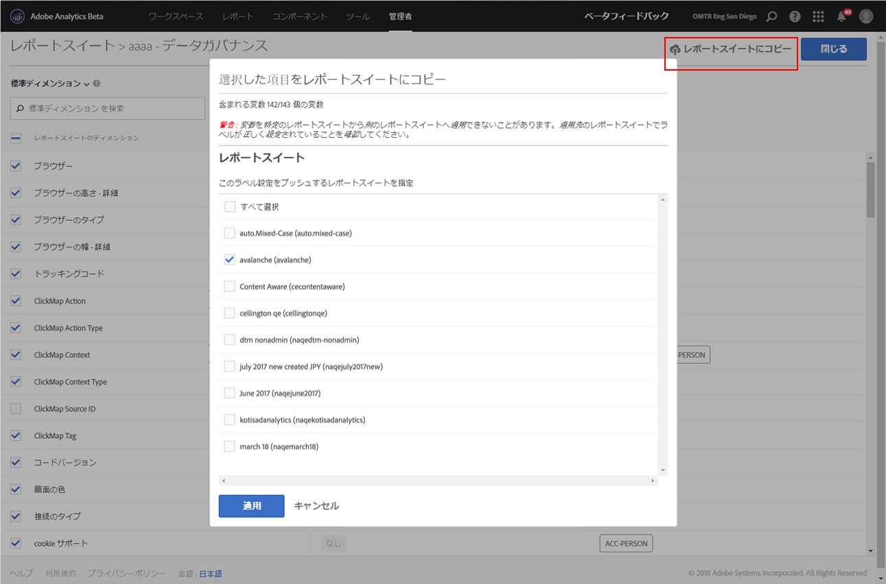

# ラベルレポートスイートのデータ

レポートスイートのデータにラベルを設定するとは、具体的には、特定のレポートスイート内の各変数に対し、識別、機密およびデータガバナンスの各ラベルを割り当てることです。事前にラベルとその意味について学んでおいてください。

>[!NOTE]
>
>新しいレポートスイートが作成されるたびに、または既存のレポートスイート内で新しい変数が有効になっている場合は、ラベル付けを再検討する必要があります。また、新しいソリューション統合が有効になると、ラベル設定が必要になる可能性のある新しい変数を公開できるので、ラベル設定を確認する必要があります。モバイルアプリまたは Web サイトを再実装すると、既存の変数の使用方法が変わる可能性があり、これにより、ラベルを更新する必要が生じる可能性があります。

## レポートスイートのラベルの割り当てまたは編集 {#section_39F829F35A274EACA532E2F6FF392996}

**例**：データ管理者が、GDPR 要求を処理するためにデータ主体から電子メールアドレスと Cookie ID を収集する予定だとします。この Cookie ID は Adobe Analytics のレポートスイートに保管されます。電子メールアドレスと Cookie ID のラベルを作成するには、Analytics で Adobe Cloud Platform の Data Usage Labeling &amp; Enforcement（DULE）フレームワークを使用する必要があります。

1. In Analytics, navigate to **[!UICONTROL Admin]** &gt; **[!UICONTROL Data Governance]** &gt; **[!UICONTROL[select report suite].]** 

1. ラベルを設定する変数のグループを選択します。

   

   * **標準ディメンション**（Adobe Analytics のデフォルトのディメンション）
   * **標準指標**（Adobe Analytics のデフォルトの指標）
   * **コンバージョンイベント**（カスタム成功イベント）
   * **マーチャンダイジングコンバージョンディメンション**（マーチャンダイジング eVar）
   * **コンバージョンディメンション**（非マーチャンダイジング eVar）
   * **カスタムトラフィックディメンション**（prop）
   * **ソリューションディメンションおよびイベント**（モバイル、ビデオ、Activity Map などのソリューションに関連するディメンション／イベントおよび Adobe Campaign、Adobe Experience Manager、Advertising Cloud などのソリューションとの統合）
   * **データ処理ディメンション**（Adobe Analytics UI を使用して通して直接レポートに直接公開されないがものの、データフィードおよび または Data Warehouse 要求を使用して通して利用可能な変数）

1. （オプション）各変数の隣の情報（i）アイコンをクリックして、最近の 90 日間で最も一般的な値について理解を深めます。（この機能は、 Analytics UI では使用できないので、データ処理ディメンションには使用できません。）

   

1. チェックボックスをオンにして 1 つ以上の変数を選択してから、右側の&#x200B;**[!UICONTROL 編集]アイコンをクリックして変数を編集します。**

   

1. **ID データ**&#x200B;ラベルダイアログが自動的に開きます。これらのラベルでは、単独または他のデータと組み合わせることで、個人を特定できるデータまたは個人への直接連絡が可能となるデータを分類します。これらのオプションについて詳しくは、[識別データラベル（DULE）](../../admin/c-data-governance/gdpr-labels.md#section_B2E78130957647338495EF37DE21D6BC)を参照してください。

   >[!NOTE]
   >
   >データ使用状況のラベル&amp;実行（DB）フレームワークは、ソリューション/サービス/プラットフォーム全体で一貫性のある方法を提供し、Adobe Experience Cloud全体でデータに関するメタデータを取得、通信および使用するように設計されています。データ管理者はこのメタデータを利用して、どのデータが個人情報や機密情報に該当するかを指定したり、契約上のどの制限事項がデータと関連しているかを指定したりできます。

   

1. 「**機密データ**」セクションを開いて、位置情報データに分類される機密データラベルを設定します。これらのオプションについて詳しくは、[機密データラベル（DULE）](../../admin/c-data-governance/gdpr-labels.md#section_533E1406F3F24A01B51D94139B94CAEC)を参照してください。

   

1. 「GDPR データ」セクションを開いて、**データガバナンス**&#x200B;ラベルを設定します。このセクションを使用して、GDPR アクセス要求および削除要求用の各変数の処理方法をアドビに知らせ、それらの要求用にデータ主体の ID を探すためにスキャンされる必要がある変数を定義します。これらのオプションについて詳しくは、[データガバナンスラベル（GDPR）](../../admin/c-data-governance/gdpr-labels.md#section_0C7F9EC4BB414A6D915C69F1D3259F1B)を参照してください。

   

1. すべてのラベル設定が完了したら、「**[!UICONTROL 適用]」をクリックします。**

## レポートスイートへのラベルのコピー{#section_7C6FDAFF049F4126B84F6261F72668EE}

次に、複数のレポートスイートに同じ DULE／GDPR 設定を割り当てる手順を示します。

1. コピーする変数を含んでいる変数グループ（標準ディメンション、コンバージョンディメンションなど）を選択します。一度にコピーできるラベルは変数の 1 グループのみであることに注意してください。
1. このグループの一部、またはすべての変数を選択します。
1. データガバナンスダイアログの右上にある「**[!UICONTROL レポートスイートにコピー]」をクリックします。**

   

1. 「**[!UICONTROL すべて選択]」をチェックして、選択した変数のラベルをすべてのレポートスイートにコピーするか、ラベルをコピーするレポートスイートを個別に選択します。**

   >[!IMPORTANT]
   >
   >選択したすべてのレポートスイートは、Experience Cloud組織にマッピングする必要があることに注意してください。

   1 つの変数または変数のセットのラベルを別のレポートスイートにコピーする場合、コピーは、コピー先レポートスイートの対応する位置の変数に対しておこなわれます。標準ディメンション、標準指標、ソリューションディメンションおよびイベント、データ処理ディメンションの場合、ラベルは、コピー先のレポートスイートの&#x200B;**同じ名前**&#x200B;の変数にコピーされます。

   ただし、コンバージョン変数（eVar）、マーチャンダイジングコンバージョンディメンションおよびカスタムトラフィックディメンション（prop）の場合、コピーは、コピー先レポートスイートの&#x200B;**同じ数**&#x200B;を持つ変数に対しておこなわれます。例えば、eVar12 は、すべてのコピー先レポートスイートの eVar12 にコピーされます。コピーの対象を判断するうえで、これらの変数の名前は無視されます。対応する変数がコピー先レポートスイートで有効でない場合、その変数のコピーは失敗します。

   変数用に定義された分類用にラベルをコピーする場合、ラベルは、コピーする分類と同じ名前を持つ、コピー先レポートスイートの対応する変数（eVar7 から eVar7）の分類にコピーされます。そうでない場合、その分類のラベルのコピーは失敗します。

   ラベルのセットが適用されると、ステータスメッセージが表示されます。ステータスメッセージには、コピー先の変数または分類とコピーが失敗したレポートスイートの名前が含まれます。

   >[!IMPORTANT]
   >
   >常に送信先レポートスイートを調べて、コピーしたラベルが正しくコピーされていることを確認してください。これは、ID または DEL ラベルを持つ変数で特に重要です。

1. Click **[!UICONTROL Apply]**.

