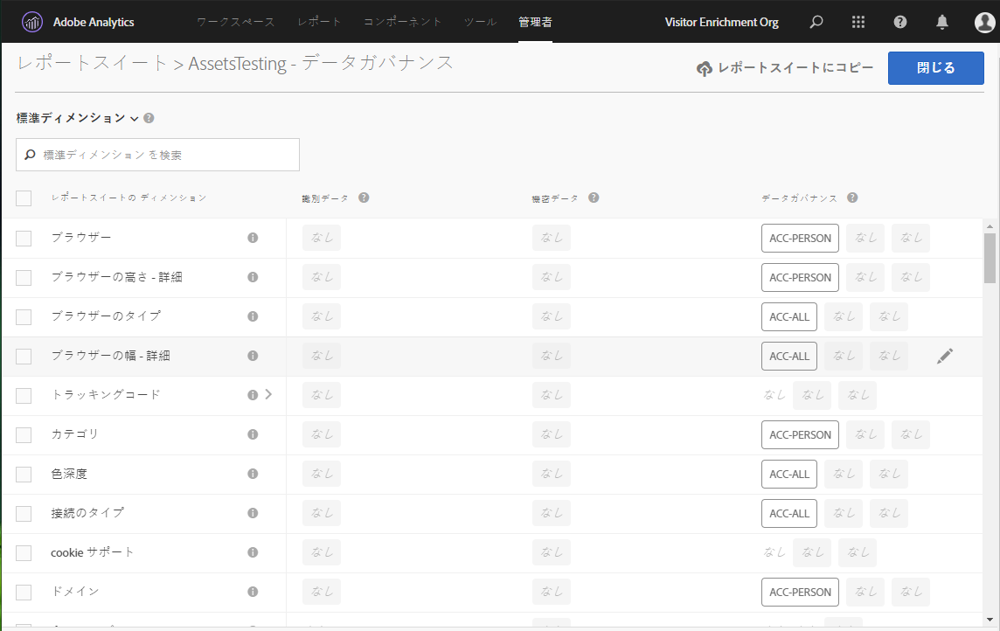
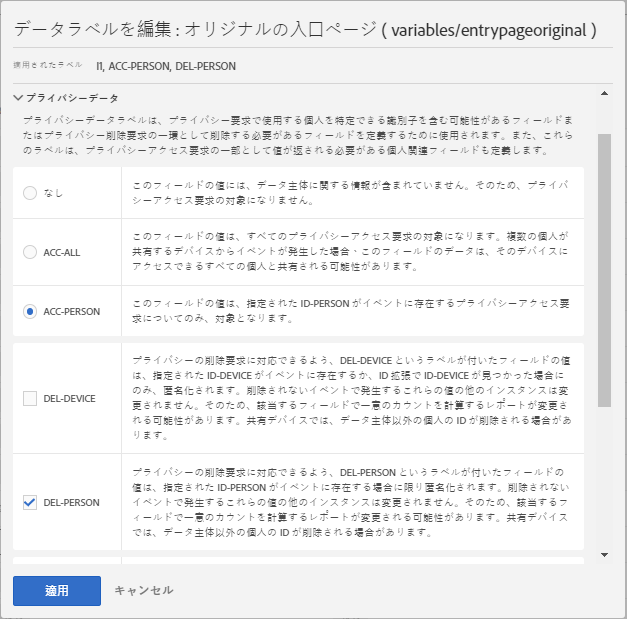

# レポートスイートのデータのラベル設定

レポートスイートデータにラベルを付けるとは、特定のレポートスイート内の各変数にID、感度およびデータガバナンスのラベルを割り当てることを意味します。 最初に、ラベルと定義について理解してください。

>[!NOTE]ラベル設定は、新しいレポートスイートが作成されるたびに、または既存のレポートスイート内で新しい変数を有効にする際に、確認する必要があります。また、新しいソリューション統合が有効な場合は、ラベル付けが必要な新しい変数を公開できるので、ラベル付けを確認する必要がある場合もあります。 モバイルアプリやWebサイトを再実装すると、既存の変数の使用方法が変わる場合があり、ラベルの更新が必要になる場合があります。

## レポートスイートのラベルの割り当てまたは編集 {#section_39F829F35A274EACA532E2F6FF392996}

**例**：データ管理者が、データプライバシー要求を処理するためにデータ主体から電子メールアドレスと Cookie ID を収集する予定だとします。これらのcookie IDは、Adobe Analyticsのレポートスイートに保存されます。 電子メールアドレスとcookie IDのラベルを作成するには、AnalyticsでAdobe Cloud PlatformのData Usage Labeling &amp; Enforcement(DULE)フレームワークを使用する必要があります。

1. Analyticsで、//に移 **[!UICONTROL Admin]** 動し **[!UICONTROL Data Governance]** ます **[!UICONTROL (select report suite)]** 。 

1. ラベルを付ける変数のグループを選択します。

   

   * **標準ディメンション** （Adobe Analyticsの標準ディメンション）
   * **標準指標** （Adobe Analyticsの標準指標）
   * **コンバージョンイベント**（カスタム成功イベント）
   * **マーチャンダイジングコンバージョン** （マーチャンダイジングeVar）
   * **コンバージョンディメンション** （非マーチャンダイジングeVar）
   * **カスタムトラフィックディメンション** (prop)
   * **ソリューションのディメンション** とイベント(モバイル、ビデオ、アクティビティマップなどのソリューションに関連するディメンション/イベント、Adobe Campaign、Adobe Experience Manager、Advertising Cloudなどのソリューションとの統合)
   * **データ処理ディメンション** (Adobe Analytics UIを通じてレポートに直接公開されず、データフィードやData Warehouseリクエストを通じて利用できる変数)

1. （オプション）各変数の横にある情報(i)アイコンをクリックして、過去90日間で最も一般的な値をよりよく理解します。 （この機能は、Analytics UIでは使用できないので、データ処理ディメンションでは使用できません）。

   

1. Select one or more variables by clicking their checkbox, then select the **[!UICONTROL Edit]** icon (to the right) to edit one or more variable(s).

   

1. [IDデー **タラベル** ]ダイアログが自動的に開きます。 これらのラベルは、個人を識別または直接個人との接触を可能にするために、自身で使用したり、他のデータと組み合わせて使用したりできるデータを分類します。 これらのオプションについて詳しくは、[ID データラベル（DULE）](/help/admin/c-data-governance/gdpr-labels.md#identity-data-labels)を参照してください。

   >[!NOTE]
   >
   >Data Usage Labeling &amp; Enforcement（DULE）フレームワークは、様々なソリューション／サービス／プラットフォームにまたがり、共通の方法で Adobe Experience Cloud 全体のデータに関するメタデータを取得、伝達、利用できるようにすることを目的としています。データ管理者はこのメタデータを利用して、どのデータが個人情報や機密情報に該当するかを指定したり、契約上のどの制限事項がデータと関連しているかを指定したりできます。

   

1. 「**機密データ**」セクションを開いて、位置情報データに分類される機密データラベルを設定します。これらのオプションについて詳しくは、[機密データラベル（DULE）](/help/admin/c-data-governance/gdpr-labels.md#sensitive-data-labels)を参照してください。

   

1. 「データプライバシーのデータ」セクションを開いて、**データガバナンス**&#x200B;ラベルを設定します。このセクションを使用して、データプライバシーアクセス要求および削除要求用の各変数の処理方法をアドビに知らせ、それらの要求用にデータ主体の ID を探すためにスキャンされる必要がある変数を定義します。これらのオプションについて詳しくは、[データガバナンスラベル（データプライバシー）](/help/admin/c-data-governance/gdpr-labels.md#data-governance-labels)を参照してください。

   

1. Click **[!UICONTROL Apply]** once you have completed all labeling.

## レポートスイートへのラベルのコピー {#section_7C6FDAFF049F4126B84F6261F72668EE}

次に、複数のレポートスイートに同じ DULE／データプライバシー設定を割り当てる手順を示します。

1. 変数グループ（標準ディメンション、コンバージョンディメンションなど）を選択します。にコピーする変数を含めます。 ラベルは、一度に1つの変数グループに対してのみコピーできます。
1. このグループ内の変数の一部またはすべてを選択します。
1. [デー **[!UICONTROL Copy Labels to Report Suite(s)]** タガバナンス]ダイアログの右上にあるをクリックします。

   

1. Either check **[!UICONTROL Select All]** to copy labels for the selected variables to all report suites or select the individual report suites that you want to copy the labels to.

   >[!IMPORTANT]
   >
   >選択したレポートスイートは、すべて Experience Cloud 組織にマッピングする必要があります。

   1 つの変数または変数のセットのラベルを別のレポートスイートにコピーする場合、コピーは、コピー先レポートスイートの対応する位置の変数に対しておこなわれます。標準ディメンション、標準指標、ソリューションディメンションおよびイベント、データ処理ディメンションの場合、ラベルは宛先のレポートスイ **ート** で同じ名前を持つ変数にコピーされます。

   ただし、コンバージョン変数(eVar)、マーチャンダイジングコンバージョンディメンションおよびカスタムトラフィックディメンション(prop)の場合、コピー先のレポートスイ **ート** で同じ番号の変数にコピーされます。 例えば、eVar12はすべてのコピー先レポートスイートのeVar12にコピーされます。 これらの変数の名前は、コピーのターゲットを決める際に無視されます。 対応する変数が送信先レポートスイートで有効になっていない場合、その変数のコピーは失敗します。

   変数に対して定義された分類のラベルをコピーすると、ラベルはコピー先のレポートスイートの対応する変数（eVar7からeVar7など）の分類にコピーされ、コピー先の分類と同じ名前が付けられます。 そうしないと、その分類のラベルのコピーは失敗します。

   一連のラベルが適用されると、ステータスメッセージが表示されます。 ステータスメッセージには、コピーが失敗した宛先変数または分類の名前と、そのレポートスイートが含まれます。

   >[!IMPORTANT]
   >
   >常にコピー先レポートスイートをチェックして、ラベルが適切にコピーされていることを確認する必要があります。これは、ID または DEL ラベルを持つ変数で特に重要です。

1. クリック **[!UICONTROL Apply]**.

