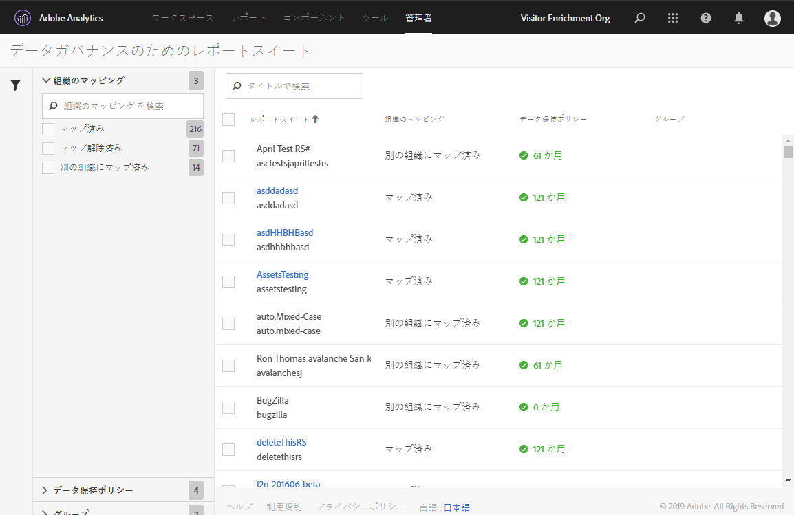
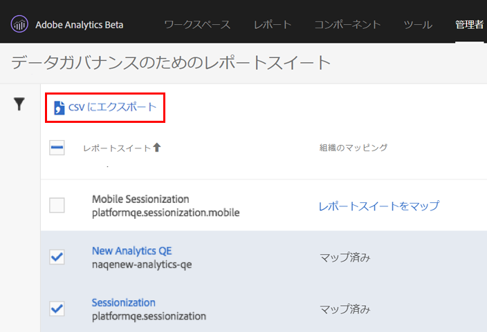

# レポートスイートのデータガバナンス設定の表示／管理

管理ツールのデータガバナンスダイアログには、Experience Cloud 組織にマッピングされているかどうかや、データ保持ポリシーが設定されているかどうかなど、データガバナンスが設定されているレポートスイートの概要が表示されます。

1. Adobe Experience Cloud にログインします。
1. **[!UICONTROL Analytics]**／**[!UICONTROL 管理者]**／**[!UICONTROL データガバナンス]**&#x200B;の順にクリックします。

   ログイン会社のレポートスイートがすべて表示されます。

   

<table id="table_448292730FF0475E9DCB731882F9A29B"> 
 <thead> 
  <tr> 
   <th colname="col1" class="entry"> 設定 </th> 
   <th colname="col2" class="entry"> 説明 </th> 
  </tr> 
 </thead>
 <tbody> 
  <tr> 
   <td colname="col1"> 
レポートスイート 
 </td> 
   <td colname="col2"> 
1 行目では、レポートスイートのわかりやすい名前がリストされます。2 行目には、レポートスイートの内部名が含まれます。レポートスイートのラベルを設定することを許可されている場合、最初の行は、ラベル設定ページに移動するクリック可能なリンクになります。 
 </td> 
  </tr> 
  <tr> 
   <td colname="col1"> 
組織のマッピング 
 </td> 
   <td colname="col2"> 
    <ul id="ul_EF8F613B0C5E42D19DB60BD0C89C114B"> 
     <li id="li_B35EE88555F547EFBF55ADE9D0C9EC3B"><b>マップ済み</b>：このレポートスイートは、ログインした Analytics ログイン会社として、同じ Experience Cloud 組織に既にマッピングされています。この設定のあるレポートスイートのみ、ラベル設定できます。 </li> 
     <li id="li_4E800BF80CFF477BAA091EF272D9071C"><b>レポートスイートをマップ</b>：このリンクをクリックすると、Experience Cloud 組織に<a href="https://docs.adobe.com/content/help/ja-JP/core-services/interface/about-core-services/report-suite-mapping.html">レポートスイートをマップ</a>できます。 
すると、Experience Cloud 組織 – レポートスイートマッピング管理ページにリダイレクトされます。そこから、レポートスイートを検索して適切な組織に割り当てる必要があります。それが完了したら、このデータガバナンス画面に戻ります。 
 </li> 
     <li id="li_FF825A65D089487BBF5FCB0D74D41CD7"><b>別の組織にマップ済み</b>：このレポートスイートは、別の Experience Cloud 組織に既にマッピングされています。 </li> 
    </ul> </td> 
  </tr> 
  <tr> 
   <td colname="col1"> 
データ保持ポリシー 
 </td> 
   <td colname="col2"> 
Analytics のデータプライバシー実装では、データ保持ポリシーを適用する必要があります。 
 
この設定では、以下の点を確認できます。 
 
    <ul> 
     <li>このレポートスイートに対してデータ保持ポリシーが適用されているかどうか。 </li> 
     <li>アドビによってデータが保持される期間（この期間を過ぎると削除されます）。デフォルトのデータ保持期間は 25 ヶ月です。 </li> 
    </ul> 
注意：データ保持期間が設定されていないと、Adobe Analytics は、データプライバシー API への要求の処理（お客様のエンドユーザーからのアクセス要求または削除要求の処理）をサポートすることはできません。データ保持期間の設定については、カスタマーサクセスマネージャーまでお問い合わせください。 
 </td> 
  </tr> 
  <tr> 
   <td colname="col1"> 
グループ 
 </td> 
   <td colname="col2"> 
グループ機能は、現在、実装されていません。 
 </td> 
  </tr> 
  <tr> 
   <td colname="col1"> 
左側のサイドバー 
 </td> 
   <td colname="col2"> 
ファネルアイコンをクリックして、サイドバーを開いたり閉じたりします。 
 
「組織のマッピング」セクションには、説明された各カテゴリに分類されたレポートスイートの数が表示されます。 
 
「データ保持ポリシー」セクションには、お客様の組織で現在実施されている独自の各データ保持ポリシーと、その保持ポリシーに割り当てられたレポートスイートの数が表示されます。 
 </td> 
  </tr> 
  <tr> 
   <td colname="col1"> 
CSV に書き出し 
 </td> 
   <td colname="col2"> 
1 つまたは複数のレポートスイートの隣のチェックボックスをオンにすると、「CSV に書き出し」オプションが表示されます。このオプションを使用すると、選択したすべてのレポートスイートのすべての変数に関する現在のすべてのラベル定義が含まれた CSV ファイルをダウンロードできます。 
 
アドビでは、自社の法務チームにラベル設定の選択を確認することをお勧めしています。このオプションによって、この確認が容易になります。データガバナンス UI にログインしてレビューを実行しなくても、法務チームと .CSV ファイルを共有できます。 
 
 
 </td> 
  </tr> 
 </tbody> 
</table>

