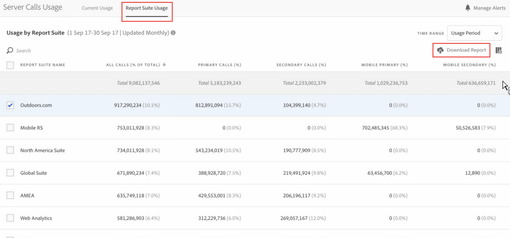
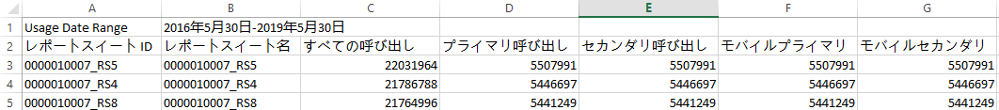

# レポートスイートの使用状況の表示

「レポートスイートの使用状況」タブには、課金会社に関連付けられたすべてのログイン会社のレポートスイートごとに、現在の使用期間のサーバー使用状況データが表示されます。

**[!UICONTROL Analytics]** / **[!UICONTROL 管理者]** / **[!UICONTROL サーバーコールの使用状況]** / **[!UICONTROL レポートスイートの使用状況]**

>[!IMPORTANT]
>
>If a report suite is not [linked to an Experience Cloud Organization](https://marketing.adobe.com/resources/help/en_US/mcloud/report-suite-mapping.html), its usage data will not be reflected in this dashboard. また、課金 ID は複数の Experience Cloud 組織に関連付けることができ、組織と課金 ID の間には必ずしも 1 対 1 の関係はありません。

レポートスイートの使用状況ダッシュボードは、以下のように動作します。

* Experience Cloud 組織内のレポートスイートごとに、現在の使用期間のサーバーコール使用状況（すべての呼び出し、プライマリ、セカンダリ、モバイルプライマリ、モバイルセカンダリ）を表示します。
* サーバーコールカテゴリーごとに、使用量全体に占める割合（パーセント）を表示します。
* 毎日更新されます。
* ダウンロード可能です。
* **[!UICONTROL アラート管理]UI にアクセスできます。**

| 列 | 定義 |
|--- |--- |
| レポートスイート名 | レポートスイートのわかりやすい名前。 |
| すべての呼び出し (合計の %) | 現在の使用期間に発生したすべてのサーバーコールの数。 |
| プライマリ呼び出し (%) | 現在の使用期間に発生したすべてのプライマリサーバーコールの数（および全体に占める割合）。 |
| セカンダリ呼び出し (%) | 現在の使用期間に発生したすべてのセカンダリサーバーコールの数（および全体に占める割合）。 |
| モバイルプライマリ (%) | 現在の使用期間に発生したすべてのモバイルプライマリサーバーコールの数（および全体に占める割合）。 |
| モバイルセカンダリ (%) | 現在の使用期間に発生したすべてのモバイルセカンダリサーバーコールの数（および全体に占める割合）。 |

## 使用状況レポートのダウンロード {#section_D7345660B5E043CD8850954216509A3D}

このオプションでは、現在の使用状況データと現在の使用期間より前の期間（2015 年 1 月までさかのぼることが可能）のデータをダウンロードできます。レポートは .csv ファイルとしてダウンロードされます。

1. 1 つ以上のレポートスイートを選択します。
1. Click **[!UICONTROL Download Report]**.

   

| レポートの要素 | 説明 |
|--- |--- |
| ファイル名 | Hardcoded name: Usage Report `day and time of report creation.csv` |
| 選択されたレポートスイート | サーバー使用状況のレポートページで選択したすべてのレポートスイートが、このリストに含まれています。 |
| 選択された呼び出しタイプ | すべての呼び出し（デフォルト）、プライマリ、セカンダリ、モバイルプライマリ、モバイルセカンダリの任意の組み合わせを指定します。 |
| 時間範囲 | 現在の使用期間を選択するか、カスタムの範囲を指定します。カスタムの範囲の場合は、範囲の開始と範囲の終了を指定します。 **注意:** 2015年1月より前に使用状況データをダウンロード  することはできません。 |

1. Click **[!UICONTROL Download]**.

ダウンロードした. csvファイルのスクリーンショットを以下に示します。レポートスイートIDの列が含まれます。レポートスイートIDは、英数字のみを含めることができる一意のIDを指定します。このIDは、レポートスイートの作成後には変更できません。

