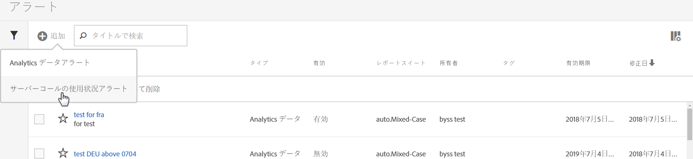
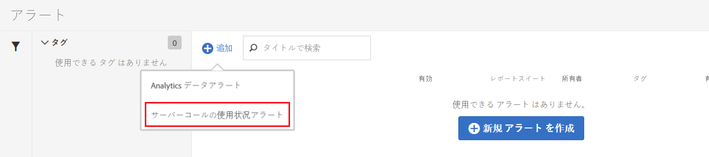

# サーバーコールの使用状況アラート

アラートをセットアップすると、請求会社のすべてのログイン会社におけるすべてのレポートスイートに適用されます。

## 概要

**[!UICONTROL サーバーコールの使用状況アラート]**&#x200B;という新しいアラートカテゴリーが既存の[アラート管理](https://docs.adobe.com/content/help/ja-JP/analytics/analyze/analysis-workspace/virtual-analyst/intelligent-alerts/intellligent-alerts.html)ユーザーインターフェイスに追加されます。

**1 つのデフォルトアラート**&#x200B;があらかじめ設定されており、サーバーコール使用状況の機能を利用できるあらゆるログイン会社内で表示されます。以下の条件のいずれかが満たされた場合、このアラートはログイン会社の管理者全員に宛てた通知をトリガーします。

* 該当するあらゆるサーバーコールタイプの「あらゆる」サーバーコール使用状況が 100 ％「以上」である。
* 該当するあらゆるサーバーコールタイプの「あらゆる」サーバーコール使用状況が 90 ％「以上」である。
* 該当するあらゆるサーバーコールタイプの「あらゆる」サーバーコール使用状況が 75 ％「以上」で、かつ、「経過した使用期間」が使用期間全体の 75 ％「以下」である。

サーバーコールの使用状況アラートには、以下の 2 とおりの方法でアクセスできます。

* 「現在の使用状況」タブまたは「レポートスイートの使用状況」タブの右上隅にある「**[!UICONTROL アラートを管理]**」をクリックします。
* Adobe Analytics で&#x200B;**[!UICONTROL コンポーネント]**／**[!UICONTROL アラート]**&#x200B;を選択します。

## サーバーコールの使用状況アラートの作成 {#section_2A2882C6D48D47C1944D52FB7C766BEC}

追加のアラートを作成するには、以下の手順に従います。

1. 「**[!UICONTROL + 追加]**」をクリックし、「**[!UICONTROL サーバーコールの使用状況アラート]**」を選択します。

   

1. アラートを定義します。

   

   * **タイトル**：わかりやすい名前を指定します。名前を付けずにアラートを保存することはできません。
   * **時間制度**：アラートのチェック頻度を指定します。*現時点では、週 1 回の精度のみサポートしています。*&#x200B;つまり、アラートは週 1 回のペースでチェックされ、現在の使用期間のデータを振り返ります。
   * **受信者**：指定されたしきい値をアラートがトリガーしたときに電子メールを受け取る、組織の全員を指定します。
   * **有効期限**：デフォルトでは、有効期限はアラート作成日の 1 年後です。
   * **次の場合にアラートを送信**：

      * 次の指標のいずれかをトリガー：
サーバーコールのタイプを指標として追加し、修飾子と次のしきい値を選択してアラートのしきい値を指定します。
         * 以上
         * 以下
      * 次の場合：
経過した使用期間のしきい値と条件（以上または以下）を指定します。

1. 「**[!UICONTROL 保存]**」をクリックします。

## サーバーコールの使用状況アラートの管理 {#section_8FF98170763C4B5CBEC6DD43F893177A}

アラートを管理するには、以下の手順に従います。

1. １ つ以上のアラートのチェックボックスを選択します。アラート管理のアクションが上部に表示されます。
1. 以下のアクションを 1 つ以上実行します。

   | アクション | 定義 |
   |--- |--- |
   | + 追加 | 「[+ 追加](/help/admin/c-server-call-usage/scu-alerts.md)」をクリックすると、[!UICONTROL アラートビルダー]にアクセスします。 |
   | タグ | アラートにタグを付けて、使いやすいように整理します。 |
   | 削除 | デフォルトアラートを除くすべてのアラートを削除できます。 |
   | 名前変更 | デフォルトアラートを除くすべてのアラートの名前を変更できます。 |
   | 承認 | アラートを承認して、「正式な」アラートにします。 |
   | 有効 / 無効 | デフォルトアラートを含め、すべてのアラートを有効または無効にすることができます。 |
   | 更新 | 1 つまたは複数のアラートが選択されている場合、更新できます。これにより、元の有効期限にかかわらず、「[!UICONTROL 更新]」がクリックされた日から 1 年先に有効期限が延長されます。 |
   | CSV に書き出し | [使用状況レポートのダウンロード](/help/admin/c-server-call-usage/report-suite-usage.md)を参照してください。 |

