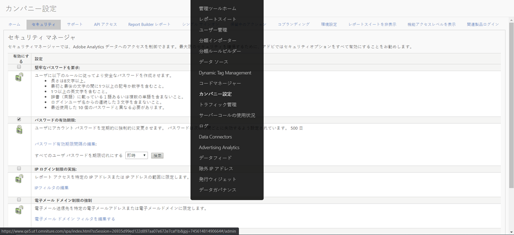

# [!UICONTROL IP ログイン制限の実施]の提供終了

Adobe Analyticsの&#x200B;**[IPログイン制限の強制](/help/admin/company/security-manager.md)**&#x200B;機能を使用すると、特定のIPアドレス（セキュリティで保護されていると見なされる）を許可リストに追加して、Adobe Analytics環境へのログインとアクセスを成功させることができます。 多くの場合、この機能は、ユーザーがログインできる唯一のセキュア IP アドレスとして会社の IP アドレスを設定するために使用されます。したがって、Adobe Analytics を使用するには、ユーザーが社内にいるか、VPN 経由でネットワークにログインする必要があります。

この機能は2021年1月に提供終了となる予定です。

## この機能の提供終了の理由を教えてください。

この機能は、特定の状況において、Experience Cloud ログイン移行または Experience Cloud ログインによって動作しなくなります。**[!UICONTROL 顧客属性]**&#x200B;や&#x200B;**[!UICONTROL オーディエンスライブラリ]**&#x200B;を使用すると動作しなくなることがわかっています。

さらに、複数の Experience Cloud ソリューションを所有している場合、この機能は Analytics 以外では存在しないかサポートされていないため、他のソリューションのいずれかを使用して Experience Cloud にログインすることで、この要件を回避できます。また、IP スプーフィングを使用してこの問題を回避することもできます。

最後に、シングルサインオンと Federated ID を使用した、機能的で優れた代替ソリューションが提供されます。この機能により、ユーザーのログインエクスペリエンスをより詳細に制御し、セキュリティを確保できます。詳しくは、以下を参照してください。

## この機能を削除すると、どのように影響を受けますか。

**[!UICONTROL IPログイン制限の強制]**&#x200B;が設定されているお客様の場合、この機能は2021年1月に削除されます。 その時点で、「IP ログイン制限の実施」は適用されなくなります。引き続き IP アドレスでログインを制限する必要がある場合は、シングルサインオンと Federated ID の推奨ソリューション（詳細情報とリソースは以下を参照）を確認し、実装する必要があります。

さらに、Analytics UIの&#x200B;**[!UICONTROL 管理者]/[!UICONTROL 会社設定]/[!UICONTROL セキュリティマネージャー]**&#x200B;から、**[!UICONTROL IPログイン制限の強制]**&#x200B;設定が削除されます（下図参照）。

## 他の選択肢はありますか。

上述のとおり、この Analytics 機能は提供終了となります。SSOおよびFederated IDの実装に時間を割くため、EOLの日付を2021年1月に延期しました。

SSO ID とFederated ID の両方が、現在導入されている IP ログイン制限機能に対する優れたソリューションであり、より詳細な制御、セキュリティ、機能を提供します。SSO／Federated ID の設定方法について詳しくは、次のヘルプドキュメントを参照してください。アドビでは、お客様の IT 部門と協力して、導入を行うことをお勧めします。

* [シングルサインオンと Experience Cloud](https://spark.adobe.com/page/JeSB8EPEQIvjD/)
* [Admin Console - ID 設定ドキュメント](https://helpx.adobe.com/jp/enterprise/using/set-up-identity.html)
* [Admin Console - ID 設定チュートリアル（ビデオ）](https://helpx.adobe.com/jp/enterprise/how-to/identity-directories-domains.html?playlist=/ccx/v1/collection/product/enterprise/topics/enterprise-identity/collection.ccx.js&amp;ref=helpx.adobe.com)
* [Federated ID の設定チュートリアル（ビデオ）](https://helpx.adobe.com/jp/enterprise/how-to/identity-configure-ids.html?playlist=/ccx/v1/collection/product/enterprise/topics/enterprise-identity/collection.ccx.js&amp;ref=helpx.adobe.com)
* [シングルサインオン - よくある質問](https://helpx.adobe.com/jp/enterprise/using/sso-faq.html)
* [アドビがサポートする ID タイプ](https://helpx.adobe.com/jp/enterprise/using/identity.html)

「IP ログイン制限の実施」のサポートを引き続き表明し、Experience Cloud による提供をリクエストする場合は、[フォーラムページ](https://forums.adobe.com/ideas/11648)でこの機能に対して投票を行うことができます。