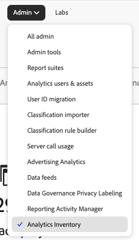
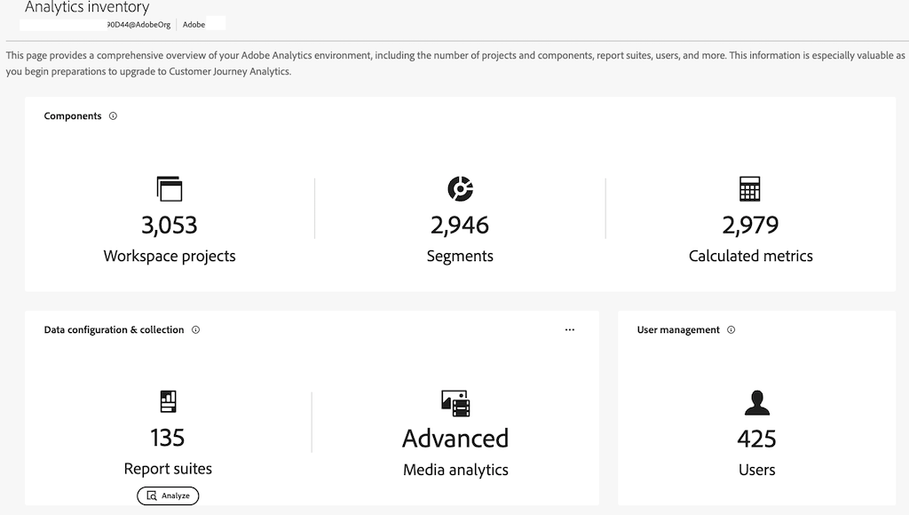

# Analytics インベントリ {#analytics-inventory}

<!-- markdownlint-disable MD034 -->

>[!CONTEXTUALHELP]
>id="analytics-inventory"
>title="Analytics インベントリ"
>abstract="このページでは、プロジェクトとコンポーネントの数、レポートスイート、ユーザーなど、Adobe Analytics 環境の包括的な概要について説明します。 この情報は、Customer Journey Analytics へのアップグレードの準備を開始する際に特に役立ちます。"

<!-- markdownlint-enable MD034 -->

Adobe Analytics インベントリでは、プロジェクト数、コンポーネント数、レポートスイート数、ユーザー数など、Adobe Adobe Analytics環境の包括的な全体像を把握できます。 この情報は、Customer Journey Analytics へのアップグレードの準備を開始する際に特に役立ちます。

Adobe Analyticsのインベントリの目的は、次の質問に答えることです。

* 組織では、どのアセット（レポートスイート、セグメント、ユーザー、ワークスペースプロジェクトなど）を移行する必要がありますか？どのアセットを残しておけばよいですか？

* 移行する必要があるアセットを決定したら、次の手順を実行します。

   * このアップグレードの前に、アセットのクリーンアップを行う必要がありますか？

   * プロセスの一環として、アセットの統合を行う必要がありますか？

   * アセットのアップグレードシーケンスを教えてください。

   * 最初または最後にアップグレードするレポートスイートはどれですか？

## 権限

Analytics Inventoryは、[Adobe Admin Console](/help/admin/admin-console/admin-roles-in-analytics.md)のAdobe Analytics製品管理者権限を持つユーザーが利用できます。

## Analytics インベントリへのアクセス

1. **[!UICONTROL 管理者]** メニューの&#x200B;**[!UICONTROL 分析インベントリ]**&#x200B;をクリックします。 または、**[!UICONTROL All admin]** > **[!UICONTROL Analytics Inventory]**&#x200B;に移動します。

1. メイン画面には、Adobe Analytics環境の包括的なインベントリが表示されます。

   

   具体的には、次の画面が表示されます。

   * この組織でアクティブなAnalysis WorkspaceおよびMobile Scorecard プロジェクトの合計数です。すべてのユーザーを対象としています。
   * この組織でアクティブなセグメントと計算指標の合計数が、すべてのユーザーで表示されます。
   * 定義された基本レポートスイートの合計数です。 仮想レポートスイートは含まれません。
   * メディア分析機能がアクティブな場合は、その場合は、どのモードでアクティブにするかを指定します。
   * この組織で定義されたユーザーの合計数です。

## コンポーネント {#components}

<!-- markdownlint-disable MD034 -->

>[!CONTEXTUALHELP]
>id="analytics-inventory-components"
>title="コンポーネント"
>abstract="このセクションには、Adobe Analytics 環境に存在するプロジェクト、セグメント、計算指標の数が表示されます。 プロジェクトとコンポーネントは、Customer Journey Analytics に移行できます。"

<!-- markdownlint-enable MD034 -->

この最初のリリースでは、Workspace プロジェクト、セグメント、計算指標の概要インベントリ番号を確認できます。 以降のリリースでは、これらのコンポーネントを分析できます。

## データの設定と収集 {#data-config}

<!-- markdownlint-disable MD034 -->

>[!CONTEXTUALHELP]
>id="analytics-inventory-data-config"
>title="データの設定と収集"
>abstract="このセクションには、Adobe Analytics 環境内のレポートスイートの数と、ストリーミングメディアサービスへのアクセス権が表示されます。"

<!-- markdownlint-enable MD034 -->

### レポートスイート

レポートスイートビューには、組織で定義されているすべてのレポートスイートが表示されます。 次のような質問に答えることができます。

* 過去90日間に最も多くのヒット数を獲得したレポートスイートは何ですか？
* 過去90日間にヒットしなかったレポートスイートはどれですか？
* ディメンションの数が最も多く定義されているレポートスイートはどれですか？
* 指標の数が最も多く定義されているレポートスイートは何ですか？

これらの質問に対する回答は、どのレポートスイートが移行に最適な候補であるかについての良いアイデアを提供します。

>[!NOTE]
>
>このテーブルは、1つにつき1つのセル値をゆっくりと入力します。

1. レポートスイートを分析するには、**[!UICONTROL データ設定とコレクション]**/**[!UICONTROL レポートスイート]**&#x200B;に移動し、**[!UICONTROL 分析]**&#x200B;をクリックします。

   

   | 要素 | 説明 |
   | --- | --- |
   | 名前 | レポートスイートの名前 |
   | ID | レポートスイート ID （rsid）。 英数字のみを含むことができる一意のIDを指定します。 このIDは、作成後に変更できません。 アドビによって設定される必須の ID 接頭辞も変更できません。 |
   | 発生件数 (過去 90 日間) | 「発生件数」指標は、特定のディメンションが設定または持続されたヒット数を示します。 過去90日間に、このレポートスイートは何件のヒットを受け取りましたか？ |
   | 指標 | このレポートスイートで定義されている指標の数 |
   | ディメンション | このレポートスイートで定義されるディメンションの数は？ |
   | Analytics for Target (A4T) は有効になっています | [ デフォルトで非表示]このレポートスイートは[Analytics for Target](https://experienceleague.adobe.com/en/docs/target/using/integrate/a4t/a4t)で有効になっていますか？ |
   | マーケティングチャネルは有効になっています | [ デフォルトで非表示]このレポートスイートは[&#x200B; マーケティングチャネル &#x200B;](/help/components/c-marketing-channels/c-getting-started-mchannel.md)に対して有効になっていますか？ |
   | ソースコネクタは有効になっています | このレポートスイートは、Adobe Experience Platformの[Adobe Analytics Source コネクタでレポートスイートデータ &#x200B;](https://experienceleague.adobe.com/ja/docs/experience-platform/sources/connectors/adobe-applications/analytics)に対して有効になっていますか？ つまり、このレポートスイートは、Analytics Source コネクタを使用してCustomer Journey Analyticsに移行できますか？ |
   | カレンダータイプ | [ デフォルトで非表示]詳しくは、[&#x200B; カスタムカレンダー](/help/admin/tools/manage-rs/edit-settings/general/custom-calendar.md)を参照してください |

#### ディメンションの分析

この画面では、特定のレポートスイートに対して定義されたすべてのディメンションの詳細が表示されます。 このビューでは、次の質問に答えることができます。

* このレポートスイートで有効なディメンションは何ですか？
* このディメンションの過去90日間の上位10個のディメンション項目は何ですか？

1. レポートスイートページの「**[!UICONTROL ディメンション]**」リンクをクリックします。

   | 要素 | 説明 |
   | --- | --- |
   | 名前 | ディメンション名 |
   | ID | ディメンション ID。 |
   | タイプ | ディメンションのタイプ。 使用可能な値には、コンバージョン、トラフィック、ナビゲーション、トラフィックソース、お客様、日付、またはAEM、Audience、Adobe Campaign、モバイルアプリなどのAdobe製品固有のディメンションが含まれます。 |
   | 説明 | すべてのディメンションに説明があるわけではありません。 |
   | ソースコネクタは有効になっています | このディメンションは、Adobe Experience Platformのレポートスイートデータ [&#128279;](https://experienceleague.adobe.com/ja/docs/experience-platform/sources/connectors/adobe-applications/analytics)に対するAdobe Analytics Source コネクタに対して有効になっていますか？ つまり、Analytics Source コネクタを使用して、このディメンションをCustomer Journey Analyticsに移行できますか？ |

1. CJAに移行する際に意味のあるディメンションを決定します。

#### 指標の分析

この画面では、特定のレポートスイートに定義されているすべての指標の詳細が表示されます。 このビューでは、次の質問に答えることができます。

* このレポートスイートで有効な指標は何ですか？
* 過去90日間の上位10個の指標は何ですか？

1. レポートスイートページの「**[!UICONTROL 指標]**」リンクをクリックします。

   | 要素 | 説明 |
   | --- | --- |
   | 名前 | 指標の名前 |
   | ID | 指標ID。 |
   | タイプ | 指標のタイプ。 使用可能な値には、コンバージョン、トラフィック、ナビゲーション、トラフィックソース、お客様、日付、またはAEM、Audience、Adobe Campaign、モバイルアプリなどのAdobe製品固有のディメンションが含まれます。 |
   | 説明 | すべてのディメンションに説明があるわけではありません。 |
   | ソースコネクタは有効になっています | この指標は、Adobe Experience Platformのレポートスイートデータ [&#128279;](https://experienceleague.adobe.com/ja/docs/experience-platform/sources/connectors/adobe-applications/analytics)に対するAdobe Analytics Source コネクタに対して有効になっていますか？ つまり、Analytics Source コネクタを使用して、この指標をCustomer Journey Analyticsに移行できますか？ |

1. CJAに移行する際に意味のある指標を決定します。

### CSV に書き出し

1. レポートスイートまたはディメンションまたは指標のリストを.csv ファイルに書き出すには、「**[!UICONTROL CSVに書き出し]**」をクリックします。

1. .csv ファイルがダウンロードフォルダーに表示されます。

1. デバイス上のスプレッドシートアプリケーションで開いて保存します。

>[!NOTE]
>
>フィルタリングされた項目と列は、.csv ファイルには書き出されません。

### フィルター、検索、並べ替え

* テーブルを検索できます。
* 左側のパネルで、フィルターアイコンをクリックして「タイプ」でフィルタリングします。 または、**[!UICONTROL フィルターを非表示]**&#x200B;をクリックします。
* すべての列を昇順/降順で並べ替えることができます（単一列の並べ替えのみ）。
* パンくずリストの項目をクリックすると、別の画面に移動できます。

## ユーザー管理 {#user-management}

<!-- markdownlint-disable MD034 -->

>[!CONTEXTUALHELP]
>id="analytics-inventory-user-management"
>title="ユーザー管理"
>abstract="このセクションには、Adobe Analytics 環境内のユーザーの数が表示されます。"

<!-- markdownlint-enable MD034 -->

ユーザー管理は、Analytics インベントリの後のリリースで使用できるようになります。

## コンポーネントの移行

[&#x200B; コンポーネントの移行](/help/admin/tools/component-migration/component-migration.md)を使用すると、Adobe Analytics管理者はAnalytics プロジェクトおよび関連するコンポーネントをCustomer Journey Analyticsに移行できます。

移行プロセスには、次が含まれます。

* Customer Journey Analytics で Adobe Analytics プロジェクトを再作成する。

* Adobe Analytics レポートスイートのディメンションと指標を、Customer Journey Analytics データビューのディメンションと指標へマッピングする。