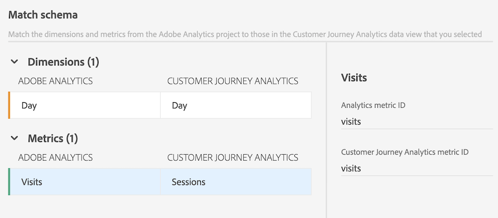
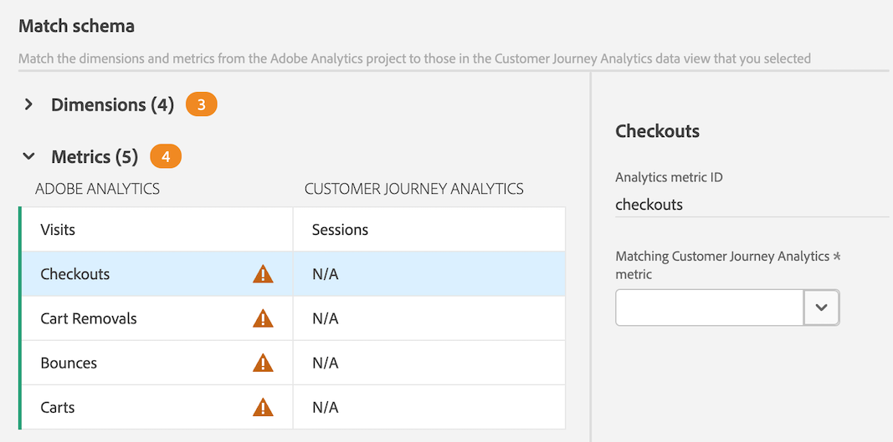
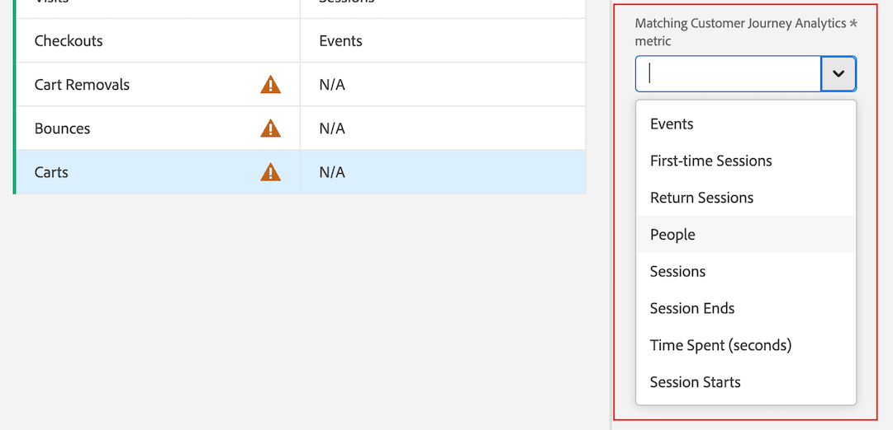
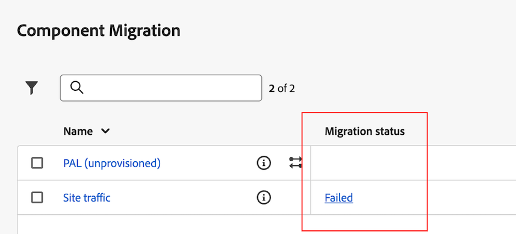

# Adobe AnalyticsからCustomer Journey Analyticsへのコンポーネントとプロジェクトの移行

Adobe Analytics 管理者は、Adobe Analytics プロジェクトとその関連コンポーネントを Customer Journey Analytics に移行できます。

移行プロセスには、次が含まれます。

* Customer Journey Analytics で Adobe Analytics プロジェクトを再作成する。

* Adobe Analytics レポートスイートのディメンションと指標を、Customer Journey Analytics データビューのディメンションと指標へマッピングする。

  一部のディメンションと指標は自動的にマッピングされます。その他は、移行プロセスの一部として手動でマッピングする必要があります。 セグメントも移行されますが、移行プロセスの一部としてマッピングする必要はありません。

  移行が完了すると、移行されたコンポーネントはすべて移行の概要に表示されます。

>[!NOTE]
>
>このページの情報では、ユーザーインターフェイスを使用してプロジェクトとその関連コンポーネントを移行する方法について説明します。
>
>または、APIを使用して移行を実行することもできます。 詳しくは、[Adobe Analytics API](https://adobedocs.github.io/analytics-2.0-apis/?urls.primaryName=Analytics%202.0%20APIs)を参照してください。 すべてのAPI定義は、**[!UICONTROL 定義を選択]** ドロップダウンメニューで使用できます。

## 移行の準備

プロジェクトをCustomer Journey Analyticsに移行する前に、[&#x200B; コンポーネントとプロジェクトをAdobe AnalyticsからCustomer Journey Analyticsに移行する準備](/help/admin/tools/component-migration/prepare-component-migration.md)でプロジェクトの移行について詳しく説明します。

また、Analytics管理者が利用できるツールを使用して、[Adobe Analytics インベントリ &#x200B;](/help/admin/tools/analytics-inventory.md)を実行します。

## Adobe Analytics プロジェクトのCustomer Journey Analyticsへの移行

>[!NOTE]
>
>この節の説明に従ってプロジェクトをCustomer Journey Analyticsに移行する前に、[&#x200B; コンポーネントとプロジェクトをAdobe AnalyticsからCustomer Journey Analyticsに移行する準備](/help/admin/tools/component-migration/prepare-component-migration.md)でプロジェクトの移行について詳しく説明します。
>
>**マッピングするディメンションまたは指標は、どのユーザーが移行を実行しているかにかかわらず、このプロジェクトと、IMS組織全体のすべての今後のプロジェクトに適用されます。 これらのマッピングは、今後のプロジェクトを移行する際に更新できます。**

1. Adobe Analytics で、「[!UICONTROL **管理者**]」タブを選択し、「[!UICONTROL **すべての管理者**]」を選択します。

1. [!UICONTROL **データ設定とコレクション**]&#x200B;で、[!UICONTROL **コンポーネントの移行**]&#x200B;を選択します。

1. 移行する各プロジェクトを探します。 プロジェクトリストは、フィルタリング、並べ替え、検索できます。

   デフォルトでは、自分と共有しているプロジェクトのみが表示されます。 組織内のすべてのプロジェクトを表示するには、**フィルター** アイコンを選択し、[!UICONTROL **その他のフィルター**]&#x200B;を展開して、[!UICONTROL **すべてを表示**]&#x200B;を選択します。 （プロジェクトリストのフィルタリング、並べ替え、検索について詳しくは、[&#x200B; プロジェクトのリストのフィルタリング、並べ替え、検索](#filter-sort-and-search-the-list-of-projects)を参照してください）。

1. （条件付き）一度に複数のプロジェクトを移行するには、移行する各プロジェクトの左側にあるチェックボックスをオンにし、[!UICONTROL **Customer Journey Analyticsに移行**]&#x200B;を選択します。

   複数のプロジェクトを移行する場合は、次の点を考慮してください。

   * 一度に移行できるプロジェクトは、最大20個まで選択できます。

   * 移行するすべてのプロジェクトで、移行ステータスが同じである必要があります。

     例えば、移行ステータスが&#x200B;**[!UICONTROL 未開始]**&#x200B;の移行プロジェクトを1つ選択した場合、移行ステータスが&#x200B;**[!UICONTROL 失敗]**&#x200B;の別のプロジェクトを選択することはできません。

   * 移行するすべてのプロジェクトに対して、同じプロジェクトオーナーを指定する必要があります。

   * ディメンションと指標は、移行するすべてのプロジェクトで同じデータビューにマッピングする必要があります。

   [!UICONTROL **Project_nameをCustomer Journey Analytics**]&#x200B;に移行ダイアログボックスが表示されます。

   <!-- add screenshot -->

1. （条件付き）単一のプロジェクトを移行するには、移行するプロジェクトにマウスポインターを置き、**移行** アイコン を選択します。

   [!UICONTROL **Project_nameをCustomer Journey Analytics**]&#x200B;に移行ダイアログボックスが表示されます。

   <!-- add screenshot -->

1. 「[!UICONTROL **プロジェクト所有者**]」フィールドで、Customer Journey Analyticsで移行されるプロジェクトの所有者として設定するユーザーの名前を入力し、ドロップダウンメニューで名前を選択します。

   指定した所有者には、移行されたプロジェクトに対する完全な管理権限があります。 所有者は、Customer Journey Analyticsの管理者である必要があります。 プロジェクトの所有権は、後の手順で変更できます。

1. レポートスイートの&#x200B;[!UICONTROL **マップスキーマ**] セクションで、レポートスイートを選択します。

1. [!UICONTROL **データビュー**] ドロップダウンメニューで、プロジェクトとコンポーネントを移行するCustomer Journey Analytics データビューを選択します。

   複数のプロジェクトを移行する場合、移行するすべてのプロジェクトが単一のデータビューマッピングに結合されます。

1. [!UICONTROL **Map schema**]&#x200B;を選択します。

1. [!UICONTROL **マップスキーマ**] セクションで、[!UICONTROL **ディメンション**]&#x200B;および&#x200B;[!UICONTROL **指標**] セクションを展開します。

   Adobe Analyticsの一部のディメンションと指標は、Customer Journey Analyticsのディメンションまたは指標に自動的にマッピングされます。 その他の部分は手動でマッピングする必要があります。

   **ディメンションと指標の自動的なマッピング**

   >[!NOTE]
   >
   >   WebSDKを使用してAdobe Experience Platformにデータを取り込む場合、ディメンションと指標を自動的にマッピングすることはできません。 詳しくは、[&#128279;](/help/admin/tools/component-migration/prepare-component-migration.md)の[前提条件](/help/admin/tools/component-migration/prepare-component-migration.md#prerequisites)を参照してください。Adobe AnalyticsからCustomer Journey Analyticsにコンポーネントとプロジェクトを移行する準備を行います。

   Adobe Analyticsの一部のディメンションと指標は、Customer Journey Analyticsのディメンションまたは指標に自動的にマッピングされます。 これらのディメンションと指標のマッピングについては決定できません。

   例えば、Adobe Analyticsの&#x200B;**訪問数**&#x200B;指標は、Customer Journey Analyticsの&#x200B;**セッション**&#x200B;指標と自動的にマッピングされます。

   任意のディメンションまたは指標を選択して、関連するIDを表示できます。

   <!-- update screenshot after I can see the Status column -->

   

   **ディメンションと指標を手動でマッピングする**

   Adobe Analyticsの一部のディメンションおよび指標は、Customer Journey Analyticsのディメンションまたは指標に自動的にマッピングできません。

   ディメンションまたは指標を自動的にマッピングできない場合、オレンジ色のカウンターが&#x200B;[!UICONTROL **ディメンション**]&#x200B;または&#x200B;[!UICONTROL **指標**] セクションヘッダーの横に表示され、手動でマッピングする必要のあるディメンションまたは指標の数が示されます。 テーブルでは、手動でマッピングする必要がある各ディメンションまたは指標の横に、警告アイコン が表示されます。

   さらに、[!UICONTROL **ステータス**]&#x200B;列には、[!UICONTROL **マッピングされていません**]&#x200B;と表示されます。

   <!-- update screenshot after I can see the Status column -->

   

1. ディメンションと指標を手動でマッピングするには、警告アイコン を含むディメンションまたは指標を選択し、[!UICONTROL **マッピングされたCustomer Journey Analytics指標**] フィールド（ディメンションをマッピングしている場合は&#x200B;[!UICONTROL **マッピングされたCustomer Journey Analytics ディメンション**] フィールド）で、選択したディメンションまたは指標にマッピングするCustomer Journey Analyticsのディメンションまたは指標を選択します。

   

   ディメンションまたは指標をマッピングすると、警告アイコンが消え、[!UICONTROL **ステータス**]&#x200B;列が緑のドットの&#x200B;[!UICONTROL **マッピング済み**]&#x200B;に変わります。 （グレーのドットが付いた&#x200B;[!UICONTROL **Mapped**]&#x200B;のステータスは、ディメンションまたは指標が前回の移行時にマッピングされたことを示します。以前のマッピングは更新できません）。

   警告アイコンを含むディメンションまたは指標ごとに、このプロセスを繰り返します。

   Adobe Analytics レポートスイートのすべてのディメンションと指標がCustomer Journey Analytics レポートスイートのディメンションまたは指標にマッピングされると、「[!UICONTROL **レポートスイートのスキーマをマップ**]」セクションのレポートスイート名の横に緑色のチェックマーク「」が表示されます。

1. （条件付き）移行するプロジェクトに複数のレポートスイートが含まれている場合は、「[!UICONTROL **レポートスイートのスキーマをマップ**]」セクションで別のレポートスイートを選択し、手順6 ～ ステップ 10を繰り返します。<!-- double-check that the step numbers are still correct -->

1. 「[!UICONTROL **移行**]」を選択します。

   >[!WARNING]
   >
   >[!UICONTROL **移行**]&#x200B;を選択すると、画面に警告メッセージが表示されます。 続行を選択する前に、マッピングするディメンションまたは指標が、移行を実行するユーザーに関係なく、IMS組織全体の今後のすべてのプロジェクトに適用されることを理解してください。 これらのマッピングは、今後のプロジェクトを移行する際に更新できます。

   移行が完了すると、[!UICONTROL **移行ステータス**] ページに、移行された内容の概要が表示されます。

   移行が失敗した場合は、以下の「[失敗した移行を再試行](#retry-a-failed-migration)」セクションを参照してください。

1. （オプション）プロジェクトを移行した後、プロジェクトの所有権をCustomer Journey Analyticsの任意のユーザーに転送できます。 詳しくは、Customer Journey Analytics ガイドの[&#x200B; アセットの転送](https://experienceleague.adobe.com/ja/docs/analytics-platform/using/tools/asset-transfer/transfer-assets)を参照してください。

## 失敗した移行の再試行

移行が失敗した場合は、移行を再試行できます。

失敗した移行を再試行する前に、プロジェクトから[&#x200B; サポートされていない要素](/help/admin/tools/component-migration/prepare-component-migration.md#understand-unsupported-elements-that-cause-errors)をすべて削除してください。

>[!NOTE]
>
>再試行しても移行が失敗し続ける場合は、プロジェクト IDをカスタマーケアにお問い合わせください。 移行ステータス ページでプロジェクト IDを見つけることができます。<!-- when does this page display? How can they get there -->

失敗した移行を再試行するには：

1. Adobe Analytics で、「[!UICONTROL **管理者**]」タブを選択し、「[!UICONTROL **すべての管理者**]」を選択します。

1. [!UICONTROL **データ設定とコレクション**]&#x200B;で、[!UICONTROL **コンポーネントの移行**]&#x200B;を選択します。

1. 再試行するプロジェクトの横にある&#x200B;[!UICONTROL **移行ステータス**]&#x200B;列の&#x200B;[!UICONTROL **失敗**]&#x200B;を選択します。

   

   [!UICONTROL **移行ステータス**] ページが表示されます。

   このページは、上記の「[Adobe Analytics プロジェクトをCustomer Journey Analyticsに移行](#migrate-adobe-analytics-projects-to-customer-journey-analytics)」セクションで説明されている移行手順を完了した直後にも表示されます。

1. 「[!UICONTROL **移行を再試行**]」を選択します。

## プロジェクトのリストのフィルタリング、並べ替え、検索

コンポーネント移行ページで、プロジェクトのリストをフィルタリング、並べ替え、検索できます。

### プロジェクトのリストをフィルタリング

次の条件でフィルタリングできます。

| フィルター | 説明 |
|---------|----------|
| [!UICONTROL **ステータス**] | 移行のステータス： <ul><li>[!UICONTROL **未開始**]</li><li>[!UICONTROL **開始**]</li><li>[!UICONTROL **完了**]</li><li>[!UICONTROL **失敗**]</li></ul>. |
| [!UICONTROL **タグ**] | タグのリスト内の任意のタグを選択します。 選択したタグが適用されたプロジェクトのみが表示されます。 |
| [!UICONTROL **レポートスイート**] | レポートスイートのリストで任意のレポートスイートを選択します。 選択したレポートスイートを使用するプロジェクトのみが表示されます。 |
| [!UICONTROL **所有者**] | 所有者のリストから任意の所有者を選択します。 選択したユーザーが所有しているプロジェクトのみが表示されます。 |
| [!UICONTROL **その他のフィルター**] | 次の追加のフィルターを使用できます。 <ul><li>[!UICONTROL **鉱山**]：所有者として設定されているプロジェクトのみを表示します。</li><li>[!UICONTROL **自分と共有**]：自分と共有されたプロジェクトのみを表示します。</li><li>[!UICONTROL **お気に入り**]：お気に入りとしてマークされたプロジェクトのみを表示します。 （[&#x200B; プロジェクトのランディングページ &#x200B;](/help/analyze/landing.md)から、プロジェクトをお気に入りにマークできます）。</li><li>[!UICONTROL **毎月**]</li><li>[!UICONTROL **年**]</li></ul> |

{style="table-layout:auto"}

### プロジェクトのリストの並べ替え

プロジェクトのリストは、任意の列で並べ替えることができます。

プロジェクトのリストを並べ替えるには：

1. 並べ替える列の列ヘッダーを選択します。

1. （オプション）同じ列ヘッダーをもう一度選択して、並べ替え順序を反転します。

### プロジェクトの検索

コンポーネント移行ページでプロジェクトのリストを検索して、移行するプロジェクトを見つけることができます。

1. コンポーネント移行ページの上部にある検索フィールドで、移行するプロジェクトの名前を入力します。

1. ドロップダウンメニューにプロジェクトが表示されたら、プロジェクトを選択します。

<!-- is there going to be a way to customize the columns that are displayed? -->
