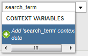
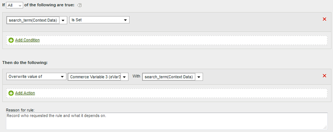
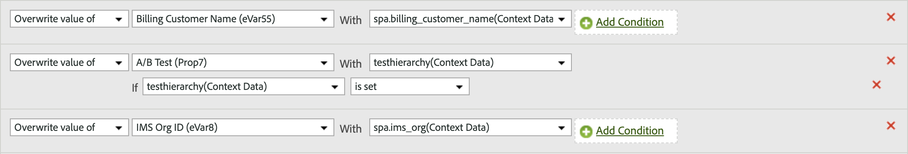
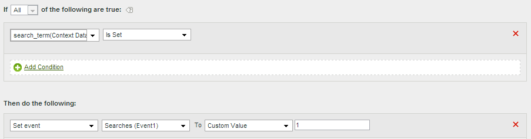
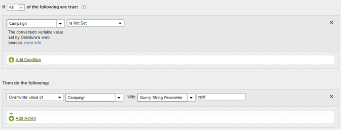
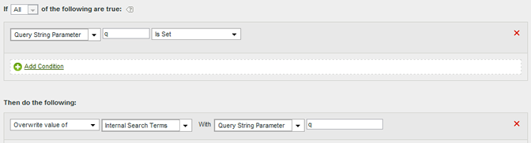
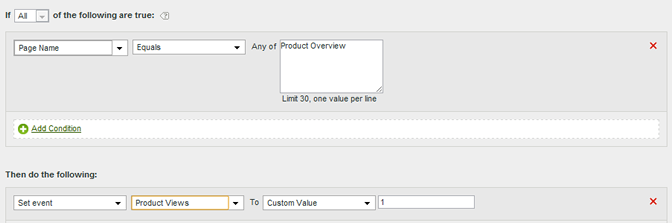
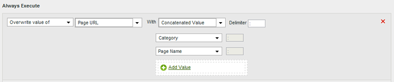
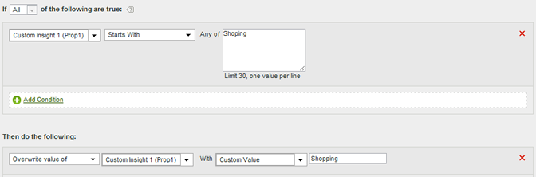
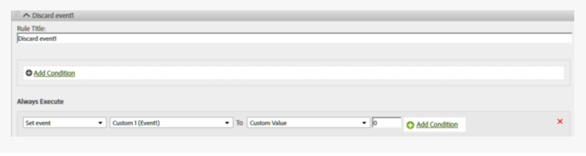

# 処理ルールのユースケース

組織内で処理ルールを使用する方法は、広範囲に及びます。 次の節では、それらを活用できる一般的な方法について詳しく説明します。

+++コンテキストデータ変数の eVar へのコピー

処理ルールは、[&#x200B; コンテキストデータ変数](/help/implement/vars/page-vars/contextdata.md)から[Props](/help/components/dimensions/prop.md)および[eVars](/help/components/dimensions/evar.md)に値を移動するために使用されます。 処理ルールがないと、Analytics にレポートが出力されないため、コンテキストデータ変数は無意味となります。

[!UICONTROL &#x200B; コンテキスト変数] リストには、過去30日間にレポートスイートに送信されたすべての変数が含まれます。 コンテキストデータ変数名を知っていても、現在のレポートスイートに送信していない場合は、手動で追加できます。

次の例では、`search_term` コンテキストデータ変数を取り出し、その値をeVar3に配置します。

| ルールセット | 値 |
| --- | --- |
| 条件 | `search_term` （コンテキストデータ）が設定されています |
| アクション | [!UICONTROL eVar3の値を]個の`search_term`で上書き（コンテキストデータ） |

コンテキストデータ変数の使用状況を示す処理ルールインターフェイスの

上記の例は、生成する eVar が少数の場合に適しています。 組織に数百のコンテキストデータ変数があり、各変数に独自の eVar が必要な場合は、条件文を使用できます。 多数の条件文を単一の処理ルールに含めることができるので、処理ルールの上限である 150 個の範囲内で、レポートスイート内のすべての eVar を生成できます。

次の例では、コンテキストデータ変数が異なる複数の変数を設定します。 1つのアクションには、条件付きステートメントも含まれます。

| ルールセット | 値 |
| --- | --- |
| アクション | [!UICONTROL eVar55の]の値を`spa.billing_customer_name`で上書き（コンテキストデータ） |
| アクション | `testhierarchy` （コンテキストデータ）が設定されている場合、[!UICONTROL Prop7の値を`testhierarchy` （コンテキストデータ）で上書き] |
| アクション | [!UICONTROL eVar8の]の値を`spa.ims_org`で上書き（コンテキストデータ） |

値を条件付きで設定する方法を示す処理ルールインターフェイスの

+++

+++コンテキストデータ変数を使用したイベントの設定

処理ルールは、[&#x200B; コンテキストデータ変数](/help/implement/vars/page-vars/contextdata.md)に基づいてイベントをトリガーできます。

[!UICONTROL &#x200B; コンテキスト変数] リストには、過去30日間にレポートスイートに送信されたすべての変数が含まれます。 コンテキストデータ変数名を知っていても、現在のレポートスイートに送信していない場合は、手動で追加できます。

次のルール定義は、特定のコンテキストデータ変数を含むすべてのヒットにイベントを設定します。

| ルールセット | 値 |
| --- | --- |
| 条件 | `search_term` （コンテキストデータ）が設定されています |
| アクション | [!UICONTROL &#x200B; イベント &#x200B;] Event1を[!UICONTROL &#x200B; カスタム値] `1`に設定 |

イベントの設定方法を示す処理ルール インターフェイスの

+++

+++クエリ文字列パラメーターを使用した変数の入力

クエリ文字列パラメーターを使用して変数を入力できます。 ほとんどの場合、通常、目的のクエリ文字列値を取得するように実装を調整します。 しかし、このデータを収集するために実装を簡単に調整できない場合、処理ルールが適切な代替手段となります。 タイプミスなどの問題により値が入力されない場合は、処理ルールを使用して変数に入力できます。

値が空か、期待される値が含まれているかを常に確認してから上書きします。

| ルールセット | 値 |
| --- | --- |
| 条件 | キャンペーンが設定されていません |
| アクション | [!UICONTROL &#x200B; クエリ文字列パラメーター[!UICONTROL &#x200B; `cpid`を使用して] キャンペーンの値を上書き] |

条件付きキャンペーンロジックを示す処理ルールインターフェイスの

| ルールセット | 値 |
| --- | --- |
| 条件 | [!UICONTROL &#x200B; クエリ文字列パラメーター] `q` [!UICONTROL が設定されています] |
| アクション | [!UICONTROL 内部検索キーワードの値を]個の値に上書きします。[!UICONTROL &#x200B; クエリ文字列パラメーター] `q` |

内部検索語句ロジックを示す処理ルール インターフェイスの

+++

+++任意のイベントを条件付きで設定し

イベントは、処理ルールで利用可能なあらゆる条件に基づいて設定できます。 例えば、ページ名が「Product overview」に等しい場合にイベントをトリガーできます。

| ルールセット | 値 |
| --- | --- |
| 条件 | [!UICONTROL &#x200B; ページ名]が「製品の概要」に等しい場合 |
| アクション | [!UICONTROL Set event] [!UICONTROL 製品ビュー]から[!UICONTROL &#x200B; カスタム値] `1` |

条件付きイベントセットを示す処理ルールインターフェイスの

+++

+++カテゴリとページ名の連結によるサブカテゴリの追加

連結オプションを使用して他の値を組み合わせることによって値を入力できます。

| ルールセット | 値 |
| --- | --- |
| 条件 | なし（常に実行） |
| アクション | [!UICONTROL eVar1の値を[!UICONTROL 連結値] カテゴリ + ページ名で上書き] |

+++

+++レポート内の値のクリーンアップ

収集したスペルの誤りに対して値を一致させ、レポートに正しく表示するように更新できます。

Adobeでは、望ましくない上書きを避けるために、可能な限り制限のあるマッチングオプションを使用することをお勧めします。 変数に関するレポートを実行し、使用する可能性のあるルール条件を検索できます。 文字列比較では、大文字と小文字は区別されません。

| ルールセット | 値 |
| --- | --- |
| 条件 | prop1 [!UICONTROL が] &quot;[!DNL Shoping]&quot;で始まる場合 |
| アクション | [!UICONTROL Prop1の値を[!UICONTROL &#x200B; カスタム値] &quot;[!DNL Shopping]&quot;で上書き] |

タイプミスを修正する方法を示す処理ルール インターフェイスの

+++

+++ヒットからのイベントの削除

実装を変更することなく、処理ルールを使用して、ヒットから特定のイベントを削除または破棄できます。 イベントをカスタム値`0`に設定すると、イベントはカウントされません。

| ルールセット |値|
|条件|なし（常に実行） |
| アクション | [!UICONTROL &#x200B; イベント &#x200B;] Event1を[!UICONTROL &#x200B; カスタム値] `0`に設定|

イベントを削除するように表示されている処理ルール インターフェイスの

+++
