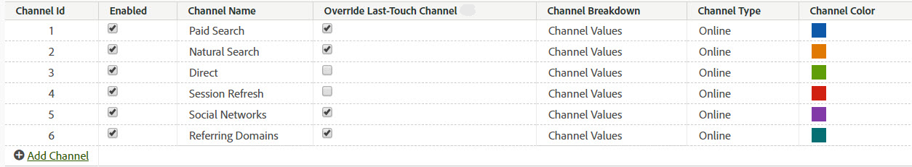

# マーケティングチャネルの管理

>[!NOTE]
>
> マーケティングチャネルに関する一般情報については、[マーケティングチャネルの基本を学ぶ](/help/components/c-marketing-channels/c-getting-started-mchannel.md)を参照してください。
>
> アトリビューションと Customer Journey Analytics に対するマーケティングチャネルの効果を最大限に高めるために、[改訂されたベストプラクティス](/help/components/c-marketing-channels/mchannel-best-practices.md)を公開しました。

**[!UICONTROL Analytics]**／**[!UICONTROL 管理者]**／**[!UICONTROL レポートスイート]**／**[!UICONTROL 設定編集]**／**[!UICONTROL マーケティングチャネル]**／**[!UICONTROL マーケティングチャネルマネージャー]**

マーケティングチャネルマネージャーでマーケティングチャネルを追加または有効化します。 マーケティングチャネルがないレポートスイートの場合、自動設定により、ルールとともに複数のチャネルを作成できます。 ニーズに合わせて定義済みのチャネルを編集したり、独自のチャネルを作成したりできます（最大25個）。

[!UICONTROL  マーケティングチャネル ] ページへのチャネルの追加は、[ マーケティングチャネル処理ルール ](/help/admin/tools/manage-rs/edit-settings/marketing-channels/mc-proc-rules.md) ページでのルールの作成とは別に行われます。 ルールを作成するときに、そのルールをチャネルに関連付けます。

チャネルを作成するためのガイドラインを以下に示します。

* あらゆるチャネルをリスト化し、訪問者のヒット数を適切なチャネルに分類して、事前に計画を立てましょう。
* [内部](/help/admin/tools/manage-rs/edit-settings/marketing-channels/mc-proc-rules.md)ヒット数のカテゴリのチャネルを含めます。
* 包括的な「その他のキャンペーン」チャネルを含め、有料チャネルの後、および有機チャネルの前に配置します。

## 前提条件 {#prereqs}

* マーケティングチャネルディメンションへのアクセスを設定します。

  詳しくは、[マーケティングチャネルの権限](/help/components/c-marketing-channels/c-channel-report-access.md)を参照してください。

## マーケティングチャネルの追加 {#add-mktg-channels}

マーケティングチャネルマネージャーでマーケティングチャネルを追加します。

>[!NOTE]
>
>チャネルは削除できません。 使用しないチャネルは、無効にするか名前を変更し、後で使用するためにとっておきます。

1. **[!UICONTROL Analytics]**／**[!UICONTROL 管理者]**／**[!UICONTROL レポートスイート]**&#x200B;の順にクリックします。
1. [!UICONTROL Report Suite Manager] ページで、レポートスイートを選択します。

   複数のレポートスイートを選択した場合、テンプレートから選択したレポートスイートに設定をコピーするために、テンプレートを選択します。

   [複数のレポートスイートへのテンプレートレポートスイート設定の適用](/help/components/c-marketing-channels/c-getting-started-mchannel.md)を参照してください。

1. **[!UICONTROL 設定を編集]**／**[!UICONTROL マーケティングチャネル]**／**[!UICONTROL マーケティングチャネルマネージャー]**&#x200B;をクリックします。

   レポートスイートでチャネルが定義されていない場合、[自動セットアップ](/help/components/c-marketing-channels/c-getting-started-mchannel.md)ページが表示されます。

1. [!UICONTROL マーケティングチャネルマネージャー]ページで、「**[!UICONTROL チャネルの追加]**」をクリックします。

   このオプションは、チャネルが 25 個定義されている場合は利用できません。

1. 「**[!UICONTROL 保存]**」をクリックします。
1. チャネルのルールを設定するには、「**[!UICONTROL マーケティングチャネルの処理ルール]**」をクリックします。

   [マーケティングチャネルの処理ルールの作成](/help/admin/tools/manage-rs/edit-settings/marketing-channels/mc-proc-rules.md)を参照してください。

## チャネル設定の適用 {#mktg-channel-mgr}

[!UICONTROL マーケティングチャネルマネージャー]ページの各チャネルに適用できる設定は様々です。

| フィールド | 定義 |
|--- |--- |
| 有効 | このマーケティングチャネルの有効と無効を切り替えます。 |
| チャネル名 | マーケティングチャネルのわかりやすい名前。 |
| ラスト タッチ チャネルの上書き | 選択したチャネルで、既存の永続的なラストタッチチャネルを上書きするかどうかを選択できます。 このチェックボックスを選択すると、任意のチャネル（ダイレクトと内部を含む）が既存のラストタッチチャネルを上書きします。 その結果、クレジットに値しない可能性のあるチャネルにコンバージョンが起因することになります。 例えば、ユーザーが以前に自然検索チャネルを介して取得した場合、このオプションを使用すると、ダイレクトチャネルにコンバージョンのクレジットが割り当てられないように設定できます。 |
| チャネル分類 | この値によって、チャネルを分類できます。 [マーケティングチャネルの分類](/help/admin/tools/manage-rs/edit-settings/marketing-channels/classifications-mchannel.md)を作成する場合、チャネル分類（サブチャネル）を追加することができます。 |
| タイプ | ユーザーがサイトにたどり着いた方法を指定します。 「オンライン」または「オフライン」を選択できます。 検索エンジンや電子メールキャンペーンを介してアクセスした訪問者に対して、オンラインチャネルを使用します。 オフラインチャネルは、新聞のクーポンや雑誌の広告でサイトを見つけた訪問者に適用されます。 オフラインチャネルには通常、データソースからインポートされたデータが含まれます。 [データソース](/help/import/data-sources/overview.md)を参照してください。 [オフラインデータの追加](/help/components/c-marketing-channels/c-getting-started-mchannel.md)を参照してください。 |

### ベストプラクティスの上書き

ダイレクトチャネルと内部チャネルのラストタッチの上書きオプションをオフにすることをお勧めします。これにより、他の永続的なラストタッチチャネル（または相互）からクレジットを取得できなくなります。

## チャネルルールの定義

レポートにチャネルとチャネルデータを表示できるようにするには、チャネルおよびそのデータを処理するための基本的なルールを作成してください。 また、[訪問者エンゲージメント期間](/help/admin/tools/manage-rs/edit-settings/marketing-channels/visitor-engagement.md)の長さも指定できます。

アドビでは、[自動セットアップ](/help/components/c-marketing-channels/c-getting-started-mchannel.md)中に定義済みのチャネルをいくつか提供します。これらはニーズに合わせて編集できます。 また、この設定を変更し、[マーケティングチャネルの処理ルール](/help/admin/tools/manage-rs/edit-settings/marketing-channels/mc-proc-rules.md)内でカスタムルールを定義することもできます。

>[!NOTE]
>
>まずテスト用のレポートスイートにレポートを設定することを推奨します。 そのテンプレートを使用して、1 つまたはそれ以上の本番用レポートスイートにまとめてチャネルとルールセットを適用できます。
>
>[複数のレポートスイートへのテンプレートレポートスイート設定の適用](/help/components/c-marketing-channels/c-getting-started-mchannel.md)を参照してください。
