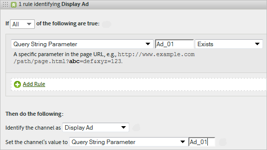

# マーケティングチャネルの処理ルール

マーケティングチャネルの処理ルールは、訪問者のヒットがチャネルに割り当てられた条件を満たすかどうかを決定するために、訪問者がサイトでおこなうすべてのヒットを処理します。ルールは指定した順序で処理され、ルールが満たされると、残りのルールの処理が停止されます。

**[!UICONTROL Analytics]**／**[!UICONTROL 管理者]**／**[!UICONTROL レポートスイート]**／**[!UICONTROL 設定を編集]**／**[!UICONTROL マーケティングチャネル]**／**[!UICONTROL マーケティングチャネルの処理ルール]**。

処理に関する追加情報：

* これらのルールに従って収集されたデータは永続的です。データ収集後に変更されたルールは、遡って適用されません。アドビでは、正しくないチャネルでデータが収集されることを軽減するために、[!UICONTROL マーケティングチャネルの処理ルール]を保存する前に、あらゆる状況を確認して考慮することを強くお勧めします。
* 最大 25 の個別のマーケティングチャネルを設定できます。
* ルールは VISTA が設定した変数にはアクセスできますが、VISTA が削除したデータにはアクセスできません。
* 2 つのマーケティングチャネルが同じイベント（購入やクリックなど）からクレジットを受けることはありません。この点でマーケティングチャネルは eVar と異なります（同一イベントから 2 つの eVar がクレジットを受ける場合がある）。
* ルールのギャップカバレッジがある場合、「[チャネルが識別されていません](/help/components/c-marketing-channels/c-faq.md)」と表示されることがあります。

## 前提条件

* [マーケティングチャネル使用の手引き](/help/components/c-marketing-channels/c-getting-started-mchannel.md)で概念的な情報を確認する。
* ルールを割り当てるためにチャネルを 1 つ以上作成してください。[マーケティングチャネルの追加](/help/admin/tools/manage-rs/edit-settings/marketing-channels/c-channels.md)を参照してください。
* [!UICONTROL アトリビューション]を備えた[!UICONTROL マーケティングチャネル]を使用するためのベストプラクティスを確認します。

## マーケティングチャネルの処理ルールの作成

訪問者のヒットがチャネルに割り当てられた条件を満たすかどうかを判断するためのマーケティングチャネルの処理ルールを作成します。

1. **[!UICONTROL Analytics]**／**[!UICONTROL 管理者]**／**[!UICONTROL レポートスイート]**&#x200B;の順にクリックします。
2. レポートスイートを選択します。

   レポートスイートでチャネルが定義されていない場合、[!UICONTROL マーケティングチャネル ：自動セットアップ]ページが表示されます。

   [自動セットアップの実行](/help/components/c-marketing-channels/c-getting-started-mchannel.md)を参照してください。

3. **[!UICONTROL 設定を編集]**／**[!UICONTROL マーケティングチャネル]**／**[!UICONTROL マーケティングチャネルの処理ルール]**&#x200B;の順にクリックします。自動セットアップを実行した場合、チャンネルとルールのセットが自動的に定義されます。

   

4. 新しいルールを追加する場合は、**[!UICONTROL 新しいルールセットを追加]**&#x200B;メニューから選択します。チャンネルを選択すると、ルールテンプレートが表示され、「カスタム」を選択すると、空白のスレートから開始します。どちらのオプションを使用しても、必要に応じてルールセットを変更できます。

   

5. ルールの作成を続けるには、「**[!UICONTROL 新しいルールセットの追加]**」をクリックします。
6. ルールに優先順位を付けるには、目的の位置にルールをドラッグアンドドロップします。
7. 「**[!UICONTROL 保存]**」をクリックします。

### マーケティングチャネル値の設定

**[!UICONTROL チャネルの値を設定]**&#x200B;では、そのチャネルで使用可能なマーケティングチャネルの詳細ディメンションを定義します。

### ルール条件

このテーブルは、マーケティングチャネルの処理ルールで使用可能なフィールド、オプションおよびヒット属性を定義しています。

>[!NOTE]
>
>クエリ文字列パラメーターや一致対象の値のリストなど、定義したテキストフィールドは、**大文字と小文字を区別しない**&#x200B;値として評価されます。例えば、クエリ文字列パラメーター `cmp = abc123` というルールがある場合、`cmp` と `abc123` の両方の大文字と小文字のバリエーションがすべて一致します。

| 用語 | 定義 |
|--- |--- |
| すべて | ルール内のすべての条件が true の場合にのみ、このチャネルをアクティブ化します。 |
| いずれか | ルール内のいずれかの条件が true の場合に、このチャネルをアクティブ化します。このオプションは、ルールに複数の条件が存在する場合にのみ使用できます。 |
| AMO ID | Adobe AdvertisingとAdvertising Analyticsの統合で使用されるプライマリトラッキングコード。 これらの統合のいずれかが有効になっている場合は、トラッキングコードのプレフィックスを使用して、Advertising固有のチャネルを識別できます。 検索の場合は「AL」、ソーシャルの場合は「AC」で始まる「AMO ID」を、ディスプレイの場合は「AC」を使用します。 AMO ID がマーケティングチャネルで使用される場合、クリック/コスト/インプレッション指標は正しいチャネルに関連付けることができます。 AMO ID が設定されていない場合、これらの指標は「直接」または「なし」に進みます。 |
| AMO EF ID | Adobe Advertisingで使用されるセカンダリトラッキングコード。 このトラッキングコードの主な目的は、データをAdvertisingに送り返すためのキーとして機能することです。 ただし、クリックスルーの表示とビュースルーの表示を、2 つの異なるマーケティングチャネルとして識別する場合にも使用できます。 これを行うには、「AMO EF ID」のマーケティングチャネルロジックが、ディスプレイのクリックスルーの場合は `:d` で終わり、ディスプレイのビュースルーの場合は「AMO EF ID」が `:i` で終わるように設定します。 「表示」を 2 つのチャネルに分割しない場合は、代わりに AMO ID ディメンションを使用します。 |
| コンバージョン変数 | このレポートスイート用に有効になっている eVar から構成され、これらの変数がページ上の Adobe コード経由で設定された場合にのみ適用されます。 |
| 存在する | 以下のオプションを選択できます。<ul><li>**が存在しない**：ヒット属性がリクエストに存在しないことを示します。たとえば、参照ドメインで、ユーザーが URL を入力するかブックマークをクリックすると、その参照ドメイン属性は存在しません。</li><li>**が空である**：ヒット属性（通常は eVar またはクエリ文字列パラメーター）は存在しますが、そのヒット属性に関連付けられた値がないことを示します。</li><li>**次を含まない**：例えば、参照ドメインに特定の値が含まれないことを指定できます（「次を含む」を選択する場合と反対です）。</li></ul> |
| チャネルを次として特定する | マーケティングチャネルマネージャーページに追加したマーケティングチャネルにルールを関連付けます。 |
| 有料検索の検出ルールに一致 | アドビによって検出された有料検索。有料検索とは、自社サイトが検索結果リストに優先的に載せられるように会社が検索エンジンに料金を支払った検索キーワードを指します。有料検索のキーワードは通常検索結果の上部または右側に表示されます。 |
| 自然検索の検出ルールに一致 | アドビのレポートによって検出された無料検索。 |
| リファラーが内部 URL フィルターに一致する | 管理ツールのレポートスイートで定義されている内部 URL フィルターに一致するページ URL からのアクセス。 |
| リファラーが内部 URL フィルターに一致しない | 管理ツールにあるレポートスイートで定義されたとおり、参照 URL が内部 URL フィルターに一致しません。この設定を「ページ URL」および「存在する」と共に使用して包括的ルールを設定することで、レポートの「チャネルが識別されませんでした」セクションに到達する訪問をなくすことができます。 |
| 内部 URL フィルターに一致するヒットを無視する | （リファラーに対して）外部参照サイトからのヒットのみをトラッキングします。内部トラフィックを含める場合以外、通常はこの設定を有効にしておきます。 |
| 訪問の最初のヒットです | Adobe レポートで検出された訪問の最初のヒット。 |
| ページ | [ページ](/help/components/dimensions/page.md)ディメンション。 |
| ページドメイン | `products.example.com` など、訪問者が到着したページのドメイン。 |
| ページドメインとパス | ドメインとパス（例：`products.example.com/mens/pants/overview.html`）。 |
| ページルートドメイン（TLD+1） | example.co.uk など、訪問者が到着したページのルートドメイン。 |
| ページ URL | サイトの web ページの URL。 |
| 参照ドメイン | [参照元ドメイン](/help/components/dimensions/referring-domain.md)ディメンション |
| クエリ文字列パラメーター | 個別のクエリ文字列パラメーターを使用します。条件ごとに指定できるクエリ文字列パラメーターは 1 つだけです。クエリ文字列パラメーターを追加するには、演算子として `ANY` を使用し、ルールにクエリ文字列パラメーターを追加します。 |
| リファラー | サイトにアクセスする前に訪問者が閲覧していた web ページの場所（フル URL）。リファラーは、定義ドメインの外側に存在します。 |
| 参照ドメインとパス | 参照ドメインと URL パスを短縮したもの。例：`www.example.com/products/id/12345` または `ad.example.com/foo` |
| 参照パラメーター | リファラー URL のクエリ文字列パラメーター。例えば、訪問者が `example.com/?page=12345&cat=1` から来訪した場合、page と cat が参照パラメーターとなります。 |
| 参照ドメインのルート | リファラーのルートドメイン。リファラーは、定義ドメインの外側に存在します。 |
| 検索エンジン | 訪問者をサイトに導いた Google や Yahoo! などの検索エンジン。 |
| 検索キーワード | 検索エンジンでの検索に使用された単語。 |
| 検索エンジン + キーワード | 検索エンジンを一意に識別するために検索キーワードと検索エンジンを連結したもの。例えば、computer という単語を検索した場合、検索エンジンとキーワードは次のように識別されます。`Search Tracking Code = "<search_type>:<search engine>:<search keyword>" where    search_type = "n" or "p", search_engine = "Google", and search_keyword = "computer"`**メモ：** n = 自然検索、p = 有料検索 |
| チャネルの値を次の値に設定する | [マーケティングチャネルの詳細](/help/components/dimensions/marketing-detail.md)ディメンションを設定します。ルールのコンテキストで最適な値を決定します。例えば、バナー広告 ID、検索キーワード、メールキャンペーンなどがあります。 |

## マーケティングチャネルのルールの順序と定義 {#channel-rules}

チャネルルールは、指定した順序で処理されます。アドビでは、有料チャネルまたは管理チャネル（有料検索、自然検索、ディスプレイ、メールなど）を最初に配置し、オーガニックチャネル（直接、内部、参照ドメインなど）を介してクレジットを受け取ることをお勧めします。

チャネルルールの推奨順序と定義例を次に示します。

### 有料検索 {#paid-search}

有料検索とは、単語または語句が検索エンジンの検索結果ページに配置されるように料金を支払うことです。このチャネルは通常、クエリ文字列パラメーター（表示チャネルの例を参照）または有料検索検知ルールに基づいて定義されます。

#### 有料検索検知

マーケティングチャネルを有料検索検知ルールに一致させるには、[!UICONTROL 有料検索検知]ページでの設定内容をマーケティングチャネルに使用します（**[!UICONTROL 管理者]**／**[!UICONTROL レポートスイート]**／**[!UICONTROL 設定を編集]**／**[!UICONTROL 一般]**／**[!UICONTROL 有料検索検知]**）。リンク先 URL はその検索エンジンの既存の有料検索検知ルールと一致します。

マーケティングチャネルルールでは、[!UICONTROL 有料検索]の設定は次のようになります。

詳しくは、[有料検索検知](../general/paid-search-detection/paid-search-detection.md)を参照してください。

### 自然検索 {#natural-search}

自然検索とは、訪問者が検索エンジンを通じてお客様の web サイトを見つけ、掲載料を支払うことなく検索エンジンでお客様のサイトをランク付けすることです。

アドビでは、検索エンジンの内部検索に基づいて検索トラフィックを決定します。リファラーが検索エンジンの条件に一致する場合、設定した[有料検索検知](../general/paid-search-detection/paid-search-detection.md)ルールを使用して、リファラーが有料検索か自然検索かを判断します。有料検索検知ルールに一致しないヒットは、自然検索と見なされます。

マーケティングチャネルルールでは、自然検索の設定は次のようになります。

### 表示 {#display}

このルールは、バナー広告から来た訪問者を識別します。これは、宛先 URL のクエリ文字列パラメーター（この場合は *`Ad_01`*）によって識別されます。クエリ文字列パラメーターと、そのパラメーターで検索される値は、大文字と小文字が区別されない値として評価されます。

### 電子メール {#email}

このルールは、メールキャンペーンから来た訪問者を識別します。これはリンク先 URL のクエリ文字列パラメーターによって識別されます（この場合は *`eml`*:

### アフィリエイト {#afilliates}

このルールは、指定された一連の参照ドメインからの訪問者を識別します。このルールでは、追跡するアフィリエイトのドメインを次のように一覧表示します。

### その他のキャンペーン {#other-campaigns}

ベストプラクティスは、すべての有料チャネルルールに従って、「その他のキャンペーン」チャネルを含めることです。このチャネルは、未分類の有料トラフィックの包括的な情報として機能します。

### SNS {#social-networks}

このルールは、Facebook などのソーシャルネットワークからの訪問者を識別します。このチャネルの名前は、多くの場合、「オーガニックソーシャル」に変更されます。以下のように設定できます。

### 内部（セッション更新）チャネル {#internal}

このルールでは、訪問者の参照 URL が Admin Console で設定された内部 URL フィルターと一致する場合、つまり訪問者がサイト内で訪問を開始した場合を扱います。このチャネルの名前は、多くの場合、「セッション更新」に変更されます。

このチャネルが発生する理由の詳細は、「[内部の理由（セッションの更新）](/help/components/c-marketing-channels/c-faq.md#internal)」を参照してください。

### 直接アクセス {#direct}

このルールは、参照ドメインを持たない訪問者を識別します。これには、お気に入りリンクをクリックしたり、ブラウザーにリンクを貼り付けたりしてサイトに直接アクセスした訪問者が含まれます。このチャネルの名前は、多くの場合、「直接入力またはブックマーク」に変更されます。

### 参照ドメインチャネル {#referring-domains}

参照ドメインチャネルは、参照ドメインを持つ訪問者を識別します。内部ドメイン、直接ドメイン、および参照ドメインの各チャネルは、まだチャネルに分類されていない残りのすべてのヒットの包括的な要素として機能します。

