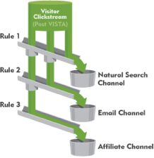
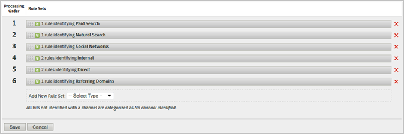

# マーケティングチャネルの処理ルール

_このページは、マーケティング チャネルをヒットに割り当てる処理ルールを指します。 データの収集方法を調整できる機能については、[処理ルール &#x200B;](../general/processing-rules/pr-overview.md)を参照してください。_

マーケティングチャネル処理ルールを使用すると、[&#x200B; マーケティングチャネル &#x200B;](/help/components/dimensions/marketing-channel.md)および[&#x200B; マーケティングチャネルの詳細](/help/components/dimensions/marketing-detail.md) ディメンションの値を決定するロジックを作成できます。 [&#x200B; マーケティングチャネルマネージャー](c-channels.md)を使用して、使用するマーケティングチャネルを決定し、処理ルールを使用して各チャネルの設定方法を決定します。

**[!UICONTROL Analytics]** > **[!UICONTROL 管理者]** > **[!UICONTROL レポートスイート]** > **[!UICONTROL 設定の編集]** > **[!UICONTROL マーケティングチャネル]** > **[!UICONTROL マーケティングチャネル処理ルール]**

[自動設定](/help/components/c-marketing-channels/c-getting-started-mchannel.md)が実行されると、設定中に生成された各チャネルのルールが作成されます。

複数のルールを使用して、単一のマーケティングチャネルを定義できます。 ルール条件に応じてチャネルの詳細を異なる方法で設定する場合は、1つのチャネルに複数のルールを使用すると便利です。 複数の条件を使用して、1つのルールを定義することもできます。

## ルールの定義

各ルールには、条件と割り当てが含まれます。

* **[!UICONTROL 次のいずれかまたは全部がtrue]**&#x200B;である場合：1つのルールに複数の条件を追加する場合、すべての条件を満たす必要があるか、またはチャネルと関連付けられた値を設定するためにいずれかの条件を満たす必要があるかどうかを判断できます。
* **ルール条件**：満たす必要がある1つ以上のルール条件を指定します。 通常、マーケティングチャネルの選定にヒットが一致する必要があるディメンションを指定します。
* **[!UICONTROL 次の操作を行います]**: ルール条件が一致したら、[&#x200B; マーケティングチャネル &#x200B;](/help/components/dimensions/marketing-channel.md) （[!UICONTROL &#x200B; チャネルを]として識別）と[&#x200B; マーケティングチャネルの詳細](/help/components/dimensions/marketing-detail.md) （[!UICONTROL &#x200B; チャネルの値を設定]）を設定します。

## ルール条件

ルール条件を設定する場合は、次のオプションを使用できます。

>[!NOTE]
>
>すべてのテキストフィールドは&#x200B;**大文字と小文字を区別しない**&#x200B;として評価されます。 例えば、クエリ文字列パラメーター`cmp`が`abc123`に等しいルール条件を使用する場合、クエリ文字列パラメーターと値の両方で、大文字と小文字の任意の組み合わせを使用できます。

**Adobeが検出した条件**&#x200B;には、テキストを入力するためのオプションまたはフィールドが含まれていません。

| Adobeで検出された条件 | 説明 |
|---|---|
| **[!UICONTROL 有料検索の検出ルールに一致]** | ヒットは、認識された検索エンジンから発生し、[有料検索の検出ルール &#x200B;](../general/paid-search-detection/paid-search-detection.md)に一致しました。 |
| **[!UICONTROL 自然検索検出ルールに一致]** | ヒットは認識された検索エンジンから発生し、検索検索検索検出ルールと一致しませんでした。 |
| **[!UICONTROL リファラーが内部URL フィルターと一致します]** | ヒットには、[内部URL フィルター](../general/internal-url-filter-admin.md)と一致する[Referrer](/help/components/dimensions/referrer.md)が含まれていました。 |
| **[!UICONTROL リファラーが内部URL フィルターと一致しません]** | ヒットには、内部URL フィルターと一致しないリファラーが含まれていました。 |
| **[!UICONTROL は訪問]**&#x200B;の最初のヒットです | ヒットは最初の訪問でした。 |
| **[!UICONTROL リファラーはソーシャルネットワークです]** | [&#x200B; リファラータイプ &#x200B;](/help/components/dimensions/referrer-type.md)は「ソーシャルネットワーク」です。 |
| **[!UICONTROL リファラーはソーシャルネットワークではありません]** | リファラータイプは「ソーシャルネットワーク」ではありません。 |
| **[!UICONTROL リファラーは会話型AIです]** | リファラータイプは「対話型AI」です。 |
| **[!UICONTROL リファラーは会話型AIではありません]** | リファラータイプは「対話型AI」ではありません。 |

**ヒット属性**&#x200B;を使用すると、ディメンション、一致する演算子、検索する値を指定できます。

| ヒット属性条件 | 説明 |
|---|---|
| **[!UICONTROL ページ]** | [ページ](/help/components/dimensions/page.md)ディメンション。 |
| **[!UICONTROL ページドメイン]** | URLのドメイン。 例：`products.example.com`。 |
| **[!UICONTROL ページドメインとパス]** | URLのドメインとパス。 例：`products.example.com/mens/pants/overview.html`。 |
| **[!UICONTROL ページルートドメイン]** | URLのルートドメイン。 例：`example.co.uk`。 |
| **[!UICONTROL ページ URL]** | ページ全体のURL。 |
| **[!UICONTROL クエリ文字列パラメーター]** | ページ URL内の個々のクエリ文字列パラメーター。 ルール条件ごとに1つのクエリ文字列パラメーターを使用します。 ルールに複数のクエリ文字列パラメーターを含める場合は、複数のルール条件を使用します。 |
| **[!UICONTROL リファラー]** | 「[リファラー](/help/components/dimensions/referrer.md)」ディメンション。 |
| **[!UICONTROL 参照ドメイン]** | [参照ドメイン &#x200B;](/help/components/dimensions/referring-domain.md) ディメンション。 |
| **[!UICONTROL 参照ドメインとパス]** | 参照ドメインとリファラーのURL パスの連結。 例：`www.example.com/products/id/12345`または`ad.example.com/foo` |
| **[!UICONTROL パラメーター]**&#x200B;を参照しています | リファラー内のクエリ文字列パラメーター。 |
| **[!UICONTROL ルートドメインの参照]** | 参照元のルートドメイン。 |
| **[!UICONTROL 検索エンジン]** | [検索エンジン &#x200B;](/help/components/dimensions/search-engine.md) ディメンション。 |
| **[!UICONTROL 検索キーワード]** | 「[検索キーワード](/help/components/dimensions/search-keyword.md)」ディメンション。 |
| **[!UICONTROL 検索エンジン +検索キーワード]** | 検索エンジンと検索キーワードの連結。 |
| **[!UICONTROL AMO ID]** | Adobe AdvertisingとAdvertising Analyticsの統合で使用される主なトラッキングコード。 これらの統合のいずれかが有効になっている場合、トラッキングコードのプレフィックスを使用して、Advertising固有のチャネルを識別できます。 「AL」で始まる値は、SearchとSocialを表します。 「AC」で始まる値はDisplay用です。 AMO IDをマーケティングチャネルで使用する場合、クリック/コスト/インプレッション指標は正しいチャネルに関連付けることができます。 |
| **[!UICONTROL AMO EF ID]** | Adobe Advertisingで使用されるセカンダリトラッキングコード。 Advertisingにデータを送り返すキーとして機能します。 このツールは、ディスプレイクリックとディスプレイビューを2つのマーケティングチャネルとして識別するために使用できます。 これを行うには、「AMO EF ID」のマーケティングチャネルロジックを、表示クリックスルーで`:d`で終わるか、表示ビュースルーで`:i`で終わるように設定します。 ディスプレイを2つのチャンネルに分割しない場合は、代わりにAMO ID ディメンションを使用します。 |

**コンバージョン変数**&#x200B;を使用すると、カスタム eVar、一致する演算子、検索する値を指定できます。

| 変換変数条件 | 説明 |
|---|---|
| **eVar 1-250** | 関連付けられた[eVar](/help/components/dimensions/evar.md) ディメンション。 |
