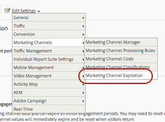

# マーケティングチャネルの有効期限

>[!NOTE]
>
> マーケティングチャネルに関する一般情報については、[マーケティングチャネルの基本を学ぶ](/help/components/c-marketing-channels/c-getting-started-mchannel.md)を参照してください。
>
> アトリビューションと Customer Journey Analytics に対するマーケティングチャネルの効果を最大限に高めるために、[改訂されたベストプラクティス](/help/components/c-marketing-channels/mchannel-best-practices.md)を公開しました。

**[!UICONTROL Analytics]**／**[!UICONTROL 管理者]**／**[!UICONTROL レポートスイート]**／**[!UICONTROL 設定を編集]**／**[!UICONTROL マーケティングチャネル]**／**[!UICONTROL マーケティングチャネルの有効期限]**。

マーケティングチャネルの有効期限（訪問者のエンゲージメント期間）を指定する方法について説明します。

訪問者のエンゲージメント期間とは、訪問者のサイトにおけるアクティビティをどれだけの期間、ファーストタッチチャネルに関連付けるかということです。 デフォルトの有効期限設定は 30 日間です。

訪問者が頻繁にサイトを使用する場合は、エンゲージメントウィンドウもそれに従って更新されます。 期限が切れ、チャネルがリセットされるまで、訪問者は 30 日間非アクティブである必要があります。 訪問者のファーストタッチチャネルとラストタッチチャネルは、両方とも、そのブラウザーで 30 日間操作が行われなかった場合にリセットされます。

例：

* 1 日目：ユーザーが「表示」でサイトにアクセスした。 ファーストタッチチャネルとラストタッチチャネルは「表示」に設定されます。
* 2 日目：ユーザーが「自然検索」でサイトにアクセスした。 ファーストタッチは「表示」のままで、「ラストタッチ」は「自然検索」に設定されます。
* 35 日目：ユーザーが 33 日間サイトにアクセスせず、ブラウザーで開いていたタブを使用して戻ってきた。 30 日間のエンゲージメント期間を想定すると、この期間は終了し、マーケティングチャネル cookie の有効期限が切れます。 ファーストタッチチャネルとラストタッチチャネルはリセットされ、ユーザーが内部 URL から来ているため「セッション更新」に設定されます。

## マーケティングチャネルの有効期限の設定

有効期限の設定は、次のとおりです。

| フィールド | 定義 |
|--- |--- |
| 日間アクセスが無い場合 | 訪問者のファーストタッチエンゲージメントが期限切れになるまでに要する日数。 デフォルト値は 30 です。 |
| なし | 訪問者のエンゲージメント期間の期限は切れません。 |
| チャネルのリセット | すべての訪問者のエンゲージメント期間を今すぐ期限切れにします。  すべてのマーケティングチャネルデータをリセットする必要がある場合、訪問者のエンゲージメント期間はすべて失効する可能性があります。 処理ルールが以前に正しく設定されていない場合は、データをリセットする必要がある場合があります。 ファーストタッチとラストタッチのチャネル値はすべて直ちに期限切れになり、訪問者が戻ったときにリセットされます。 |

## マーケティングチャネルの有効期限の定義 {#define-expiration}

訪問者のエンゲージメント期間を指定します。

1. **[!UICONTROL Analytics]**／**[!UICONTROL 管理者]**／**[!UICONTROL レポートスイート]**&#x200B;の順にクリックします。
2. [!UICONTROL Report Suite Manager] で、**[!UICONTROL 設定を編集]**／**[!UICONTROL マーケティングチャネル]**／**[!UICONTROL マーケティングチャネルの有効期限]**&#x200B;の順にクリックします。

   

3. 訪問者のエンゲージメント期間のフィールドを設定します。
4. 「**[!UICONTROL 保存]**」をクリックします。
