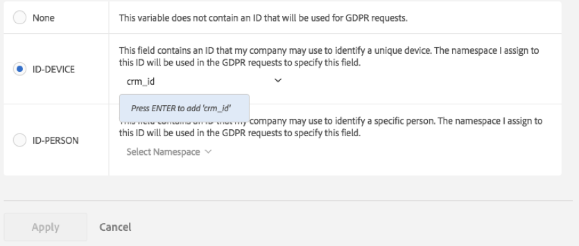

# Analytics 変数のデータプライバシーラベル

アドビのお客様は、データ管理者として、EU 一般データ保護規則（GDPR）やカリフォルニア州消費者プライバシー法（CCPA）など、適用されるデータプライバシー法に準拠する責任を負います。 お客様は、自社の法務チームに相談して、データプライバシー法に準拠するためのデータの処理方法を決定する必要があります。 アドビは、各お客様がプライバシーに関連する固有のニーズを持っていることを理解しています。そのため、アドビはお客様がデータプライバシーのデータ処理に関する目的の設定をカスタマイズできるようにしています。 これにより、それぞれのお客様が、ブランドのニーズと保有するデータセットに最適な方法でデータプライバシー要求を処理できます。

Adobe Analytics では、計測データのプライバシー性と契約上の制限に従ってデータをラベルで分類するためのツールの提供を開始します。 ラベルは、（1）データ主体の識別、（2）アクセスリクエストの一部として返すデータの決定、（3）削除リクエストの一部として削除する必要があるデータフィールドの識別のための重要なステップです。

どの変数やフィールドにどのラベルを適用するかを把握するためには、Analytics データから取得する [ID について理解](/help/admin/tools/privacy-labeling/best-practices.md)し、データプライバシー要求でどのような ID を使用するかを決める必要があります。

Adobe Analytics のデータプライバシー実装では、識別データ、機密データ、データガバナンス用に以下のラベルを利用できます。

>[!NOTE]
>
>I1、I2、S1 および S2 ラベルは、Adobe Experience Platform の対応する名前の DULE ラベルと同じ意味を持ちます。 ただし、使用目的は非常に異なります。 Adobe Analytics 内では、これらのラベルを使用すると、Privacy Service のリクエストの結果として匿名化する必要があるフィールドを識別するのに役立ちます。 Adobe Experience Platform 内では、アクセス制御、同意管理、ラベル付きフィールドへのマーケティング制限の適用に使用されます。 Adobe Experience Platform では、Adobe Analytics で使用されない多くの追加ラベルをサポートしています。 また、Adobe Experience Platform のラベルがスキーマに適用されます。 Analytics データコネクタを利用して Adobe Analytics データを Adobe Experience Platform に読み込む場合は、各レポートスイートで使用されるスキーマに対して、Adobe Experience Platform で適切な DULE ラベルが設定されていることを確認する必要があります。 Adobe Analytics で割り当てられたラベルは、場合によって適用する必要がある DULE ラベルのサブセットのみを表すので、Adobe Experience Platform のこれらのスキーマには自動的に適用されません。 また、異なるレポートスイートがスキーマを共有していても、同じ数の prop と eVar に異なるラベルが割り当てられている場合があり、そのスキーマが他のデータソースのデータセットによって共有されている場合、特定のフィールドにこれらのラベルが付けられた理由について混乱が生じる可能性があります。

## 識別データラベル {#identity-data-labels}

識別データの「I」ラベルは、個人を特定できるデータまたは個人に連絡できるデータの分類に使用されます。

| ラベル | 定義 | その他要件 |
| --- | --- | --- |
| I1 | 個人を直接的に特定可能：名前やメールアドレスなど、個人を特定できるデータまたは個人に直接連絡できるデータ。 | <ul><li>イベントに設定できません</li><li>マーチャンダイジング eVarに設定できません</li></ul> |
| I2 | 個人を間接的に特定可能：他のデータと組み合わせることで、個人やデバイスを特定できるデータまたは個人やデバイスに連絡できるデータ。  個人を特定することはできませんが、他の情報と組み合わせて（あなたの所有している場合とそうでない場合があります）誰かを特定することができます。 たとえば、顧客のロイヤルティ番号や、企業のCRM システムで使用される、顧客一人ひとりに一意のIDなどがあります。 | <ul><li>イベントに設定できません</li><li>マーチャンダイジング eVarに設定できません</li></ul> |

{style="table-layout:auto"}

## 機密データラベル {#sensitive-data-labels}

機密データの「S」ラベルは、地理データなどの機密データの分類に使用されます。 将来的に、他のタイプの機密情報を特定するために、追加の機密データラベルが導入される予定です。

| ラベル | 定義 |
| --- | --- |
| S1 | 緯度と経度に関連する正確な位置情報データ。デバイスの正確な位置（誤差 100m 以内）の特定に使用できます。 |
| S2 | 広く定義されたジオフェンス領域の特定に利用できる位置情報データ。 |

{style="table-layout:auto"}

## データガバナンスラベル（データプライバシー） {#data-governance-labels}

データガバナンスラベルを使用すると、アドビのお客様が規制や企業のポリシーに引き続き準拠するのに役立つ、プライバシー関連の注意事項や契約条件を反映したデータを分類できます。

### データプライバシーアクセスラベル {#access}

| ラベル | 定義 | その他要件 |
| --- | --- | --- |
| なし | データプライバシーアクセスリクエストの一部としてデータ主体に返されたデータに含まれている必要があるデータがこの変数に含まれていない場合は、このオプションを選択します。 | |
| ACC-ALL | このフィールドの値は、すべてのデータプライバシーアクセスリクエストに含める必要があります。 このヒットの発生源が複数のユーザーが共有するデバイスの場合に、データ管理者であるお客様がこのラベルを適用すると、その共有デバイスへのアクセス権を持つすべてのユーザー間でこのフィールドのデータを共有することを許可したことになります。 | このラベルが設定されたフィールドは、すべてのデータプライバシー要求で返されます。 |
| ACC-PERSON | このフィールドの値は、ID-PERSON フィールドの値と一致するデータプライバシーリクエスト ID によって決定されるように、ヒットがデータ主体からのものであることが合理的に確信できる場合にのみ、データプライバシーアクセスリクエストに含める必要があります。 | また、このレポートスイート内の何らかの変数に対して ID-PERSON ラベルを設定する必要があり、その ID を使用してリクエストを送信する必要があります。そうでない場合、このラベルは適用されません。 |

{style="table-layout:auto"}

ほとんどの変数は他のラベルを受け取りませんが、アクセスラベルが多くの変数に適用されることが期待されます。 ただし、自社の法務チームと相談し、収集したデータのうちどれをデータ主体と共有するかを決めるのは、お客様次第です。

### データプライバシー削除ラベル {#delete}

他のラベルとは異なり、これらの削除ラベルは相互に排他的ではありません。 両方またはゼロを選択できます。 どちらの削除オプションもただチェックしなければ「[!UICONTROL なし]」が表示されるので、「[!UICONTROL なし]」ラベルを別途指定する必要はありません。

削除ラベルは、ヒットとデータ主体との関連付けを許可する（つまり、データ主体の識別を許可する）値を含んだフィールドに対してのみ必要です。 その他の個人情報（お気に入り、閲覧履歴、購入履歴、健康状態など） データ主体との関連付けは切断されるので、削除する必要はありません。

| ラベル | 定義 | その他要件 |
| --- | --- | --- |
| DEL-DEVICE | データプライバシー削除リクエストについては、このフィールドの値は、指定された ID-DEVICE がヒットに含まれるリクエストの場合にのみ匿名化する必要があります。  削除されていない他のヒットで同じ値が発生した場合、それらの他のインスタンスは変更されません。 そのため、このフィールドのユニーク数を算出するレポートで、カウント数が変わります。 共有デバイスでは、これによってデータ主体だけでなく、他の個人の ID も削除される可能性があります。  このフィールドに ID-DEVICE ラベルも設定されており、このフィールドの値がデータプライバシー要求で ID として使用されていた場合は、カウント数は変わりません。 | <ul><li>I1、I2、S1 ラベルも必要です</li><li>イベントに設定できません</li><li>マーチャンダイジング eVarに設定できません</li></li><li>分類に設定できません</li><li>ID-DEVICEを使用してリクエストを送信するか、expandIDをtrueに設定する必要があります。そうしないと、このラベルは適用されません。</li></ul> |
| DEL-PERSON | データプライバシー削除リクエストについては、このフィールドの値は、指定された ID-PERSON がヒットに含まれるリクエストの場合にのみ匿名化する必要があります。  削除されていない他のヒットで同じ値が発生した場合、それらの他の値は変更されません。 これにより、このフィールドで一意のカウントを計算するレポートのカウントが変更されます。 このフィールドに ID-PERSON ラベルも設定されており、このフィールドの値がデータプライバシー要求で ID として使用されていた場合は、カウント数は変わりません。 | <ul><li>I1、I2、S1 ラベルも必要です</li><li>イベントに設定できません</li><li>マーチャンダイジング eVarに設定できません</li></li><li>分類に設定できません</li><li>また、このレポートスイート内の何らかの変数に設定された ID-PERSON ラベルを使用してリクエストを送信し、その ID を使用してリクエストを送信する必要があります。そうでない場合、このラベルは適用されません。</li></ul> |

{style="table-layout:auto"}

### データプライバシー ID ラベル {#identity}

| ラベル | 定義 | その他要件 |
| --- | --- | --- |
| なし | この変数には、データプライバシー要求に使用される ID が含まれていません。 | これら他のラベルのいずれかを設定する必要があるのは、[プライバシーサービス API](https://experienceleague.adobe.com/docs/experience-platform/privacy/api/overview.html?lang=ja) または UI でアクセスリクエストまたは削除リクエストを送信する際に使用する ID がこのフィールドに含まれている場合のみです。 |
| ID-DEVICE | このフィールドには、データプライバシーリクエストのデバイスを識別するために使用できる ID が含まれていますが、共有デバイスの個々のユーザーを区別することはできません。  ID を含むすべての変数にこのラベルを指定する必要はありません（このために I1／I2 ラベルがあります）。 この変数に保存された ID を使用してデータプライバシー要求を送信し、特定の ID についてこの変数を検索したい場合に、このラベルを使用します。 | I1 または I2 ラベルも必要です。<ul><li>イベントに設定できません</li><li>マーチャンダイジング eVarに設定できません</li><li>分類に設定できません</li></ul> |
| ID-PERSON | このフィールドには、データプライバシーリクエストで認証済みユーザー（特定のユーザー）の識別に使用できる ID が含まれています。  ID を含むすべての変数にこのラベルを指定する必要はありません（このために I1／I2 ラベルがあります）。 この変数に保存された ID を使用してデータプライバシー要求を送信し、特定の ID についてこの変数を検索したい場合に、このラベルを使用します。 | <ul><li>I1 または I2 ラベルも必要です。</li><li>イベントに設定できません</li><li>マーチャンダイジング eVarに設定できません</li><li>分類に設定できません</li></ul> |

{style="table-layout:auto"}

## 変数を ID-DEVICE または ID-PERSON としてラベル設定する際の名前空間の提供 {#provide-namespace}

変数を ID-DEVICE または ID-PERSON としてラベル設定する場合、名前空間を提供するよう指示されます。 以前定義した名前空間を使用することも、新しい名前空間を定義することもできます。

### 以前定義した名前空間の使用 {#previously-defined}

以前、ログイン会社の任意のレポートスイートの他の変数に ID ラベルを割り当てたことがある場合は、これらの既存の名前空間の 1 つを選択できます。 この変数に、この名前空間で既にラベル付けされている他の変数と同じタイプのIDが含まれており、リクエストの送信時にすべてを検索する必要がある場合は、名前空間を再利用する必要があります。

1. 「**[!UICONTROL 名前空間を選択]**」をクリックして、既存の名前空間の 1 つを選択します。
   
1. 「**[!UICONTROL 適用]**」をクリックします。


### 新しい名前空間の定義 {#define}

新しい名前空間を定義することもできます。 名前空間文字列は、英数字に加えて、アンダースコア、ダッシュ、スペースに制限することをお勧めします。 すべての小文字に変換されます。

1. 「**[!UICONTROL 名前空間を選択]**」をクリックして、名前空間のタイトルを入力します。

   

1. **[!UICONTROL Enter]** キーを押してこの名前空間を追加します。 これで「適用」ボタンがアクティブになります。
1. 「**[!UICONTROL 適用]**」をクリックします。

名前空間として指定した文字列は、データプライバシー API で要求を「名前空間」パラメーターの値として送信する際に使用する必要がある文字列と同じです。 次に、リクエストにより、Adobe Analytics は、リクエストで指定した ID のこの名前空間を共有するすべてのレポートスイート内のすべての変数を検索します。

ID を含むすべての変数に ID-DEVICE ラベルまたは ID-PERSON ラベルを指定する必要はありません（このために I1／I2 ラベルがあります）。 この変数に保存された ID を使用してデータプライバシー要求を送信し、特定の ID についてこの変数を検索したい場合に、このラベルを使用します。 例えば、eVar1 に電子メールアドレスを、eVar2 にログインユーザー名を含むことができるが、ユーザー名のみを使用して要求を送信する場合、eVar1 には I1、ACC-PERSON、DEL-PERSON とラベル設定しますが、eVar2 は名前空間「ユーザー名」と共に、I2、ACC-PERSON、DEL-PERSON、ID-PERSON とラベル設定します。 次のようなユーザーセクション JSON ブロックを使用してリクエストを送信できます。

```
{
     "namespace": "user name",
     "type": "analytics",
     "value": "rocketman123"
}
```

同じレポートスイート内の異なる変数に同じ名前空間を使用することは許容されます。 例えば、一部のカスタム実装では、propとeVarの両方にCRM-IDを保存します。 CRM-ID が常にこれらのどちらか（eVar など）にあり、まれに他方（prop）にあるが、eVar にもないときに prop にない場合、アドビは、ID をその eVar でのみ検索できるので、eVar のみ ID ラベルおよび名前空間が必要です。 ただし、CRM-ID が一方の変数にあることも、もう一方の変数にあることもある場合、両方が同じ名前空間を持つ必要があり、アドビは、この名前空間を持つ、データプライバシー要求の一環として指定した ID について、両方の変数を検索します。 これらの変数すべてにDEL ラベルを付ける必要があります。これにより、値がどこで発生しても匿名化されます。

別の例として、CRM IDがeVar 1経由で送信されることもあれば、prop7経由で送信されることもあります。 次に、値をeVar1からeVar3にコピーする処理ルールがあります。 そうでない場合は、prop7 から eVar3 に値をコピーします。 このシナリオでは、CRM ID がわかっている場合、必ずそれが eVar3 に格納されるので、ID-PERSON ラベルが必要なのは eVar3 のみとなります。

>[!CAUTION]
>
>名前空間 `visitorId` と `customVisitorId` は、Analytics のレガシートラッキング cookie と Analytics の顧客訪問者 ID を識別するために予約されています。 これらの名前空間を、カスタムトラフィックやコンバージョン変数に使用しないでください。

## 変数のタイプとそれぞれが対応しているデータプライバシーラベル {#variable-types}

データプライバシーのラベル設定は、Analytics 変数の 4 つの主要クラスに影響します。 すべての変数ですべてのラベルを利用できるわけではありません。 以下の表には、各変数で利用できるラベルと利用できないラベルがまとめられています。

| 変数の種類 | サポートされるラベル | サポートされていないラベル |
|--- |--- |--- |
| <ul><li>カスタム成功イベント</li><li>マーチャンダイジング eVar</li><li>複数値の変数（mvVars）</li><li>階層変数</li></ul> | <ul><li>S1/S2</li><li>ACC-ALL、ACC-PERSON</li></ul> | <ul><li>I1/I2</li>  <li>ID-DEVICE, ID-PERSON</li><li>DEL-DEVICE、DEL-PERSON</li></ul> |
| 分類 | <ul><li>I1/I2、S1/S2</li><li>ACC-ALL、ACC-PERSON</li></ul> | <ul><li>ID-DEVICE, ID-PERSON</li><li>DEL-DEVICE、DEL-PERSON</li></ul> |
| <ul><li>トラフィック変数（prop）</li><li>Commerce変数（マーチャンダイジング以外のeVar）</li></ul> | すべてのラベル | - |
| その他のほとんどの変数（*例外については、次の表を参照してください*） | ACC-ALL、ACC-PERSON | <ul><li>I1/I2、S1/S2</li><li>ID-DEVICE, ID-PERSON</li><li>DEL-DEVICE、DEL-PERSON)</li></ul> |

{style="table-layout:auto"}

## ACC-ALL／ACC-PERSON 以外のラベルを割り当てる／変更することができる変数 {#variables}

<table id="table_0972910DB2D7473588F23EA47988381D"> 
 <thead> 
  <tr> 
   <th colname="col1" class="entry"> グループ </th> 
   <th colname="col2" class="entry"> 変数 </th> 
   <th colname="col3" class="entry"> 変更可能なラベル </th> 
   <th colname="col4" class="entry"> コメント </th> 
  </tr>
 </thead>
 <tbody> 
  <tr> 
   <td colname="col1" morerows="1"> 
    <ul id="ul_62FA1BAA3B9245909509566D8C03F900"> 
     <li id="li_38F7C4E18ECB42C292370713F502B8EB">コンバージョンディメンション </li> 
     <li id="li_41CB61F927CB4402AAB4A62E219CD153">カスタムトラフィックディメンション </li> 
    </ul> </td> 
   <td colname="col2"> <p>分類を除くすべて </p> </td> 
   <td colname="col3"> <p>すべて </p> </td> 
   <td colname="col4"> </td> 
  </tr>
  <tr> 
   <td colname="col1"> <p>トラフィック変数 </p> </td> 
   <td colname="col2"> <p>リスト prop </p> </td> 
   <td colname="col3"> <p>なし／S1／S2 </p> </td> 
   <td colname="col4"> <p>リスト prop には複数の値を含めることができ、プライバシー識別子として使用できません。</p> </td> 
  </tr> 
  <tr> 
   <td colname="col2"> <p>分類 </p> </td> 
   <td colname="col3"> <p>なし / I1 / I2 </p> <p>なし／S1／S2 </p> </td> 
   <td colname="col4"> </td> 
  </tr> 
  <tr> 
   <td colname="col1"> <p>コンバージョンイベント </p> </td> 
   <td colname="col2"> <p>すべて </p> </td> 
   <td colname="col3"> <p>なし／S1／S2 </p> </td> 
   <td colname="col4"> </td> 
  </tr> 
  <tr> 
   <td colname="col1"> <p>ソリューションのディメンションとイベント </p> </td> 
   <td colname="col2"> <p>Activity Map リンク, </p> <p>Activity Map ページ </p> </td> 
   <td colname="col3"> <p>なし / I1 / I2 </p> <p>なし / DEL-DEVICE / DEL-PERSON </p> </td> 
   <td colname="col4"> <p>変数には、直接または間接的に識別可能なデータを含むURL パラメーターを含めることができます。 これらの変数で個人を直接的または間接的に特定できるデータを収集しない実装の場合は、識別ラベルおよび削除ラベルは不要です。 </p> <p>削除によって URL パラメーターはクリアされますが、元の URL は保持されます。 </p> </td> 
  </tr> 
  <tr> 
   <td colname="col1"> <p>データ処理ディメンション </p> </td> 
   <td colname="col2"> <p>カスタム訪問者 ID </p> </td> 
   <td colname="col3"> <p>ID-DEVICE/ID-PERSON </p> <p>DEL-DEVICE/DEL-PERSON </p> </td> 
   <td colname="col4"> <p>ID または DEL ラベルを削除（なしに設定）することはできませんが、カスタム ID 実装に応じて、DEVICE バリアントまたは PERSON バリアントに変更できます。 </p> <p>カスタム訪問者 ID を使用しない場合、設定は関係ありません。 </p> </td> 
  </tr> 
  <tr> 
   <td colname="col1" morerows="1"> 
    <ul id="ul_5EB0193732D44A20AEA08CE9DFE01DBD"> 
     <li id="li_F70D969F83314A94BD8567449968EE2F">標準ディメンション </li> 
     <li id="li_6046764B19FF4679B51E55671C2C0ADB">データ処理ディメンション </li> 
    </ul> </td> 
   <td colname="col2"> <p>IP アドレス </p> <p>IP アドレス 2 </p> </td> 
   <td colname="col3"> <p>DEL-DEVICE/DEL-PERSON </p> </td> 
   <td colname="col4"> <p>DEL ラベルは削除できませんが、DEL-DEVICEまたはDEL-PERSON、またはその両方に変更できます。 </p> </td> 
  </tr> 
  <tr> 
   <td colname="col2"> <p>ClickMap Action （Legacy）: </p> <p>ClickMap Context （Legacy）, </p> <p>ページ、 </p> <p>ページ URL、 </p> <p>オリジナル入口ページ URL、 </p> <p>リファラー、 </p> <p>訪問開始ページ URL </p> </td> 
   <td colname="col3"> <p>なし / I1 / I2 </p> <p>なし / DEL-DEVICE / DEL-PERSON </p> </td> 
   <td colname="col4"> <p>変数には、直接または間接的に識別可能なデータを含むURL パラメーターを含めることができます。 これらの変数で個人を直接的または間接的に特定できるデータを収集しない実装の場合は、識別ラベルおよび削除ラベルは不要です。 </p> <p>削除によって URL パラメーターはクリアされますが、元の URL は保持されます。 </p> </td> 
  </tr> 
 </tbody> 
</table>

## 削除処理 {#deletion}

Adobe Analytics でのデータプライバシー削除要求は、レポートへの影響を最小限に抑えるように設計されています。 ほとんどの場合、レポートに表示される指標は変わりません。 データプライバシー削除の前に実行された履歴レポートは、削除の後に実行された同じレポートと一致します。 これは、削除されたデータをデータ主体から完全に切り離し、個人を特定できないデータを保持してレポートの値の一貫性を保つことで実現されます。

次の表に、様々な変数の「削除」方法を示します。 完全なリストではありません。

| 変数 | 削除方法 |
| --- | --- |
| <ul><li>トラフィック変数（prop）</li><li>コマース変数（eVar）</li></ul> | 既存の値は、「Data Privacy-356396D55C4F9C7AB3FBB2F2FA223482」という形式の新しい値に置き換わります。ここで、「Data Privacy-」接頭辞の後の 32 桁の 16 進数値は、暗号論的に強固な 128 ビット疑似乱数です。<p>基本的にはランダムな文字列に置き換わるので、この新しい値から元の値を決定する方法はなく、新しい値をたどって元の値を知ることはできません。  特定の変数について、置き換えられる値と同一の値が、同じデータプライバシー要求の一部として削除される他のヒット内に存在する場合、その値のすべてのインスタンスが同じ新しい値に置き換えられます。<p>値の一部のインスタンスが1つの削除リクエストに置き換えられ、後のリクエストで元の値の他の（新しい）インスタンスが削除された場合、新しい置換値は元の置換値とは異なります。 |
| 購入 ID | 既存の値は、「G-7588FCD8642718EC50」という形の新しい値で置き換えられます。ここで、「G-」接頭辞の後の 18 桁の 16 進数は、暗号として強固な 128 bit 疑似乱数の最初の 18 桁です。 トラフィック変数とコマース変数の削除に適用されるすべてのコメントも、ここに適用されます。<p>購入 ID はトランザクション ID で、購入確認ページの表示を更新する場合など、購入の二重処理が行われていないことを確認することが主な目的です。 ID自体は、購入を記録する独自のDBの行に購入を結び付けることができます。 ほとんどの場合、この ID を削除する必要はないので、デフォルトでは削除されません。<p>独自のデータのデータプライバシー削除要求の後でもまだ購入をユーザーに関連付けできる場合、この訪問者の Analytics データを購入者に関連付けできないように、このフィールドを削除する必要がある場合があります。 |
| 訪問者 ID | 値は128 ビットの整数で、暗号学的に強い128 ビットの擬似乱数値に置き換えられます。 |
| <ul><li>MCID</li><li>カスタム訪問者 ID</li><li>IP アドレス</li><li>IP アドレス 2 | 値はクリアされます（変数のタイプに応じて、空の文字列または 0 に設定されます）。 |
| <ul><li>ClickMap アクション（従来）</li><li>ClickMap コンテキスト（従来）</li><li>ページ</li><li>ページ URL</li><li>オリジナル入口ページ URL</li><li>リファラー</li><li>訪問開始ページ URL</li></ul> | URL パラメーターはクリアまたは削除されます。 値がURLのように見えない場合、値はクリアされます（空の文字列に設定されます）。 |
| <ul><li>緯度</li><li>経度</li></ul> | 精度は低下して 1 km よりも悪くなります。 |

{style="table-layout:auto"}

## 想定される削除ラベルをサポートしていない変数 {#no-delete-support}

この節では、削除に対応していない Analytics 変数について説明します。 これらの変数は、変数に含まれているデータのタイプを理解しておらず、変数の名前に基づいて不適切な判断をしかねない Analytics 以外のユーザー（法務チームなど）によって削除されてしまう可能性があります。

ラベル設定や削除に関する決定を行う前に、各変数に含まれるデータのタイプを理解し、変数名のみに依存しないようにすることが重要です。 ここでは、これらの変数の一部をリストします。また、削除が不要な理由や、特定の削除ラベルを必要としない理由も示します。

| 変数 | コメント |
| --- | --- |
| [!UICONTROL 新規訪問者 ID] | 新規訪問者 ID はブール値で、特定の訪問者 ID が初めて表示されるときに true になります。 訪問者IDが匿名化されたら、削除する必要はありません。 匿名化後、この匿名化されたIDを初めて見たときに対応します。 |
| [!UICONTROL 郵便番号]<p>[!UICONTROL 位置情報の郵便番号] | Zip コードは、米国発祥のヒットに対してのみ設定されます。 彼らはEUからのヒットのために設定されていません。 設定された場合でも、データ主体の再特定が困難な広範囲の地域のみが提供されます。 |
| [!UICONTROL 位置情報の緯度]<p>[!UICONTROL 位置情報の経度] | これらは、IP アドレスから派生した大まかな場所を提供します。 精度は一般に、実際の場所から数十km以内の郵便番号に似ています。 |
| [!UICONTROL ユーザーエージェント] | ユーザーエージェントは、使用されたブラウザーのバージョンを識別します。 |
| [!UICONTROL ユーザー ID] | データが含まれる Analytics レポートスイート（番号）を指定します。 |
| [!UICONTROL レポートスイート ID] | データが含まれる Analytics レポートスイートの名前を指定します。 |
| [!UICONTROL 訪問者 ID]<p>[!UICONTROL MCID]／[!UICONTROL ECID] | これらの ID には DEL-DEVICE ラベルが設定されていますが、DEL-PERSON ラベルを追加することはできません。 一致する ID が prop または eVar に含まれているヒットでこれらの Cookie ID を匿名化したい場合は、実際にユーザーを特定できる場合でも、prop または eVar に ID-DEVICE ラベルを設定することで、このラベル設定の制限を回避できます（すべての DEL-PERSON ラベルを DEL-DEVICE ラベルに変更する必要があります）。 この場合、訪問者 ID または ECID の一部のインスタンスのみが匿名化されるので、履歴レポートではユニーク訪問者数が変更されます。 |
| [!UICONTROL AMO ID] | Adobe Advertising IDは、変更不可能な[!UICONTROL DEL-DEVICE] ラベルを持つソリューション変数です。 訪問者IDとMCIDと同じようにCookieから入力されます。 他のIDが削除されるたびに、ヒットから削除する必要があります。 詳しくは、それらの変数の説明を参照してください。 |

{style="table-layout:auto"}

## アクセスリクエストのデータフィールド {#access-requests}

タイムスタンプを含む標準変数は5つあります。

| タイムスタンプ | 定義 |
| --- | --- |
| ヒット時刻 (UTC) | Adobe Analyticsがヒットを受け取った時間。 |
| カスタムヒット時刻 (UTC) | ヒットが発生した時間。一部のモバイルアプリやその他の実装では、ヒットが受信された時間よりも早い場合があります。 例えば、ネットワーク接続が発生したときに利用できなかった場合、接続が利用可能になったときにアプリがヒットを保持して送信する場合があります。 |
| 日時 | 「カスタムヒット時刻 (UTC)」と同じ値ですが、GMT ではなく、レポートスイートのタイムゾーンです。 |
| 最初のヒット時間GMT | このヒットの訪問者ID値に対して受信した最初のヒットのカスタムヒット時間UTC値。 |
| 訪問開始時刻 (UTC) | この訪問者 ID の現在の値に対して受信した初回ヒットの「カスタムヒット時刻 (UTC)」の値。 |

{style="table-layout:auto"}

データプライバシーアクセス要求用に返されたファイルを生成するコードでは、少なくとも最初の 3 つのタイムスタンプ変数のいずれかがアクセス要求に含まれている（この要求のタイプに適用する ACC ラベルを持つ）必要があります。 これらがいずれも含まれていない場合、「カスタムヒット時刻 (UTC)」が ACC-ALL ラベルを持つかのように扱われます。

データプライバシーアクセスリクエストに対して返されたヒットレベル CSV ファイルでは、これらのフィールドの値を Unix タイムスタンプから `YYYY-MM-DD HH:MM:SS` 形式（例：`2018-05-01 13:49:22`）の日付／時刻フィールドに変換します。 概要 HTML ファイルでは、これらのタイムスタンプ値は、日付 `YYYY-MM-DD` のみを含むように切り捨てられて、これらのフィールド用に発生する一意の値の数を減らします。
