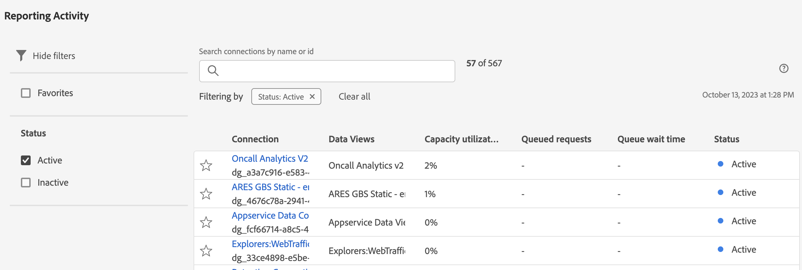

# レポートアクティビティマネージャーでのレポートアクティビティの表示

[!UICONTROL レポートアクティビティマネージャー]を使用すると、管理者はレポート作成のピーク時のレポート処理能力の問題をすばやく診断および修正できます。

主なメリットや権限要件など、レポートアクティビティマネージャーについて詳しくは、[レポートアクティビティマネージャーの概要](/help/admin/tools/reporting-activity-manager/reporting-activity-overview.md)を参照してください。

## すべてのレポートスイートのレポートアクティビティの表示 {#view-all-report-suites}

<!-- markdownlint-disable MD034 -->

>[!CONTEXTUALHELP]
>id="cja_tools_reportingactivitymanager_connections"
>title="接続"
>abstract="この表は、レポートアクティビティを管理する権限がある接続を示しています。各接続に関する情報は、表の各列に表示されます。"

<!-- markdownlint-enable MD034 -->

<!-- markdownlint-disable MD034 -->

>[!CONTEXTUALHELP]
>id="tools_reportingactivitymanager_connections"
>title="接続"
>abstract="この表は、レポートアクティビティを管理する権限がある接続を示しています。各接続に関する情報は、表の各列に表示されます。"

<!-- markdownlint-enable MD034 -->

1. Adobe Analytics で、**[!UICONTROL 管理者]**／**[!UICONTROL レポートアクティビティマネージャー]**&#x200B;に移動します。

   有効なベースレポートスイートのリストが表示されます。

   

1. （オプション）レポートスイートのリストを検索またはフィルタリングできます。

   * 検索フィールドを使用して、特定のレポートスイートを検索します。レポートスイート名または ID の入力を開始すると、入力に応じてレポートスイートのリストが更新されます。

   * [!UICONTROL **フィルター**]&#x200B;アイコン  を選択して、フィルターオプションのリストを展開します。[!UICONTROL **お気に入り**]&#x200B;または&#x200B;[!UICONTROL **ステータス**]&#x200B;でフィルタリングできます。

     レポートスイートをお気に入りとしてマークするには、レポートスイート名の左側にある星アイコンを選択します。

     <!-- (does this option still exist?) 1. (Optional) Select **[!UICONTROL Refresh]** at the top-right to refresh the data. -->

1. 各レポートスイートに関する稼働率情報を表示します。テーブルに表示されるデータは、ページが最後に読み込まれた時点のレポートスイートのレポートアクティビティを表します。

   次の列を表示できます。

   | UI 要素 | 説明 |
   | --- | --- |
   | **[!UICONTROL レポートスイート]** | 監視するレポートアクティビティのベースレポートスイート。 |
   | **[!UICONTROL 仮想レポートスイート]** | このベースレポートスイートにフィードするすべての仮想レポートスイートを表示します。仮想レポートスイートでは、適用されるフィルタリングとセグメント化のレベルが追加されるため、レポートリクエストが複雑になります。仮想レポートスイートからのすべてのリクエストは、ベースレポートスイートに組み合わされます。 |
   | **[!UICONTROL 処理能力の使用率]** | リアルタイムで使用されているレポートスイートのレポート処理能力の割合。 
**メモ** 使用処理能力が 100％であっても、レポートリクエストのキャンセルをすぐに開始する必要があるとは限りません。平均待ち時間が妥当な場合は、100 %の使用処理能力は正常に動作します。一方、キューに入れられたリクエスト数も増加している場合、使用処理能力が 100％であっても、問題が発生している可能性があります。
 |
   | **[!UICONTROL キューに登録されたリクエスト数]** | 処理待ちのリクエストの数。<!-- ??? --> |
   | **[!UICONTROL キューの待ち時間]** | リクエストの処理が開始されるまでの平均待ち時間。<!-- ???? --> |
   | **[!UICONTROL ステータス]** | 表示される可能性のあるステータスは次のとおりです。 <ul><li>[!UICONTROL **アクティブ**]（青）：過去 2 時間にレポートスイートでレポートが実行されました。テーブルに表示されるデータは、ページが最後に読み込まれた時点のレポートスイートのレポート処理能力を表します。</li><li>[!UICONTROL **非アクティブ**]（グレー）：過去 2 時間にレポートスイートでレポートが実行されていないので、レポートスイートのデータは表示されません。</li></ul> |

   {style="table-layout:auto"}

## 単一のレポートスイートのレポートアクティビティの表示

1. Adobe Analytics で、[!UICONTROL **管理者**]／[!UICONTROL **レポートアクティビティマネージャー**]&#x200B;を選択します。

1. 詳細を表示するレポートスイートのリンクされたタイトルを選択します。

   選択したレポートスイートのレポートアクティビティデータが表示されます。

   <!-- Need to update this screenshot:  -->

1. （オプション）レポートアクティビティマネージャーが初めて接続を読み込む際、表示されるデータは現在の稼働率指標を表します。最初の読み込み後に更新された指標を表示するには、「[!UICONTROL **更新**]」ボタンを選択してページを手動で更新します。

1. 使用可能なグラフとテーブルを使用して、レポートスイートのレポートアクティビティを把握します。

   * [グラフを表示](#view-graphs)

   * [テーブルの表示](#view-table)

### グラフを表示

次のグラフは、レポートスイートで発生しているアクティビティをより深く理解するのに役立ちます。

グラフが表示されない場合は、「[!UICONTROL **グラフを表示**]」ボタンを選択します。

#### 稼働率グラフ {#utilization}

稼働率グラフには、選択したレポートスイートの過去 2 時間のレポート稼働率が表示されます。

グラフにポインタを合わせると、その時間（分単位）に使用処理能力の割合が最も高かった時点が表示されます。

* **X 軸**：過去 2 時間のレポート使用処理能力。
* **Y 軸**：レポート使用処理能力の割合（分単位）。

  

#### 個別のユーザーグラフ

個別のユーザーグラフには、選択したレポートスイートの過去 2 時間のレポートアクティビティが表示されます。

グラフにポインタを合わせると、その時間（分単位）に最大ユーザー数が最も高かった時点が表示されます。

* **X 軸**：過去 2 時間の時間枠のレポートアクティビティ。
* **Y 軸**：レポートリクエストを行ったユーザーの数（分単位）。

  

#### リクエストグラフ

リクエストグラフには、選択したレポートスイートの過去 2 時間に処理されたリクエスト数と実行待ちのリクエスト数が表示されます。

グラフにポインタを合わせると、その時間（分単位）に最大リクエスト数が最も高かった時点が表示されます。

* **X 軸**：過去 2 時間の時間枠で処理されたリクエスト数と完了したリクエスト数。
* **Y 軸**：処理されたリクエスト数（緑色）と実行待ちのリクエスト数（紫色）（分単位）。

  

#### キューグラフ

キューグラフには、選択したレポートスイートの過去 2 時間のレポートリクエストに対するキューの平均待機時間（秒単位）が表示されます。

グラフにポインタを合わせると、その時間（分単位）に最大平均待機時間が最も高かった時点が表示されます。

* **X 軸**：過去 2 時間の時間枠のレポートリクエストに対する平均キュー待ち時間。
* **Y 軸**：平均待ち時間（秒単位）。

  

### テーブルの表示 {#view-table}

テーブルを表示する場合は、次の点を考慮します。

* データテーブルの上部にある「[!UICONTROL **リクエスト**]」、「[!UICONTROL **ユーザー**]」、「[!UICONTROL **プロジェクト**]」または「[!UICONTROL **アプリケーション**]」のいずれかのタブを選択して、データを表示できます。

* 接続のリストを検索またはフィルタリングできます。

   * 検索フィールドを使用して、特定の接続を検索します。接続名または ID の入力を開始すると、入力に応じて接続のリストが更新されます。

   * [!UICONTROL **フィルター**]&#x200B;アイコン  を選択して、フィルターオプションのリストを展開します。[!UICONTROL **ステータス**]、[!UICONTROL **複雑さ**]、[!UICONTROL **アプリケーション**]、[!UICONTROL **ユーザー**]、または&#x200B;[!UICONTROL **プロジェクト**]&#x200B;別にフィルタリングできます。

   * 「[!UICONTROL **グラフを非表示**]」を選択すると、テーブルのみが表示されます。

#### リクエスト別にデータを表示

「[!UICONTROL **リクエスト**]」タブを選択すると、テーブルで次の列が使用できます。

| 列 | 説明 |
| --- | --- |
| [!UICONTROL **リクエスト ID**] | トラブルシューティングの目的で使用できる一意の ID。ID をコピーするには、リクエストを選択し、「[!UICONTROL **リクエスト ID をコピー**]」オプションを選択します。 |
| [!UICONTROL **時間の実行**] | リクエストが実行されている時間。 |
| [!UICONTROL **開始時間**] | リクエストの処理が開始された時刻（管理者の現地時間に基づく）。 |
| [!UICONTROL **待ち時間**] | リクエストが処理されるまでの待ち時間。十分な処理能力がある場合、この値は通常「0」です。 |
| [!UICONTROL **アプリケーション**] | [!UICONTROL レポートアクティビティマネージャー]でサポートされているアプリケーションは次のとおりです。 <ul><li>Analysis Workspace UI</li><li>Workspace のスケジュール済みプロジェクト</li><li>Report Builder</li><li>ビルダー UI：セグメント、計算指標、注釈、オーディエンスなど。</li><li>API 1.4 または 2.0 からの API 呼び出し</li><li>アラート</li><li>任意のユーザーと共有リンク</li><li>Analytics レポートエンジンにクエリを実行するその他のアプリケーション</li></ul> |
| [!UICONTROL **ユーザー**] | リクエストを開始したユーザー。 
**メモ：**&#x200B;この列の値が&#x200B;[!UICONTROL **認識されない**]&#x200B;の場合、ユーザーは管理者権限を持たないログイン会社に属しています。
 |
| [!UICONTROL **プロジェクト**] | 保存済みの Workspace プロジェクト名、API レポート ID など（メタデータはアプリケーションによって異なる場合があります）。 |
| [!UICONTROL **ステータス**] | 次のステータスインジケーターがあります。 <ul><li>**実行中**：リクエストは現在処理中です。</li><li>**保留中**：リクエストは処理待ちの状態です。</li></ul> |
| [!UICONTROL **複雑さ**] | すべてのリクエストの処理に同じ時間が必要なわけではありません。リクエストの複雑さは、リクエストの処理に必要な時間に関する一般的な考え方を提供するのに役立ちます。 
指定できる値には以下のものがあります。
 <ul><li>[!UICONTROL **低**]</li><li>[!UICONTROL **中**]</li><li>[!UICONTROL **高**]</li></ul>この値は、次の列の値の影響を受けます。<ul><li>[!UICONTROL **月の境界**]</li><li>[!UICONTROL **列**]</li><li>[!UICONTROL **セグメント**]</li></ul> |
| [!UICONTROL **月の境界**] | リクエストに含まれる月数。月の境界が増加すると、リクエストがより複雑になります。 |
| [!UICONTROL **列**] | リクエスト内の指標と分類の数。列が増加すると、リクエストがより複雑になります。 |
| [!UICONTROL **セグメント**] | リクエストに適用されるセグメントの数。セグメントが増加すると、リクエストがより複雑になります。 |

{style="table-layout:auto"}

#### ユーザー別にデータを表示

「[!UICONTROL **ユーザー**]」タブを選択すると、テーブルで次の列が使用できます。

| 列 | 説明 |
| --- | --- |
| [!UICONTROL **ユーザー**] | リクエストを開始したユーザー。この列の値が&#x200B;[!UICONTROL **認識されない**]&#x200B;の場合、ユーザーは管理者権限を持たないログイン会社に属しています。 |
| [!UICONTROL **リクエスト数**] | ユーザーが開始したリクエスト数。 |
| [!UICONTROL **プロジェクト数**] | ユーザーに関連付けられているプロジェクト数。<!-- ??? --> |
| [!UICONTROL **アプリケーション**] | [!UICONTROL レポートアクティビティマネージャー]でサポートされているアプリケーションは次のとおりです。 <ul><li>Analysis Workspace UI</li><li>Workspace のスケジュール済みプロジェクト</li><li>Report Builder</li><li>ビルダー UI：セグメント、計算指標、注釈、オーディエンスなど。</li><li>API 1.4 または 2.0 からの API 呼び出し</li><li>アラート</li><li>任意のユーザーと共有リンク</li><li>Analytics レポートエンジンにクエリを実行するその他のアプリケーション</li></ul> |
| [!UICONTROL **複雑さの平均**] | ユーザーが開始したリクエストの複雑さの平均。 
すべてのリクエストの処理に同じ時間が必要なわけではありません。リクエストの複雑さは、リクエストの処理に必要な時間に関する一般的な考え方を提供するのに役立ちます。

この列の値は、次の列の値によって決定されるスコアに基づいています。
<ul><li>[!UICONTROL **平均月の境界**]</li><li>[!UICONTROL **平均列数**]</li><li>[!UICONTROL **平均セグメント数**]</li></ul> |
| [!UICONTROL **平均月の境界**] | リクエストに含まれる平均月数。月の境界が増加すると、リクエストがより複雑になります。 |
| [!UICONTROL **平均列数**] | 含まれるリクエスト内の指標と分類の平均数。列が増加すると、リクエストがより複雑になります。 |
| [!UICONTROL **平均セグメント数**] | 含まれるリクエストに適用されるセグメントの平均数。セグメントが増加すると、リクエストがより複雑になります。 |

{style="table-layout:auto"}

#### プロジェクト別にデータを表示

「[!UICONTROL **プロジェクト**]」タブを選択すると、テーブルで次の列が使用できます。

| 列 | 説明 |
| --- | --- |
| [!UICONTROL **プロジェクト**] | リクエストが開始されたプロジェクト。 |
| [!UICONTROL **リクエスト数**] | プロジェクトに関連付けられているリクエスト数。 |
| [!UICONTROL **ユーザー数**] | プロジェクトに関連付けられているユーザー数。<!-- ??? --> |
| [!UICONTROL **アプリケーション**] | [!UICONTROL レポートアクティビティマネージャー]でサポートされているアプリケーションは次のとおりです。 <ul><li>Analysis Workspace UI</li><li>Workspace のスケジュール済みプロジェクト</li><li>Report Builder</li><li>ビルダー UI：セグメント、計算指標、注釈、オーディエンスなど。</li><li>API 1.4 または 2.0 からの API 呼び出し</li><li>アラート</li><li>任意のユーザーと共有リンク</li><li>Analytics レポートエンジンにクエリを実行するその他のアプリケーション</li></ul> |
| [!UICONTROL **複雑さの平均**] | プロジェクトに含まれるリクエストの複雑さの平均。 
すべてのリクエストの処理に同じ時間が必要なわけではありません。リクエストの複雑さは、リクエストの処理に必要な時間に関する一般的な考え方を提供するのに役立ちます。

この列の値は、次の列の値によって決定されるスコアに基づいています。
<ul><li>[!UICONTROL **平均月の境界**]</li><li>[!UICONTROL **平均列数**]</li><li>[!UICONTROL **平均セグメント数**]</li></ul> |
| [!UICONTROL **平均月の境界**] | リクエストに含まれる平均月数。月の境界が増加すると、リクエストがより複雑になります。 |
| [!UICONTROL **平均列数**] | 含まれるリクエスト内の指標と分類の平均数。列が増加すると、リクエストがより複雑になります。 |
| [!UICONTROL **平均セグメント数**] | 含まれるリクエストに適用されるセグメントの平均数。セグメントが増加すると、リクエストがより複雑になります。 |

{style="table-layout:auto"}

#### アプリケーション別にデータを表示

「[!UICONTROL **アプリケーション**]」タブを選択すると、テーブルで次の列が使用できます。

| 列 | 説明 |
| --- | --- |
| [!UICONTROL **アプリケーション**] | リクエストが開始されたアプリケーション。 |
| [!UICONTROL **リクエスト数**] | アプリケーションに関連付けられているリクエスト数。 |
| [!UICONTROL **ユーザー数**] | アプリケーションに関連付けられているユーザー数。<!--???--> |
| [!UICONTROL **プロジェクト数**] | アプリケーションに関連付けられているプロジェクト数。<!--???--> |
| [!UICONTROL **複雑さの平均**] | アプリケーションに関連付けられているリクエストの複雑さの平均。 
すべてのリクエストの処理に同じ時間が必要なわけではありません。リクエストの複雑さは、リクエストの処理に必要な時間に関する一般的な考え方を提供するのに役立ちます。

この列の値は、次の列の値によって決定されるスコアに基づいています。
この列の値は、次の列の値によって決定されるスコアに基づいています。<ul><li>[!UICONTROL **平均月の境界**]</li><li>[!UICONTROL **平均列数**]</li><li>[!UICONTROL **平均セグメント数**]</li></ul> |
| [!UICONTROL **平均月の境界**] | リクエストに含まれる平均月数。月の境界が増加すると、リクエストがより複雑になります。 |
| [!UICONTROL **平均列数**] | 含まれるリクエスト内の指標と分類の平均数。列が増加すると、リクエストがより複雑になります。 |
| [!UICONTROL **平均セグメント数**] | 含まれるリクエストに適用されるセグメントの平均数。セグメントが増加すると、リクエストがより複雑になります。 |

{style="table-layout:auto"}

<!--

## Frequently asked questions {#faq}

| Question | Answer |
| --- | --- |
|  |  |

{style="table-layout:auto"}

-->