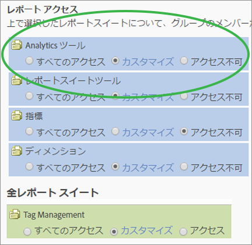

# Analytics ツールの権限のカスタマイズ

>[!IMPORTANT]
>
>ユーザーと製品の管理が管理コンソールに移 [行されました](https://helpx.adobe.com/enterprise/using/admin-console.html)。 ユーザーを移行する時期は、アドビから通知されます。After all customers have migrated, help content for **[!UICONTROL Analytics]** &gt; **[!UICONTROL Admin]** &gt; **[!UICONTROL User Management]** will be retired.

一般的な項目（課金、ログなど）、会社の管理、ツール、Web サービスへのアクセス、Report Builder および Data Connectors の統合に関するユーザー権限を有効にします。

**[!UICONTROL ユーザー管理]** /グループ **[!UICONTROL /すべ]** てのレポートアクセス **[!UICONTROL /]** Analytics ******[!UICONTROL /Analyticsカスタマイズ]**

>[!NOTE]
>
>2016年秋のリリース（10月21日）では、グループ管理に変更が加えられました。 See [Administrative Changes - Fall 2016](../../../admin/user-management2/c-user-management/permissions-changes.md#concept_86581595B86B47D5B8F90282FC3E31EF) for a summary of changes.

## レポートアクセス - Analytics ツール

「**[!UICONTROL カスタマイズ]」をクリックして、このグループがアクセスする項目を選択します。**

## フィールドの説明

このページの設定は、[!UICONTROL ユーザーグループの定義]ページで選択されたレポートスイートに関係します。

| 要素 | 説明 |
|--- |--- |
| **一般** |  |
| [コードマネージャー](../../../admin/admin/code-manager-admin.md) | Web およびモバイルプラットフォーム用のデータ収集コードをダウンロードする権限を有効にします。 |
| コードマネージャー - Web サービス | Web サービスを使用したコードマネージャーへのアクセスを管理者以外のユーザーに許可します。 |
| [ログ](../../../admin/admin/logs.md) | ユーザーがログインした時間、ユーザーの使用量、アクセス、レポートスイート、管理者による変更を確認するのに役立つログファイルに対する権限を有効にします。 |
| ログ - Web サービス | Web サービスを使用した管理ツールのログへのアクセスを管理者以外のユーザーに許可します。 |
| [トラフィック管理](../../../admin/c-traffic-management/traffic-management.md) | トラフィック管理ページでは、予想されるトラフィック量の変化を指定できます。 |
| 権限管理 | 管理ツールのユーザー管理ページへのアクセス権を管理者以外のユーザーに付与します。読み取り権限がありますが、書き込み権限はありません。 |
| 権限（書き込み） - Web サービス | 管理者以外のユーザーが Web サービスのユーザー管理で権限設定の読み取り／書き込みをおこなうことができるようにします。 この設定は、特に、管理 API の該当する権限アクションを指します。 |
| 権限（読み取り） - Web サービス | 管理者以外のユーザーが Web サービスのユーザー管理に権限設定を表示できるようにします。 この設定は、特に、管理 API の該当する権限アクションを指します。 |
| **会社管理** |  |
| [セキュリティ](../../../admin/company/security-manager.md) | レポートデータへのアクセスを制御するセキュリティマネージャーページに対する権限を付与します。オプションには、強力なパスワード、パスワード有効期限、IP ログイン制限、電子メールドメイン制限などがあります。 |
| サポート情報 | カンパニー設定のサポート情報に対する権限を付与します。 |
| [Web サービス](../../../admin/company/web-services-admin.md) | 管理ツールインターフェイスの Web サービスページにアクセスできるようにします（[!UICONTROL カンパニー設定]／[!UICONTROL Web サービス]）。 Web Services API を使用すると、ユーザーインターフェイスを通じて使用可能な機能を複製および補強する Adobe Analytics サービスにプログラムレベルでアクセスできます。 |
| シングルサインオン（レガシー） | 管理ツールのシングルサインオンページへのアクセス権を付与します。 **注意：** Adobe Experience Cloud のシングルサインオンは、Experience Cloud とソリューションの間の[アカウントのリンク](https://marketing.adobe.com/resources/help/en_US/mcloud/organizations.html)を使用して実装されます。 |
| [保留中のアクション](../../../admin/company/pending-actions-admin.md) | [!UICONTROL カンパニー設定]の保留中のアクションを管理する権限を付与します。 |
| [ブランド提携](../../../admin/company/co-branding-admin.md) | Analytics のコブランド化の権限を付与します。 |
| [環境設定](../../../admin/admin/preferences-manager.md) | [!UICONTROL Preference Manager] に対する権限を付与します。 |
| [レポートスイートを非表示](../../../admin/company/c-hide-report-suites.md) | Adobe Analytics ユーザーインターフェイスでレポートスイートを非表示にする権限を付与します。 |
| **ツール** | これらの設定は、Analytics ツール（インターフェイスおよびアプリケーション）およびセグメンテーションや計算指標などの高度な機能へのアクセス権を付与します。 |
| [現在のデータ](https://marketing.adobe.com/resources/help/en_US/reference/data_latency.html) | レポートの「現在のデータ」機能を使用する権限を付与します。 |
| [Ad Hoc Analysis](https://marketing.adobe.com/resources/help/en_US/dsc/) ライセンスユーザー | [!UICONTROL Ad Hoc Analysis] へのアクセス権を付与します。 |
| Web サービスへのアクセス | 管理者以外のユーザーの Web サービスへのアクセスを有効にします。Web サービス資格情報を生成します。 |
| [Report Builder](https://marketing.adobe.com/resources/help/en_US/arb/setup.html) | このグループのメンバーに [!UICONTROL Report Builder] ライセンスへのアクセス権を付与します。 |
| [Analysis Workspace](https://marketing.adobe.com/resources/help/en_US/analytics/analysis-workspace/) アクセス | [!DNL Adobe Analytics] の推奨レポートインターフェイスである、Analysis Workspace へのアクセス権をユーザーに付与します。 |
| [Reports &amp; Analytics](https://marketing.adobe.com/resources/help/en_US/sc/user/) | Reports &amp; Analytics へのアクセス権をユーザーに付与します。 |
| [計算指標の作成](https://marketing.adobe.com/resources/help/en_US/analytics/calcmetrics/) | 計算指標を作成する権限をユーザーに付与します。 |
| [セグメントの作成](https://marketing.adobe.com/resources/help/en_US/analytics/segment/) | セグメントを作成する権限をユーザーに付与します。 |
| **Data Connectors** |  |
| 統合（作成、更新または削除） | Data Connector 統合を作成、更新および削除する権限を付与します。 |
