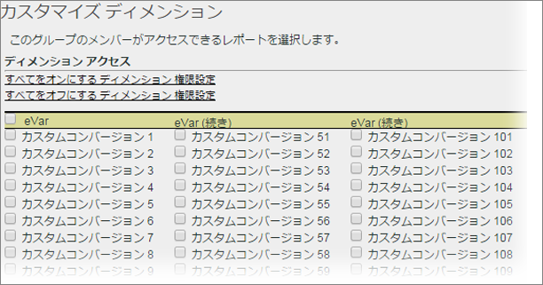

# ディメンション権限のカスタマイズ

>[!IMPORTANT]
>
>User and product management is moving to the [Admin Console](https://helpx.adobe.com/enterprise/using/admin-console.html). ユーザーを移行する時期は、アドビから通知されます。After all customers have migrated, help content for **[!UICONTROL Analytics]** &gt; **[!UICONTROL Admin Tools]** &gt; **[!UICONTROL User Management]** will be retired.

eVar、トラフィックレポート、ソリューションレポートおよびパスレポートを含む、詳細なレベルでユーザーアクセスをカスタマイズします。

**[!UICONTROL ユーザー管理]** / **[!UICONTROL グループ]** / **[!UICONTROL レポートアクセス]** / **[!UICONTROL ディメンション]** / **[!UICONTROL カスタマイズ]**

>[!IMPORTANT]
>
>現時点では、一部のディメンションは権限設定できません。このようなディメンションとしては、モバイルのブックマークの長さ、モバイルデバイス番号、モバイル DRM、モバイル情報サービス、モバイル Java VM、モバイルデコレーションメール、モバイルインターネットプロトコル、モバイル OS、モバイルプッシュトゥトークがあります。
>
>これらのディメンションは、他の権限にかかわらず、すべてのユーザーが使用可能です。

このページの設定は、[!UICONTROL ユーザーグループの定義]ページで選択されたレポートスイートに関係します。

権限のディメンションカテゴリに関する次の情報について説明します。

* eVar 1 ～250 に対して個別に権限が与えられます。
* すべてのトラフィックレポートはディメンションです。
* ビデオ&amp;モバイルレポートは、ディメンションおよびその他のAnalyticsソリューションレポート（Experience Manager、Advertising Cloud、Socialなど）です。
* パスレポートは、ユーザーが親ディメンションにアクセスできる場合に使用できます。
* カスタムグループ内にあるすべてのディメンションと指標は新しいカテゴリに自動的に移行されます。既存のグループで指標が有効な場合、新しく権限を付与できるすべてのディメンション（eVar およびコンテンツに対応するもの）および指標は、デフォルトで有効になります。
* 分類インポーター（以前の SAINT）の権限：分類へのアクセスは、分類の基となる[変数](https://marketing.adobe.com/resources/help/en_US/reference/c_classifications.html)へのアクセスによって判断されます。

詳しくは、[権限の変更に関するよくある質問](https://marketing.adobe.com/resources/help/en_US/reference/permissions_faq.html)を参照してください。

**ディメンションのカスタマイズ**

次の項目は、権限を設定できるディメンションです。

<table id="table_F37D74A1619A4560A5F5651E855DAF1C"> 
 <thead> 
  <tr> 
   <th colname="col1" class="entry"> エレメント </th> 
   <th colname="col2" class="entry"> 説明 </th> 
  </tr> 
 </thead>
 <tbody> 
  <tr> 
   <td colname="col1"> 
 <a href="../../../admin/admin/conversion-var-admin/conversion-var-admin.md#concept_C02F7AA01DE242F1AA1A4E74022BE9DE" format="dita" scope="local"> eVars </a> 
 </td> 
   <td colname="col2"> 
eVar 1 ～250 に対して個別に権限が与えられます。eVar は、カスタムレポートのコンバージョン成功指標をセグメント化するために使用するカスタムコンバージョン変数です。 
 </td> 
  </tr> 
  <tr> 
   <td colname="col1"> 
 <a href="https://marketing.adobe.com/resources/help/en_US/sc/implement/props_eVars.html" format="html" scope="external"> Props </a> 
 </td> 
   <td colname="col2"> 
prop は、カスタムトラフィック変数です。 
 
Analytics の導入の<a href="https://marketing.adobe.com/resources/help/en_US/sc/implement/props_eVars.html" format="html" scope="external">トラフィック prop と コンバージョン eVar</a> を参照してください。 
 </td> 
  </tr> 
  <tr> 
   <td colname="col1"> 
 <a href="https://marketing.adobe.com/resources/help/en_US/sc/implement/hierN.html" format="html" scope="external"> Hierarchy </a> 
 </td> 
   <td colname="col2"> 
 階層（hierN）変数は、サイトの階層またはページ構造におけるページの位置を決定します。 
 </td> 
  </tr> 
  <tr> 
   <td colname="col1"> 
 <a href="https://marketing.adobe.com/resources/help/en_US/sc/implement/listN.html" format="html" scope="external"> Listvar </a> 
 </td> 
   <td colname="col2"> 
 リスト Prop の機能と同様、リスト変数は、同じイメージリクエスト内で複数の値を許可します。 
 </td> 
  </tr> 
  <tr> 
   <td colname="col1"> 
Standard 
 </td> 
   <td colname="col2"> 
Analytics の標準（あらかじめ用意されている） Analyticsのディメンションを使用できます。 
 </td> 
  </tr> 
  <tr> 
   <td colname="col1"> 
 <a href="https://marketing.adobe.com/resources/help/en_US/em/" format="https" scope="external"> AEM </a> 
 </td> 
   <td colname="col2"> 
Adobe Experience Manager   
 </td> 
  </tr> 
  <tr> 
   <td colname="col1"> 
 <a href="https://marketing.adobe.com/resources/help/en_US/media-optimizer/" format="https" scope="external"> AMO </a> 
 </td> 
   <td colname="col2"> 
Adobe Advertising Cloud 
 </td> 
  </tr> 
  <tr> 
   <td colname="col1"> 
 <a href="https://marketing.adobe.com/resources/help/en_US/analytics/activitymap/" format="https" scope="external"> Activity Map </a> 
 </td> 
   <td colname="col2"> 
 Activity Map レポートディメンション：Activity Map ページ、Activity Map リンク、Activity Map 地域、Activity Map 地域別リンク、Activity Map XY 
 </td> 
  </tr> 
  <tr> 
   <td colname="col1"> 
 <a href="https://marketing.adobe.com/resources/help/en_US/mobile/" format="https" scope="external"> モバイル </a> 
 </td> 
   <td colname="col2"> 
Adobe Mobile Services 
 </td> 
  </tr> 
  <tr> 
   <td colname="col1"> 
 Comscore 
 </td> 
   <td colname="col2"> 
このパートナーとの統合は無効になりました。 
 </td> 
  </tr> 
  <tr> 
   <td colname="col1"> 
 <a href="https://marketing.adobe.com/resources/help/en_US/sc/appmeasurement/hbvideo/nielsen-partnership.html" format="html" scope="external"> Nielsen </a> 
 </td> 
   <td colname="col2"> 
パートナー統合。 
 </td> 
  </tr> 
  <tr> 
   <td colname="col1"> 
 ソーシャル 
 </td> 
   <td colname="col2"> 
未使用。 
 </td> 
  </tr> 
 </tbody> 
</table>

