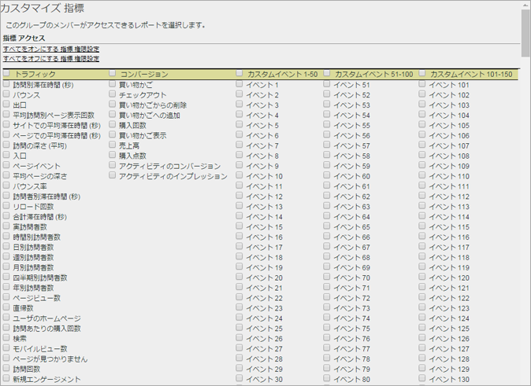

# 指標の権限のカスタマイズ

>[!IMPORTANT]
>
>User and product management is moving to the [Admin Console](https://helpx.adobe.com/enterprise/using/admin-console.html). ユーザーを移行する時期は、アドビから通知されます。After all customers have migrated, help content for **[!UICONTROL Analytics]** &gt; **[!UICONTROL Admin Tools]** &gt; **[!UICONTROL User Management]** will be retired.

トラフィック指標、コンバージョン指標、カスタムイベント、ソリューションイベントおよびコンテンツ対応に関する権限を有効にします。

**[!UICONTROL ユーザー管理]** / **[!UICONTROL グループ]** / **[!UICONTROL レポートアクセス]** / **[!UICONTROL 指標]** / **[!UICONTROL カスタマイズ]**

カスタム指標ページの設定は、[!UICONTROL ユーザーグループの定義]ページで選択されたレポートスイートに適用されます。

## ソリューションイベント

In addition to [Custom Events](https://marketing.adobe.com/resources/help/en_US/sc/implement/events.html), this category includes Analytics solution events, including Experience Manager (AEM), Advertising Cloud (AMO), Mobile, Video, and Social.). 指標を含むすべてのカスタムグループには、新しい指標として追加されたすべての Analytics ソリューションイベントがあります。

カスタムイベントおよび Analytics ソリューションイベント（AEM、AMO、Mobile、Video、Social）に権限を設定できます。

指標を含むすべてのカスタムグループには、新しい指標として追加されたすべての Analytics ソリューションイベントがあります。

Analytics で使用される指標について詳しくは、[指標の概要を](/help/components/c-variables/c-metrics/metricslist.md) 参照してください。

## コンテンツ対応

コンテンツ対応には、Experience Cloud ソリューション統合に関連した指標に関する権限を管理できる変数が含まれます。You can manage permissions on [!DNL Social], [!DNL Mobile], or any other data that was inserted through a [!DNL Experience Cloud] integration. これらは、デフォルトで有効になります。
