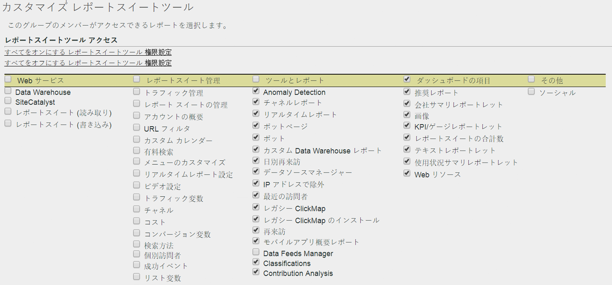

# レポートスイートツールの権限のカスタマイズ

>[!IMPORTANT]
>
>User and product management is moving to the [Admin Console](https://helpx.adobe.com/enterprise/using/admin-console.html). ユーザーを移行する時期は、アドビから通知されます。After all customers have migrated, help content for **[!UICONTROL Analytics]** &gt; **[!UICONTROL Admin Tools]** &gt; **[!UICONTROL User Management]** will be retired.

API アクセス、レポートスイートの管理、ツールとレポートおよびダッシュボードの項目に関するユーザー権限を有効にします。

**[!UICONTROL ユーザー管理]** / **[!UICONTROL グループ]** / **[!UICONTROL レポートアクセス]** / **[!UICONTROL レポートスイートツール]** / **[!UICONTROL カスタマイズ]**

[!UICONTROL レポートスイートツールのカスタマイズ]ページでは、グループのメンバーに次の項目へのアクセス権を付与します。

## フィールドの説明

このページの設定は、[!UICONTROL ユーザーグループの定義]ページで選択されたレポートスイートに関係します。

| 要素 | 説明 |
|--- |--- |
| **Web サービス** |  |
| これらの設定を使用すると、ユーザーは Data Warehouse メソッドに対する呼び出しをおこなって、レポートスイート設定を引き出すことができます。 |  |
| Data Warehouse | 管理者以外のユーザーがWeb Services APIを使用してData Warehouseメソッドを使用して呼び出しを行うことができます。[Data Warehouse-開発者向けドキュメントを参照してください](/help/export/data-warehouse/data-warehouse.md) |
| レポート スイート（読み取り） | 管理者以外のユーザーが API のレポートスイートメソッドを使用できます。 |
| レポート スイート（書き込み） | 管理者以外のユーザーが API のレポートスイートメソッドを使用できます。 |
| **レポートスイートの管理** |  |
| These settings grant access to the menu items in  Admin &gt;  Report Suites  &gt;  Edit Settings ([Report Suite Manager](../../../admin/c-manage-report-suites/report-suites-admin.md)). |  |
| [トラフィック管理](../../../admin/c-traffic-management/traffic-management.md) | トラフィック管理に対する権限を付与します。 |
| [レポートスイートの管理](../../../admin/c-manage-report-suites/report-suites-admin.md) | レポートスイートを管理する権限を付与します。 |
| [アカウントの概要](../../../admin/admin/general-acct-settings-admin.md) | レポートスイートのアカウント設定を編集する権限を付与します。 |
| [URL フィルター](../../../admin/admin/internal-url-filter-admin.md) | レポートスイートの内部 URL フィルターに対する権限を付与します。内部 URL フィルターは、サイト内部のリファラー（参照ページ）を識別するために使用されます。 |
| [カスタムカレンダー](../../../admin/admin/custom-calendar.md) | カスタムカレンダーを編集する権限を付与します。 |
| [有料検索](https://marketing.adobe.com/resources/help/en_US/reference/paid_search_detection.html) | 有料検索探知は、検索エンジンと検索キーワードレポート内の自然検索と有料検索を区別します。 |
| [メニューのカスタマイズ](../../../admin/admin/customize-menus.md) | Reports &amp; Analytics でユーザーに表示されるレポートメニューをカスタマイズします。 |
| [リアルタイムレポート設定](../../../admin/admin/realtime/t-realtime-admin.md) | Analytics でリアルタイムレポートを設定する権限です。 |
| [ビデオ設定](../../../admin/admin/video-management.md) | ビデオのトラッキングとレポートに使用されるカスタムコンバージョン変数（eVar）とカスタムイベントのセットを指定する権限です。 |
| [ビデオ分類](https://marketing.adobe.com/resources/help/en_US/sc/appmeasurement/video/video_config.html) | ビデオのトラッキングとレポートに使用されるカスタムコンバージョン変数（eVar）とカスタムイベントのセットを指定する権限です。 |
| [トラフィック変数](../../../admin/admin/c-traffic-variables/traffic-var.md) | カスタムデータを特定のトラフィック関連イベントに相互に関連付ける権限です。 |
| [トラフィック分類](/help/admin/admin/c-traffic-variables/traffic-classifications.md) | （ツールとレポートの）分類に統合されました。 |
| [チャネル](https://marketing.adobe.com/resources/help/en_US/mchannel/index.html) | Report Suite Manager／設定を編集／マーケティングチャネルのマーケティングチャネル設定に対する権限を付与します。 |
| [コスト](https://marketing.adobe.com/resources/help/en_US/mchannel/c_overview_budget.html) | Report Suite Manager のマーケティングチャネル／マーケティングチャネルのコスト設定に対する設定を有効にします。 |
| [コンバージョン変数](../../../admin/admin/conversion-var-admin/conversion-var-admin.md) | カスタムインサイトコンバージョン変数（または eVar）は、サイト上の選択された Web ページの Adobe コードに配置されます。その主な目的は、カスタムマーケティングレポートでコンバージョン成功指標をセグメント化することです。 |
| [検索方法](../../../admin/admin/finding-methods.md) | 各種の検索方法レポートがサイト上のコンバージョンの成功イベントのクレジットを受け取る方法を特定できます。 |
| [コンバージョンの分類](../../../admin/admin/conversion-var-admin/conversion-classifications.md) | （ツールとレポートの）分類に統合されました。 |
| [個別訪問者](https://marketing.adobe.com/resources/help/en_US/reference/t_unique_visitor_variable.html) | 個別訪問者変数を指定する権限を付与します。 |
| [成功イベント](https://marketing.adobe.com/resources/help/en_US/reference/success_event.html) | 製品表示、チェックアウト、購入など、トラッキングできるアクション。 |
| [分類階層](../../../components/c-classifications2/classification-hierarchies.md) | （ツールとレポートの）分類に統合されました。 |
| [リスト変数](https://marketing.adobe.com/resources/help/en_US/sc/implement/listN.html) | リスト Var とも呼ばれます。リスト Prop の機能と同様、リスト Var は同じイメージリクエスト内で複数の値を許可します。 |
| [デフォルトの指標](../../../admin/admin/default-metrics.md) | ユーザーがカスタム指標のセットを選択しない限り、Reports &amp; Analytics ではすべてのコンバージョンレポートでデフォルトの指標セットが表示されます。選択した指標は、関連付けられたレポートスイートのすべてのユーザーに表示されます。 |
| [処理ルール](https://marketing.adobe.com/resources/help/en_US/sc/implement/ref-processing-rules.html) | データ収集をシンプル化し、レポートに送信されるコンテンツを管理する処理ルールへのアクセス権を付与します。 |
| **ツールとレポート** |  |
| [異常値検出](https://marketing.adobe.com/resources/help/en_US/analytics/analysis-workspace/anomaly_detection.html) | 以前のデータに関連して特定の指標がどのように変化したかを判定するための統計的手法である、異常値検出に対する権限を付与します。 |
| [チャネルレポート](https://marketing.adobe.com/resources/help/en_US/mchannel/index.html) | レポート／マーケティングチャネルレポートにあるマーケティングチャネルレポートに対する権限を付与します。 |
| [リアルタイムレポート](../../../admin/admin/realtime/t-realtime-admin.md) | リアルタイムレポートへのアクセス権を付与します。 |
| [ボットページ](../../../admin/admin/bot-rules/bot-rules.md#concept_A306689C65EB4D0F9AE65E3FD48ED5F7) | ボットルールを使用すると、既知のスパイダやボットによって生成されるトラフィックを、レポートスイートから削除できます。ボットトラフィックを削除することで、Web サイトでのユーザーアクティビティをより正確に測定できるようになります。 |
| [ボット](../../../admin/admin/bot-rules/bot-rules.md) | ボットルールを使用すると、既知のスパイダやボットによって生成されるトラフィックを、レポートスイートから削除できます。ボットトラフィックを削除することで、Web サイトでのユーザーアクティビティをより正確に測定できるようになります。 |
| [カスタム Data Warehouse レポート](../../..//export/data-warehouse/data-warehouse.md) | Data Warehouse は、カスタムレポート用の処理されていない生のデータを取り出す機能です。カスタムレポートはこのデータをフィルタリングして実行します。ユーザー独自の質問に基づいて生のデータから詳細なデータの関連性を表示するように、レポートにリクエストできます。 |
| [日別再来訪](../../../components/c-variables/dimensionslist/reports-daily-return-visits.md) | （レガシー）ある特定の日に、Web サイトを 2 回以上訪ねた訪問者の数を表示するレポートです。1 日は直前の 24 時間として定義されます。 |
| [データソースマネージャー](../../../admin/admin/data-sources.md) | データソース機能を使用すると、オフラインソースから Analytics にデータをインポートできます。 |
| [IP アドレスで除外](../../../admin/admin/exclude-ip.md) | レポートから、社内の Web サイト活動、サイトのテスト、従業員の使用量など、特定の IP アドレスからのデータを除外できます。 |
| レガシー ClickMap | レガシー ClickMap オーバーレイツールへのアクセス権を付与します。 |
| レガシー ClickMap のインストール | レガシー ClickMap ツールにインストール権限を付与します。 |
| [再来訪](../../../components/c-variables/dimensionslist/reports-return-visits.md) | 訪問回数が 2 以上である訪問の数を示すレポート。再来訪レポートには、cookie を使用していない訪問者が含まれます。 |
| [分類インポーター](https://marketing.adobe.com/resources/help/en_US/reference/c_working_with_saint.html) / エクスポーターおよび[ルールビルダー](https://marketing.adobe.com/resources/help/en_US/reference/classification_rule_builder.html) | 分類に統合されました（以下を参照してください）。 |
| データフィードマネージャー | 権限を Analytics データフィード. |
| 分類       | 次の権限を組み合わせます。「トラフィック分類」、「ビデオ分類」、「コンバージョン分類」、「分類階層」、「分類マネージャー」および「分類インポーター/エクスポーターとルールビルダー」。注意：この権限を持つユーザーは、選択したレポートスイートだけではなく、すべてのレポートスイートの分類を編集できます。 |
| [貢献度分析](https://marketing.adobe.com/resources/help/en_US/analytics/analysis-workspace/contribution-analysis.html) | Analysis Workspace で貢献度分析を使用する権限を付与します。 |
| **ダッシュボードの項目** |  |
| The settings in Dashboard Items enables access to [reportlets](https://marketing.adobe.com/resources/help/en_US/sc/user/dashboard.html) in Reports &amp; Analytics:, My Recommended Reports, Company Summary Reportlet, Image, KPI/Gauge Reportlet, Report Suite Totals, Text, Reportlet, Usage Summary Reportlet, and Web Resources |  |
| **その他** |  |
| ソーシャル | Report Suite Manager のソーシャルの管理メニューへのアクセスを制御します。 |
