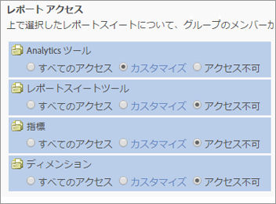
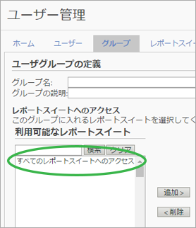

# ユーザーおよびグループ権限の変更

>[!IMPORTANT]
>
>ユーザーと製品の管理は[Admin Console](https://helpx.adobe.com/jp/enterprise/using/admin-console.html)に移動しました。 ユーザーを移行する時期は、アドビから通知されます。すべての顧客が移行されたら、**[!UICONTROL Analytics]**／**[!UICONTROL 管理ツール]**／**[!UICONTROL ユーザー管理]**&#x200B;のヘルプコンテンツは利用できなくなります。

## 変更内容 {#section_2C205DE94155441B9E9D3E4C46CCF2EE}

**[!UICONTROL 管理者]**／**[!UICONTROL ユーザー管理]**／**[!UICONTROL グループ]**

>[!NOTE]
>
>使用可能な権限の組み合わせが多いので、権限の組み合わせごとに使用できる API メソッドをすべて説明するドキュメントを用意することはできません。一般に、Web サービスへのアクセス権を付与された非管理者は、API メソッドへの読み取りアクセスのみ可能です。API メソッドへの書き込みアクセスはできません。

API とインターフェイスでは同じ権限付与システムを使用しているので、管理者以外の個々のユーザーがインターフェイス（Adobe Admin Console）で管理者からどのような権限を付与されようと、API に対するそのユーザーの権限と同じものになります。

<table id="table_D1DB0DE37752450BBCCA44DB760BB505"> 
 <thead> 
  <tr> 
   <th colname="col1" class="entry"> 機能強化 </th> 
   <th colname="col2" class="entry"> 説明 </th> 
  </tr> 
 </thead>
 <tbody> 
  <tr> 
   <td colname="col1"> 
レポートアクセスの変更（グループのカスタマイズ） 
 </td> 
   <td colname="col2"> 
  新しいグループを追加／レポートアクセス 
 
ユーザーグループの定義ページの「レポートアクセス」セクションは、4 つのカテゴリに整理され、詳細なレベルで権限をカスタマイズできます。 
 
 </img> 
 
以前の項目は、次のように変更されています。 
 
    <ul id="ul_16D5EF18D57D4608AEEDEC40D90D8828"> 
     <li id="li_F29E84C6228A464C8807F09205AEAAC6"> 
 <a href="/help/admin/user-management2/c-customize-report-access/groups-analytics-tools.md">Analytics ツール</a>：一般的な項目（課金、ログなど）、会社の管理、ツール、Web サービスへのアクセス、Report Builder および Data Connectors の統合に関するユーザー権限を有効にします。 
 
 <b>注意：</b>Admin Console のカスタマイズカテゴリのカンパニー設定は、Analytics ツールに移動されました。 
 </li> 
     <li id="li_A6EB788162A2455E94CE54B9279A854D"> 
 <a href="/help/admin/user-management2/c-customize-report-access/groups-report-suite-tools.md">レポートスイートツール</a>：Web アクセス、レポートスイートの管理、ツールとレポートおよびダッシュボードの項目に関するユーザー権限を有効にします。 
 </li> 
     <li id="li_EDB0255E009B4F1CAFAF53966B41363C"> 
 <a href="/help/admin/user-management2/c-customize-report-access/groups-metrics.md">指標</a>：トラフィック、コンバージョン、カスタムイベント、ソリューションイベントおよびコンテンツ対応などに関する権限を有効にします。 
 </li> 
     <li id="li_8DAE87D1DEF54803A9C6FE31C01F0FB0"> 
 <a href="/help/admin/user-management2/c-customize-report-access/groups-dimensions.md">ディメンション</a>：eVar、トラフィックレポート、ソリューションレポートおよびパスレポートを含め、詳細なレベルでユーザーアクセスをカスタマイズします。 
 </li> 
    </ul> 
例えば、特定の指標およびディメンション（eVar を含む）およびセグメントや計算指標の作成などの機能に対する権限を持つ、複数の Analytics ツール（Analysis Workspace、Reports &amp; Analytics および Report Builder）へのアクセス権を持つグループを作成できます。 
 </td> 
  </tr> 
  <tr> 
   <td colname="col1"> 
定義済みグループの変更 
 </td> 
   <td colname="col2"> 
 <b>管理者アクセス：</b>管理者には、定義済みのグループは、必要なくなりました。管理者は、すべての項目（ツール、指標、ディメンション）に加え、Webサービス、Report BuilderおよびActivity Mapにアクセスできるようになりました。 
 
将来的なグループの目的は、管理者以外のユーザーにアクセスを付与または制限することです。 
 
 <b>カスタムグループ：</b>カスタムグループが、定義済みのグループから置き換わりました。既存の定義済みグループは、同じグループ名を使用して、カスタムグループに移行されます。作成したカスタムグループは、その設定も含めて保持されます。ただし、設定の場所が移動されることに注意してください。例えば、（Admin Console のカスタマイズの）カンパニー設定は、現在は、<a href="/help/admin/user-management2/c-customize-report-access/groups-analytics-tools.md">Analytics ツールのカスタマイズ</a>にあります。 
 
 「すべてのレポートアクセス」に属するユーザーは、次のアクセス権を持つカスタムグループに移行されました。 
 
    <ul id="ul_696A9243F5FD4AF187352C2F4B1CFDC2"> 
     <li id="li_683A0A3BB7214CFFBC61D5A4CD237F48">すべてのディメンション </li> 
     <li id="li_D8FDBF6A32224731AB706315DEA0A03E">すべての指標 </li> 
     <li id="li_65ABE5C95D43444D88E63EE95C9AED05">すべてのレポートスイート </li> 
     <li id="li_7ED1505590144B38B3B9851BAA6BBB49">チャネルレポート権限 </li> 
     <li id="li_F718FE1FCF9A4B05AB933CA3F105F3EC">異常値検出レポートの権限 </li> 
     <li id="li_527BD52007E846FE8B5F71AB3C12F695">リアルタイムレポートの権限 </li> 
     <li id="li_AFFB58C7FB644AC8A85E2D76BA7D51F5">Analysis Workspace のアクセス権限 </li> 
    </ul> 
定義済みのグループで以前に使用可能だったすべての設定が<a href="/help/admin/user-management2/c-user-groups/groups.md">ユーザーグループの定義</a>の「レポートアクセス」設定でカスタマイズに利用できるので、管理者は、カスタムグループを削除して、独自のものを作成できます。 
 </td> 
  </tr> 
  <tr> 
   <td colname="col1"> 
ディメンションレベルの権限 
 </td> 
   <td colname="col2"> 
権限をカスタマイズして、（指標に加えて）ディメンションへのアクセス権を含めたり、除外したりできます。 
 
    <ul id="ul_DA5A54223673474E9151AF979DA50659"> 
     <li id="li_C3E82F7BC07A4F2F83A85D3D511292CC"> 
カスタムグループ内にあるすべてのディメンションと指標は新しいカテゴリに自動的に移行されます。既存のグループで指標が有効な場合、新しく権限を付与できるすべてのディメンション（eVar およびコンテンツに対応するもの）および指標は、デフォルトで有効になります。 
 </li> 
     <li id="li_CC56F9181CC14AB59318628E72F2E8C9"> 分類インポーター（以前の SAINT）の権限：分類へのアクセスは、分類の基となる<a href="https://docs.adobe.com/content/help/ja-JP/analytics/components/classifications/c-classifications.html">変数</a>へのアクセスによって判断されます。 </li> 
    </ul> 
<a href="/help/admin/user-management2/c-customize-report-access/groups-dimensions.md">ディメンションの権限のカスタマイズ</a>を参照してください。 
 </td> 
  </tr> 
  <tr> 
   <td colname="col1"> 
Admin Console 
 </td> 
   <td colname="col2"> 
新規のお客様または <a href="https://docs.adobe.com/content/help/ja-JP/core-services/interface/about-core-services/core-services.html">Experience Cloud でプロビジョニングされた</a>会社を持つお客様の場合にのみお勧めします。既存の Analytics のお客様の Experience Cloud ID 管理システムへの移行は、予定されています。 
 
詳しくは、<a href="https://helpx.adobe.com/jp/enterprise/using/manage-permissions-and-roles.html">Admin Console での製品権限の管理</a>を参照してください。 
 </td> 
  </tr> 
 </tbody> 
</table>

## 権限の変更に関するよくある質問（FAQ） {#section_02809EFC95054B40A089E6C6E4FACA13}

新規または計画されているアップデートに関する新情報および管理環境に与える影響を示します。

<table id="table_1E93F45C66E841E6882FB602509F30A3"> 
 <thead> 
  <tr> 
   <th colname="col1" class="entry"> 質問 </th> 
   <th colname="col2" class="entry"> 回答 </th> 
  </tr> 
 </thead>
 <tbody> 
  <tr> 
   <td colname="col1"><b>2016 年 7 月</b>リリースでは、どの権限が変更されますか。 </td> 
   <td colname="col2"> 
 <b>すべてのレポートスイートへのアクセス</b> 
 
レポートスイートを追加してグループに含める際に、「すべてのレポートスイートへのアクセス」を指定します。この設定は、現在および将来のすべてのレポートスイートにグループ権限を設定します。 
 
この機能を有効にするには、ユーザー管理／グループ／新しいユーザーグループの追加／すべてのレポートスイートアクセスに移動します。 
 
 
 </td> 
  </tr> 
  <tr> 
   <td colname="col1"> 
ユーザーを管理するために Admin Console を使用する必要はありますか。それとも既存の Analytics ユーザー管理を使用する必要がありますか。 
 </td> 
   <td colname="col2"> 
Analytics／管理者／ユーザー管理に加えられた変更は、Admin Console には反映されません。従って、ユーザーおよびグループ管理に Admin Console を既に使用している新しいお客様のみ、引き続き使用する必要があります。既存の Analytics グループ管理の Admin Console への移行は、予定されています。 
 </td> 
  </tr> 
  <tr> 
   <td colname="col1"> 
<b>2016 年 10 月</b>リリースでは、どの権限が変更されましたか。 
 </td> 
   <td colname="col2"> 
現在の管理ツールインターフェイスに対する次の機能強化が利用できます。 
 
 
     <ul id="ul_2A31E8DC17A94B7FABDBA9C87C3947EF"> 
      <li id="li_AE2ECCA01CC64D30B109BE74379EE474"><a href="/help/admin/user-management2/c-user-management/permissions-changes.md">管理上の変更 — 2016 年秋</a>で説明されている権限の変更。 </li> 
      <li id="li_33CB2B6A2E5F45BE97CC5E0983AF280E">メニューになくなった使用されなくなったトラフィックレポートが削除されました。 </li> 
      <li id="li_57234CF27E1D405987DE89312CD62C52">分類権限： 分類へのアクセスは、分類が適用される変数へのアクセス権によって判別されます。 </li> 
     </ul> 
 </td> 
  </tr> 
  <tr> 
   <td colname="col1"> 
ユーザーを移行するためにしておく必要があることはありますか。 
 </td> 
   <td colname="col2"> 
いいえ、すべての権限移行は、透過的に発生します。 
 
 
     <ul id="ul_654F85286EC04416B3E0BA725EBE10AD"> 
      <li id="li_8050B8941F794103B82A0ADF0930D216">カスタムグループの現在のすべてのトラフィックレポートは、新しいディメンションカテゴリに自動的に移行されます。 </li> 
      <li id="li_B97079DB29A346B98D066F11AB7F94AF">カスタムグループに既に有効にした指標がある場合、新しく権限設定可能になったすべてのディメンション（eVar およびソリューション変数）を自動的に指定します。 </li> 
      <li id="li_F1219EF490DA473BA15F2B215F2995AE"> 少なくとも 1 つの指標のあるカスタムグループには、新しく使用できるようになったトラフィックディメンション（以前のトラフィックレポート）を<b>除く</b>すべての eVar およびその他のコンテンツ対応ディメンションへのアクセス権が自動的に付与されます。 </li> 
      <li id="li_F494CE6144A04A6199CFBBA1D7BEA32B">すべての定義済みグループは、権限に変更されます。これらの新しい権限は、新しい Analytics ツールカテゴリに追加されます。 </li> 
      <li id="li_2FCD9254FC3C4FD7871EEF9453E5CE1E">指標を含むすべてのカスタムグループには、新しい指標として追加されたすべての Analytics ソリューションイベントがあります。 </li> 
      <li id="li_34C4560769B64F28A4E83BAE71065DCC">全レポートアクセスに属していたすべてのユーザーは、新しいカスタムグループに追加されます。「全レポートアクセス」は、なくなります。 </li> 
     </ul> 
 </td> 
  </tr> 
  <tr> 
   <td colname="col1"> 
変更されないのは何ですか。 
 </td> 
   <td colname="col2"> 
「訪問者の属性」は、引き続き権限がありません。 
 </td> 
  </tr> 
 </tbody> 
</table>

## 権限のクイックリファレンス  {#section_A3FDD8259F524B21A5489833533D1B28}

次の表に、会社のステータスに応じたタスクとその実行場所を示します。

>[!NOTE]
>
>*`migrated user`* および *`Experience Cloud user`* は、Experience Cloud に参加するための電子メールの招待状を承認したユーザーを指します。電子メールの招待状が承認されなかった場合、ユーザーは、依然として Analytics ユーザーで、Admin Console で管理できません。（例外は、移行が [Enterprise ID または Federated ID](https://helpx.adobe.com/jp/enterprise/using/set-up-identity.html) を使用する場合です。この場合、ユーザーは、管理者がユーザーごとにユーザーを移行する際に移行されます。）

<table id="table_B68FD00FC5D24823A86BB69558C0327C"> 
 <thead> 
  <tr> 
   <th colname="col1" class="entry"> タスク </th> 
   <th colname="col2" class="entry"> 移行していないログイン会社 </th> 
   <th colname="col3" class="entry"> 現在移行中の会社 </th> 
   <th colname="col4" class="entry"> 移行が完了したログイン会社 </th> 
  </tr> 
 </thead>
 <tbody> 
  <tr> 
   <td colname="col1"> ユーザーの作成 </td> 
   <td colname="col2"> 
Admin Console（ユーザーの作成および Analytics <a href="https://docs.adobe.com/content/help/ja-JP/core-services/interface/manage-users-and-products/admin-getting-started.html">製品設定</a>への追加でも Analytics にユーザーアカウントが作成されます）。 
 
 <a href="/help/admin/user-management2/c-user-management/t-add-user-account.md">管理ツール</a> 
 </td> 
   <td colname="col3"> 
 <a href="https://adminconsole.adobe.com/enterprise/">Admin Console</a> 
 </td> 
   <td colname="col4"> 
 <a href="https://adminconsole.adobe.com/enterprise/">Admin Console</a> 
 </td> 
  </tr> 
  <tr> 
   <td colname="col1"> ユーザーの編集 </td> 
   <td colname="col2"> 
 <a href="/help/admin/user-management2/c-user-management/t-add-user-account.md">管理ツール</a> 
 </td> 
   <td colname="col3"> 
 <a href="https://adminconsole.adobe.com/enterprise/">Admin Console</a> 
 
 管理ツール - 移行されたユーザーの管理ツールでの編集は、API キー管理およびアセットの削除／転送に制限されます。 
 </td> 
   <td colname="col4"> 
 <a href="https://adminconsole.adobe.com/enterprise/">Admin Console</a> 
 
 管理ツール - 編集は、API キー管理およびアセットの削除／転送に制限されます。 
 </td> 
  </tr> 
  <tr> 
   <td colname="col1"> ユーザーの削除 </td> 
   <td colname="col2"> 
Admin Console - Experience Cloud ユーザー用 
 
管理ツール - すべてのユーザー用、ただし、Experience Cloud ユーザーの場合、Experience Cloud アカウントではなく、マッピングした Analytics ユーザーを削除するのみ。 
 </td> 
   <td colname="col3"> 
Admin Console - 移行されたユーザー用。 
 
管理ツール - Analytics のみのユーザー用。 
 </td> 
   <td colname="col4"> 
Admin Console 
 
 管理ツール - Experience Cloud ユーザーを削除した後、または Admin Console でそのアカウントのリンクを解除した後、管理ツールから Analytics ログインを削除できます。 
 </td> 
  </tr> 
  <tr> 
   <td colname="col1"> Analytics へのログイン </td> 
   <td colname="col2"> 
 <b>Experience Cloud：</b>marketing.adobe.com。Experience Cloud ユーザーのみ利用可能。 
 
 <b>Analytics（レガシー）：</b>sc.omniture.com。Analytics のみのユーザー、および Analytics 資格情報を持つ Experience Cloud ユーザー 
 </td> 
   <td colname="col3"> 
 marketing.adobe.com - Experience Cloud ユーザーのみ利用可能。 
 
 sc.omniture.com - Analytics のみのユーザー、および Analytics 資格情報を持つ Experience Cloud ユーザー。 
 
移行中、管理者は、特定のユーザーの omniture.com ログイン機能をオフにできます。 
 </td> 
   <td colname="col4"> 
Admin Console 
 </td> 
  </tr> 
  <tr> 
   <td colname="col1"> グループの作成 </td> 
   <td colname="col2"> 
Admin Console - Admin Console でグループが作成されると、Analytics でマッピングされたグループは管理ツールに表示されますが、このマッピングされたグループは、管理ツールから名前を変更したり削除したりすることはできません。 
 
管理ツール。 
 </td> 
   <td colname="col3"> 
Admin Console（<a href="https://docs.adobe.com/content/help/en/core-services/interface/manage-users-and-products/admin-getting-started.html">製品設定の作成</a>） 
 </td> 
   <td colname="col4"> 
Admin Console（<a href="https://docs.adobe.com/content/help/en/core-services/interface/manage-users-and-products/admin-getting-started.html">製品設定の作成</a>） 
 </td> 
  </tr> 
  <tr> 
   <td colname="col1"> グループのユーザーの編集 </td> 
   <td colname="col2"> 
Admin Console - Experience Cloud ユーザーのみ 
 
管理ツール - Analytics のみのユーザーと、グループに対する Experience Cloud ユーザーメンバーシップは、管理ツールから編集できます。ただし、Experience Cloud ユーザーが Admin Console のグループの一員である場合、管理ツールでグループから削除できません。 
 </td> 
   <td colname="col3"> 
Admin Console - Experience Cloud ユーザーのみ 
 
 管理ツール - Analytics のみのログインは、管理ツールでグループに追加／削除できます。 
 </td> 
   <td colname="col4"> 
Admin Console 
 </td> 
  </tr> 
  <tr> 
   <td colname="col1"> グループの権限の編集 </td> 
   <td colname="col2"> 
Admin Console - Admin Console で作成したグループを編集できます。 
 
管理ツール - あらゆるグループの権限を編集できます。 
 </td> 
   <td colname="col3"> 
Admin Console 
 </td> 
   <td colname="col4"> 
Admin Console 
 </td> 
  </tr> 
  <tr> 
   <td colname="col1"> グループの削除 </td> 
   <td colname="col2"> 
Admin Console - Admin Console で作成したグループを削除できます。 
 
管理ツール - 管理ツールから作成したグループのみを削除できます。 
 </td> 
   <td colname="col3"> 
Admin Console 
 </td> 
   <td colname="col4"> 
Admin Console 
 </td> 
  </tr> 
  <tr> 
   <td colname="col1"> ユーザーの管理ステータスの変更 </td> 
   <td colname="col2"> 
Admin Console - Experience Cloud ユーザーのみ。 
 
管理ツール 
 </td> 
   <td colname="col3"> 
Admin Console - Experience Cloud ユーザーのみ。 
 
管理ツール - Analytics ユーザーのみ。 
 </td> 
   <td colname="col4"> 
Admin Console 
 </td> 
  </tr> 
 </tbody> 
</table>
