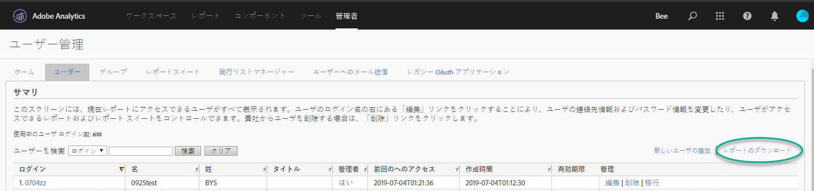
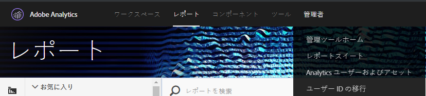
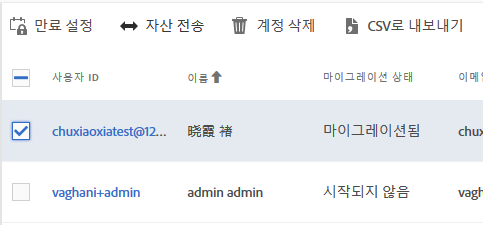
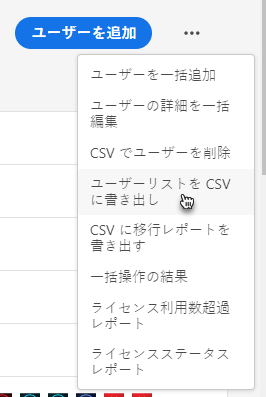
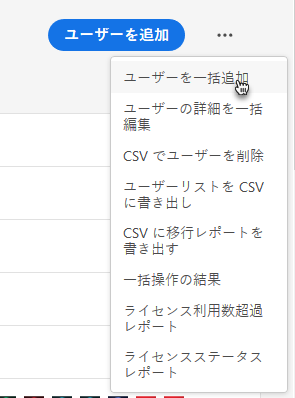
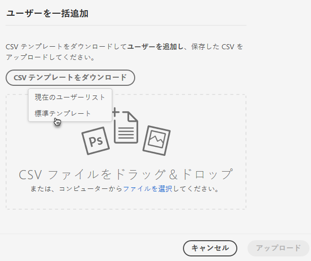
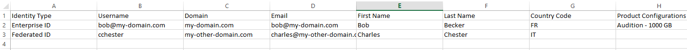
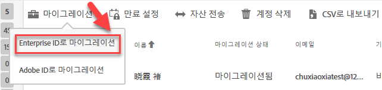

# Enterprise ID と Federated ID の Analytics ユーザーアカウントの移行{#migrate-analytics-user-accounts-for-enterprise-and-federated-ids}

Enterprise または Federated ID として Analytics ユーザーアカウントを Admin Console に移行する方法。

## 前提条件 {#concept-e60d8deb3fc54a1a81f1f47a26658de3}

Admin Console でユーザーを管理するための前提条件。

新しいドメインおよびディレクトリの場合は、次の手順に従います。

* ディレクトリの設定
* ドメインの設定
* ドメインをディレクトリにリンクさせる

詳しくは、[ID システムの設定](https://helpx.adobe.com/enterprise/using/set-up-identity.html)を参照してください。

別の事業部門またはチームによって、別の組織でディレクトリを作成済みの場合は、[直接信頼](https://helpx.adobe.com/enterprise/using/set-up-identity.html#Directorytrusting)の手順に従い、Analytics 用に使用している組織でディレクトリを確立してください。

## Enterprise ID と Federated ID のユーザー ID の移行 {#task-0cfb3e4400fd4ab58e4d9704528b05fa}

この手順では、以下をおこないます。

* **[!UICONTROL Analytics]** / **[!UICONTROL Analyticsユーザーおよびアセットからユーザーログインリストをダウンロード]**&#x200B;します。

* **[!UICONTROL 管理コンソール]** / **[!UICONTROL ユーザーから現在のユーザーリストをダウンロード]**&#x200B;します。

* リストを比較します（Admin Console でアカウントデータが上書きされるのを防ぐため、重複がないか探します）。
* [!DNL .csv] （ **[!UICONTROL 管理コンソール]** / **[!UICONTROL ユーザー]**&#x200B;から） Enterprise IDまたはFederated IDユーザーを管理コンソールにアップロードします。

既存の Adobe ID ユーザーアカウントを Enterprise ID または Federated ID へ移行する必要がある場合は、Adobe Customer Care に連絡するか、[ユーザー ID の一括切り替え](https://helpx.adobe.com/enterprise/using/bulk-operations.html)をリクエストしてください。

**ユーザーアカウントを移行するには**

1. 次のいずれかのメソッド（ユーザーを移行済みかどうかによって異なります）を使用して、Analytics User Management から Analytics ユーザーログインファイル（[!DNL User Logins List.tab]）をダウンロードします。
   1. *移行前に***[!UICONTROL 、管理]** 者/ **[!UICONTROL ユーザー管理（レガシー）]** /ユーザー **[!UICONTROL を編集に移動]**&#x200B;し、「レポートのダウンロード」をクリック ****&#x200B;します。

      

      Download Report リンクは、ユーザーを移行していない顧客にのみ表示されます。

   1. *既にユーザーを移行している場合は、***[!UICONTROL Analytics]** / **[!UICONTROL Analyticsユーザーおよびアセットに移動]**&#x200B;します。

      

   1. [!DNL Users] ページで、ユーザーを選択し、"CSVにエクスポート」をクリック ****&#x200B;します。

      

   1. Open the downloaded [!DNL User List.csv] file in Excel.

      Be prepared to copy the *`Email`*, *`First Name`*, and *`Last Name`* values to a [!DNL sample.csv] file (described in the next step).

      >[!IMPORTANT]
      >
      >CSVファイルの値はコンマで区切ります。

      **ヒント**：この手順の間に、ユーザーリストを整理して、Enterprise または Federated ID 移行に有効な電子メール ID を持つユーザーのみを含めることをお勧めします。

1. Admin Console で、Admin Console ユーザーのリストをダウンロードします。

   1. [管理コンソール](http://adminconsole.adobe.html/#) / **[!UICONTROL ユーザー]**&#x200B;に移動し、「ユーザーリストをCSVに [エクスポート」をクリック](https://helpx.adobe.com/enterprise/using/users.html)します。

      

   1. Compare the two files: the existing Admin Console users in the exported [!DNL .csv] file ( [!DNL sample.csv], in this example) with the users in the Analytics [!DNL User Logins List.csv] file.

      >[!IMPORTANT]
      >
      >If you find duplicates, delete them from the Analytics [!DNL User Logins List.csv] file. この手順は、Admin Console の既存の Experience Cloud ユーザー権限が上書きされるのを防ぎ、移行するアカウントのリストを提供します。

1. Admin Console から CSV テンプレートをダウンロード：
   1. On the Users tab, click **[!UICONTROL Add users by CSV]**, then **[!UICONTROL Download CSV Template]**.

      

   1. **[!UICONTROL 標準テンプレートを選択]**&#x200B;します。

      この手順では、[!DNL sample.csv] テンプレートファイルをダウンロードします。

      

1. *`Email`*、および *`First Name`**`Last Name`* 列の値をテンプレート内の対応する列 [!DNL User Logins List.tab] にコピー [!DNL sample.csv] します。

   **テンプレートファイルの例**

   

1. テンプレート（[!DNL sample.csv]）で、次の必須フィールドに入力します。

<table id="table_1B5EEFDB5BD8436EB760BE5FFAB1CF02"> 
 <thead> 
  <tr> 
   <th colname="col1" class="entry"> フィールド </th> 
   <th colname="col2" class="entry"> 説明 </th> 
  </tr>
 </thead>
 <tbody> 
  <tr> 
   <td colname="col1"> 
電子メール 
 </td> 
   <td colname="col2"> 
User Logins List.tab からコピーしたもの。 
 </td> 
  </tr> 
  <tr> 
   <td colname="col1"> 
名 
 </td> 
   <td colname="col2"> 
User Logins List.tab からコピーしたもの。 
 </td> 
  </tr> 
  <tr> 
   <td colname="col1"> 
姓 
 </td> 
   <td colname="col2"> 
User Logins List.tab からコピーしたもの。 
 </td> 
  </tr> 
  <tr> 
   <td colname="col1"> 
ID タイプ 
 </td> 
   <td colname="col2"> 
 Federated ID または  Enterprise ID。 
 </td> 
  </tr> 
  <tr> 
   <td colname="col1"> 
ドメイン 
 </td> 
   <td colname="col2"> 
ドメインが 「ドメイン 」  列と「電子メール 」列は <a href="../c-migration-tool/migrate-enterprise.md#concept-e60d8deb3fc54a1a81f1f47a26658de3" format="dita" scope="local"> 、前提条件</a>で確立されたドメインと一致しています。 
 </td> 
  </tr> 
  <tr> 
   <td colname="col1"> 
国コード 
 </td> 
   <td colname="col2"> </td> 
  </tr> 
 </tbody> 
</table>

[!DNL .csv] ファイル内のフィールドについて詳しくは [、CSVファイル形式](https://helpx.adobe.com/enterprise/using/users.html)を参照してください。

>[!NOTE]
>
>Other columns, such as *`Product Configurations`* and *`Admin Roles`* can be blank.

1. On the Users tab in the Admin Console, upload the template file by clicking **[!UICONTROL Add users by CSV]** (as shown in [Step 3](../c-migration-tool/migrate-enterprise.md#step-190321c6025947e38b195daed122c063).).
1. In Analytics, run the migration tool (as described in [Migrate Analytics user accounts](../c-migration-tool/t-migrate-users.md#task-f3355f3b14a340feae58cfa04c0ba1c9)).
1. **[!UICONTROL 移行]** / **[!UICONTROL Enterprise IDとして移行をクリック]**&#x200B;します。

   

   **[!UICONTROL 「移行」]**&#x200B;をクリックすると、管理コンソールのEnterprise ID/Federated IDアカウントにユーザーがリンクされます。The permissions of the legacy user account in Analytics will match the permissions granted to the Enterprise/Federated ID login in **[!UICONTROL Admin Console]** &gt; **[!UICONTROL Analytics]** &gt; **[!UICONTROL Product Profiles]**. 「移行完了」バケットにユーザー ID が表示されます。従来の [!DNL my.omniture.com] アクセスを無効にできます。

   After migrating users, the status under the Migration Status column changes from *`Not Initiated`* to *`Migrated`*.

   移行ツールに表示される Adobe ID ユーザーも、このプロセスで移行できます。これらのユーザーは、ID 切り替えが実行されるまで、引き続き Adobe ID を使用してログインする必要があります。ID 切り替えに関してサポートが必要な場合は、Adobe カスタマーケアにお問合せください。
