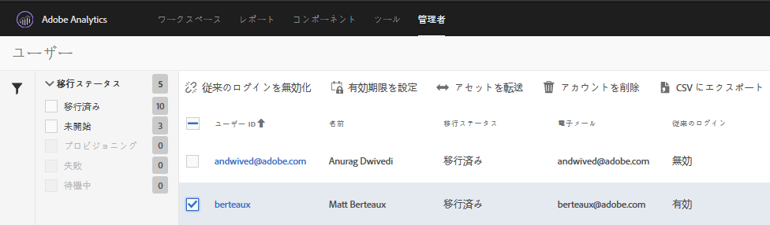

# 従来のログインの無効化{#disable-legacy-logins}

Analytics ユーザーの従来のログインを無効化する方法を学習します。

ユーザーを従来の Analytics ユーザー管理システムから Adobe Admin Console に移行した後は、従来のログインを無効にすることができます。従来のログインを無効化した場合、従来の方法でログインしようとするユーザーは Experience Cloud ログインにリダイレクトされます。

1. **[!UICONTROL Analytics]** / **[!UICONTROL 管理者]** / **[!UICONTROL ユーザーIDの移行で移行ツールを開き]**&#x200B;ます。
1. [!DNL User Information] セクションで、操作するユーザーを含むドメインを選択し、「ユーザーを選択」をクリック ****&#x200B;します。
1. 無効にする従来のログインを持つユーザーを選択します。

   

   The users that are eligible will have a status of *`Migrated`* under the Migration Status column. ユーザーが移行されるまで、従来のログインを無効にすることはできません。
1. Click **[!UICONTROL Disable Legacy Login]**, then click **[!UICONTROL Done]**.

   「従来のログインを無効化」には、従来の [!DNL my.omniture.com] ユーザー名とパスワードを引き続き使用できるユーザーが表示されます。

   まだ移行されていないユーザーの従来のログインを無効化することはできません。無効化されると、ユーザーは Experience Cloud ID を使用して Analytics　へログインおよびアクセスする必要があります。

