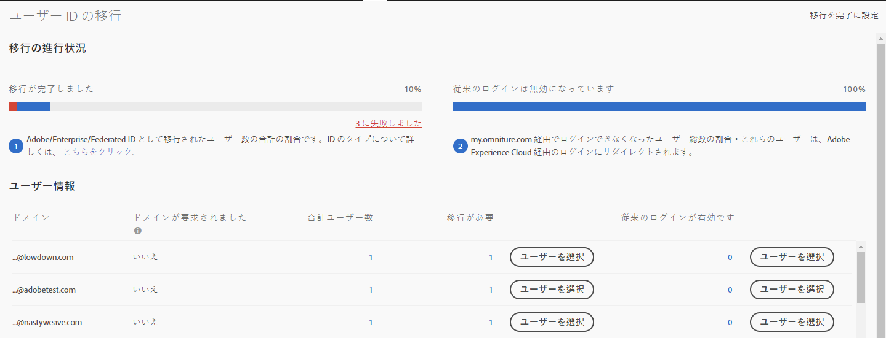

# Adobe ID 用に Analytics ユーザーアカウントを移行する{#migrate-analytics-user-accounts-for-adobe-ids}

従来の Analytics ユーザー管理システムから Admin Console へユーザーを移行します。

## Adobe ID 用に Analytics ユーザーアカウントを移行する {#task-f3355f3b14a340feae58cfa04c0ba1c9}

従来の Analytics ユーザー管理システムから Admin Console へユーザーを移行します。

>[!NOTE]
>
>Experience Cloud経由でログインしていない管理者がユーザーID移行ツールにアクセスしようとすると、Experience Cloudログインページにリダイレクトされます。

**Analytics ユーザーを移行するには**

1. **[!UICONTROL Analytics]** / **[!UICONTROL 管理者]** / **[!UICONTROL ユーザーIDの移行に移動]**&#x200B;します。

   

   ユーザー ID の移行ページには、*以降の進行状況*&#x200B;および&#x200B;*ユーザー情報*&#x200B;の 2 つのセクションがあります。

   **移行の進行状況**

<table id="table_F9F1CFF762C745E198CB075A02BA2DDA"> 
 <thead> 
  <tr> 
   <th colname="col1" class="entry"> フェーズ </th> 
   <th colname="col2" class="entry"> 説明 </th> 
  </tr>
 </thead>
 <tbody> 
  <tr> 
   <td colname="col1"> 
移行完了 
 </td> 
   <td colname="col2"> 
ユーザーが招待を受け入れました。 
 </td> 
  </tr> 
  <tr> 
   <td colname="col1"> 
従来のログインの無効化 
 </td> 
   <td colname="col2"> 
会社 ID を使用している従来のログインが無効化されます。ユーザーは、Adobe ID または Enterprise ID を使用して、Experience Cloud にアクセスするようになります。すべてのユーザーがこのフェーズに達すると、移行が完了します。 
 
移行時には、レガシーログインは無効になります。Users are redirected to  experiencecloud.adobe.com and must log in using the Adobe ID or Enterprise ID. 
 
See <a href="../c-migration-tool/t-disable-legacy-login.md#task-c9262e469814473c8a3ff3971c95570b" format="dita" scope="local"> Disable Legacy Logins</a> for more information. 
 </td> 
  </tr> 
 </tbody> 
</table>

**ユーザー情報**

ユーザー情報は、組織内のユーザーの概要を、ドメイン名で区切って表示します。

<table id="table_3822E27AF81E4A188562FEB5131548A5"> 
 <thead> 
  <tr> 
   <th colname="col1" class="entry"> 要素 </th> 
   <th colname="col2" class="entry"> 説明 </th> 
  </tr>
 </thead>
 <tbody> 
  <tr> 
   <td colname="col1"> 
ドメイン 
 </td> 
   <td colname="col2"> 
ドメインは、現在の Analytics ユーザーベースの電子メール ID に固有のものとなります。1 つのドメインを複数の組織がクレームすることはできません。また、ドメインをクレームできるのはシステム管理者のみです。詳しくは、<a href="https://helpx.adobe.com/enterprise/help/request-access-to-claimed-domain.html" format="html" scope="external">クレームされたドメインへのアクセスを要求する</a>を参照してください。 
 </td> 
  </tr> 
  <tr> 
   <td colname="col1"> 
申請されたドメイン 
 </td> 
   <td colname="col2"> 
ユーザーを Enterprise または Federated ID として移行する場合はシステム管理者であり、かつ、ユーザーを移行する前に Admin Console から利用可能なドメインを申請する必要があります。詳しくは<a href="https://helpx.adobe.com/enterprise/help/identity.html" format="html" scope="external">こちら</a>。 
 
Enterprise またはr Federated ID のドメインを申請する場合は、この手順をスキップして、ユーザーを Adobe ID として移行します。ID タイプの詳細については<a href="https://helpx.adobe.com/enterprise/help/identity.html" format="html" scope="external">ここ</a>をクリックしてください。 
 </td> 
  </tr> 
 </tbody> 
</table>

1. Locate the domain containing the user IDs you want to migrate, then, under **[!UICONTROL Requiring Migration]**, click **[!UICONTROL Select Users]**.
1. [!DNL Users] ページで移行するユーザーを選択し、 **[!UICONTROL 「移行]**」をクリックします。

   **[!UICONTROL 「移行」]**&#x200B;をクリックすると、ユーザーは招待（移行開始）を受け取り、承認する必要があります。このアクションにより、ユーザー ID が「移行完了」に変わります。その後、[!DNL my.omniture.com] への従来のアクセスをオフにすることができます。

   

1. ユーザーを移行する ID タイプを [Adobe ID または Enterprise ID](https://helpx.adobe.com/enterprise/help/identity.html) として指定します。

   After migrating users, the status under the column Migration Status changes from *`Not Initiated`* to *`Migrated`*.

   If *`Failed`* displays, hover over the icon for a description about why the migration failed.
